# System Architecture Blueprint
## Campus Placement & Referral Portal with Auto-Resume Matcher

---

## 1. Architecture Overview

### 1.1 Project Purpose
The **Campus Placement & Referral Portal with Auto-Resume Matcher** is an institutional web platform engineered to automate, govern, and streamline the campus recruitment and referral lifecycle for colleges and universities. It unifies three core stakeholders:
- **Students:** Build verified profiles, upload resumes, verify placement eligibility, match with institutional drives, and track job applications and interview schedules.
- **Recruiters & Alumni:** Register organizations, submit job and internship listings, review eligible student applicants, inspect automated resume-to-job matching scores, and schedule interviews through selection.
- **Training & Placement Cell (TPC) Administrators:** Exercise institutional governance, approve/reject external recruiter job postings, establish eligibility criteria, resolve placement policy locks, oversee drives, and export regulatory placement compliance reports.

### 1.2 Architectural Style: Modular Monolith
The platform adopts a **Modular Monolith** architecture. All business domains reside in a single deployable backend codebase with strictly isolated domain boundaries, unified data access, shared transactional integrity, and centralized middleware governance. 

This architectural style is chosen deliberately over microservices for the following reasons:
1. **Strong ACID Guarantees:** Critical placement workflows—such as offer acceptance triggering an atomic update of student placement status to `PLACED` and cascading `AUTO_WITHDRAWN` transitions across all concurrent applications—require relational database transactions with zero distributed consensus overhead.
2. **Simplified Deployment & Operational Simplicity:** Eliminates the latency, network unreliability, and observability overhead of inter-service RPCs, message brokers, and distributed tracing.
3. **Strict Internal Modularity:** Code is partitioned into distinct domain modules (Identity, Student, Recruiter, Job, Eligibility, Resume, ATS, Application, Interview, Offer, Notification, Analytics, Audit) communicating via internal programmatic service interfaces, preserving the capability to extract standalone services in the future if scale warrants it.

### 1.3 Major Architectural Components
- **Client Presentation Layer:** Next.js + React web application serving specialized portals for Students, Recruiters, and TPC Administrators.
- **API Gateway & Routing Layer:** Node.js + Express.js REST API providing rate limiting, security headers, CORS negotiation, structured payload parsing, and centralized authentication/authorization middleware.
- **Domain Services Layer:** Pure business logic modules encapsulating institutional rules, state transition validation, and deterministic score computation.
- **Data Access Layer:** Prisma ORM interfacing with a relational PostgreSQL database engine.
- **Storage Subsystem:** Pluggable Private File Storage Abstraction (Local filesystem for development; S3-compatible/Cloudinary for production) managing resume PDF assets.
- **Deterministic ATS Subsystem:** CPU-bound, in-memory pipeline performing PDF text extraction, case-insensitive whitespace normalization, deterministic canonical alias substitution, token set extraction, and exact Jaccard similarity scoring.

### 1.4 Horizon Phasing: MVP vs. V2 vs. Future Scope

| Architectural Component | Phase 1 (MVP) | Phase 2 (V2) | Future Scope |
| :--- | :--- | :--- | :--- |
| **Backend Architecture** | Express.js Modular Monolith | Modular Monolith with Redis caching | Distributed Services (if required) |
| **Frontend Architecture** | Next.js + React (App Router/SSR + Client boundaries) | Next.js + React with Real-time UI updates | Native Mobile Applications (iOS/Android) |
| **Authentication** | JWT (Stateless) + DB Authoritative State Validation | JWT + DB + Refresh Token Rotation in Redis | SAML / Institutional SSO / OAuth2 (Google/MS) |
| **ATS Scoring** | Deterministic Jaccard Similarity on Canonical Skill Sets | Jaccard + Weighted Must-Have vs Nice-to-Have Skills | Semantic Embeddings (Sentence-Transformers) / LLM |
| **Background Processing** | Synchronous Node.js event-loop processing | Redis-backed BullMQ Queue Workers | Dedicated Distributed Worker Fleet (Celery/Temporal) |
| **Event Communication** | In-app transactional persistence + Synchronous Email | BullMQ Worker + Email Retry Queue | WebSockets / Server-Sent Events (SSE) / Push Notifications |
| **File Storage** | Local Secure Storage (Dev) / Cloudinary/S3 Abstraction (Prod) | S3-Compatible Storage with Pre-signed Upload URLs | Multi-region Geo-distributed Object Storage |
| **Export Formats** | CSV / XLSX with Formula Injection Sanitization | High-throughput asynchronous batch exports | Institutional Custom Report Builder |

---

## 2. High-Level System Architecture

```mermaid
graph TD
    subgraph Stakeholders ["Stakeholders & Client Layer"]
        S["Student Portal"]
        R["Recruiter / Alumni Portal"]
        A["TPC Admin Portal"]
    end

    subgraph Presentation ["Presentation Layer (Next.js + React)"]
        FE["Next.js Application<br/>(Route Guards / Role Layouts / React Query / Zod UI)"]
    end

    subgraph Gateway ["Gateway & Middleware Layer (Express.js)"]
        GW["Express REST API Gateway<br/>(Helmet, CORS, RateLimiter, BodyParser)"]
        AUTH_MW["Authentication & Authorization Middleware<br/>(JWT Token Extraction, RBAC Verification)"]
        STATE_MW["Authoritative DB State Interceptor<br/>(Debarment, Placement Status, Job Status Validation)"]
    end

    subgraph Services ["Modular Monolith Domain Services"]
        ID_SVC["Identity & Auth Service"]
        STU_SVC["Student Profile Service"]
        REC_SVC["Recruiter Service"]
        JOB_SVC["Job Governance Service"]
        ELIG_SVC["Eligibility Engine Service"]
        RES_SVC["Resume Parser Service"]
        ATS_SVC["Deterministic ATS Matcher"]
        APP_SVC["Application State Machine"]
        INT_SVC["Interview Management Service"]
        OFF_SVC["Offer & Placement Policy Service"]
        NOTIF_SVC["Notification Service"]
        AUD_SVC["Audit Logging Service"]
    end

    subgraph DataAccess ["Data & Storage Layer"]
        PRISMA["Prisma ORM (Data Access Layer)"]
        POSTGRES[("PostgreSQL Relational Database")]
        STORAGE_ABS["Private Storage Abstraction<br/>(Local Storage / Cloudinary / S3)"]
    end

    %% Client to Presentation
    S -->|HTTPS / UI Interaction| FE
    R -->|HTTPS / UI Interaction| FE
    A -->|HTTPS / UI Interaction| FE

    %% Presentation to Gateway
    FE -->|REST API Calls (JSON / Bearer JWT)| GW

    %% Gateway Flow
    GW --> AUTH_MW
    AUTH_MW --> STATE_MW
    STATE_MW --> Services

    %% Services Interconnections
    JOB_SVC -.-> ELIG_SVC
    APP_SVC --> ELIG_SVC
    APP_SVC --> ATS_SVC
    APP_SVC --> OFF_SVC
    OFF_SVC --> APP_SVC
    RES_SVC --> ATS_SVC
    Services --> AUD_SVC
    Services --> NOTIF_SVC

    %% Services to Data & Storage
    RES_SVC -->|Stream PDF File Buffer| STORAGE_ABS
    Services --> PRISMA
    PRISMA --> POSTGRES
```

---

## 3. Frontend Architecture

### 3.1 Technology Stack & Core Principles
- **Framework:** Next.js + React
- **Rendering Model:** Hybrid architecture leveraging Next.js Server Components for layout structure and SEO-safe landing views, and Client Components (`"use client"`) for rich interactive workflows (application tracking, interview scheduling, profile management).
- **Styling:** Modular Vanilla CSS design system with CSS custom properties (design tokens) ensuring high contrast, institutional accessibility, dark/light themes, and responsive layouts.
- **Client-Side Validation:** Zod schemas shared structurally with backend validation definitions.
- **Client State & Server Cache:** Lightweight client-side state management coupled with a data-fetching layer (React Query or SWR pattern) managing caching, optimistic updates, and background refetching.

### 3.2 Route & Layout Organization
The Next.js directory structure strictly enforces role-based user experience boundaries:

```
frontend/
├── app/
│   ├── (auth)/
│   │   ├── login/
│   │   ├── register/
│   │   └── forgot-password/
│   ├── (public)/
│   │   ├── page.tsx (Public Landing)
│   │   └── policy/
│   ├── student/
│   │   ├── layout.tsx (Student Guard & Navigation Shell)
│   │   ├── dashboard/
│   │   ├── profile/
│   │   ├── jobs/
│   │   │   ├── page.tsx (Browse Active Approved Drives)
│   │   │   └── [id]/page.tsx (Drive Details & Real-Time Eligibility)
│   │   ├── applications/
│   │   │   └── [id]/page.tsx (Timeline & Application Snapshot)
│   │   └── interviews/
│   ├── recruiter/
│   │   ├── layout.tsx (Recruiter Guard & Navigation Shell)
│   │   ├── dashboard/
│   │   ├── organization/
│   │   ├── jobs/
│   │   │   ├── create/ (Draft & Submit for TPC Approval)
│   │   │   └── [id]/applicants/ (ATS Rank, Shortlist, Review)
│   │   └── interviews/
│   └── admin/
│       ├── layout.tsx (TPC Admin Guard & Institutional Navigation)
│       ├── dashboard/ (Placement Metrics & KPIs)
│       ├── approvals/ (Job & Recruiter Approval Queue)
│       ├── students/ (Verification, Debarment Controls)
│       ├── drives/ (Institutional Drive Governance)
│       └── exports/ (Compliance CSV/XLSX Generators)
```

### 3.3 Role-Based UI Boundaries & Route Guards
1. **Client Guard Middleware (`middleware.ts`):** Inspects incoming requests for session tokens. Verifies route prefix access against token role context (`/student/*` requires `STUDENT`, `/recruiter/*` requires `RECRUITER`, `/admin/*` requires `TPC_ADMIN`). Redirects unauthenticated or unauthorized users immediately to `/login`.
2. **Layout Level Role Enclosure:** Each portal layout encapsulates role-specific sidebars, header navigation, notification hubs, and role badges. If a user token is revoked or corrupted, the client runtime clears local storage and forces redirection to the auth gateway.
3. **Proactive Eligibility UI vs. Reactive Server Enforcement:**
   - In `/student/jobs/[id]`, the frontend renders a visual **Eligibility Checklist** (CGPA, Backlogs, Branch, Graduation Year) highlighting matching and failing criteria.
   - The "Apply" button is conditionally disabled with clear contextual messaging if client-side criteria fail.
   - **Crucial Security Requirement:** Client disabling is strictly UX convenience. The backend API independently and authoritatively re-evaluates all eligibility rules inside the database transaction before creating any application record.

### 3.4 API Communication, Error & Loading States
- **HTTP Client Layer:** Centralized API client interceptor appending the `Authorization: Bearer <token>` header on outbound requests.
- **Unified API Response Parsing:** API error responses contain a status code, stable error category, human-readable message, and optional structured validation details.
- **Form State & Feedback:** Form submissions utilize Zod resolvers with inline field error rendering. Async states trigger visual skeleton loaders and button submission spinners, preventing duplicate clicks.

---

## 4. Backend Architecture

### 4.1 Logical Layered Monolith Architecture
The Express backend is organized into distinct, unidirectional logical layers. No layer may skip an intermediate layer:

```
[ HTTP Request ]
       ↓
[ 1. Routing Layer ]              --> Route definitions, HTTP method binding, URL params
       ↓
[ 2. Middleware Layer ]           --> CORS, Rate Limiting, JWT Auth, Role RBAC, Authoritative DB Checks
       ↓
[ 3. Validation Layer ]           --> Zod schema validation (Body, Query, Params)
       ↓
[ 4. Controller Layer ]           --> Request unpack, HTTP status codes, Response serialization
       ↓
[ 5. Domain Service Layer ]       --> Core business logic, state machines, eligibility rules, ATS scoring
       ↓
[ 6. Data Access Layer (Prisma) ] --> Typed queries, multi-table transactions, relational constraints
       ↓
[ PostgreSQL Database ]
```

### 4.2 Responsibility of Backend Layers
1. **Routing Layer (`/routes`):** Declares endpoint paths, associates appropriate middleware chains, and maps endpoints to specific controller actions. No business logic is permitted in route files.
2. **Middleware Layer (`/middleware`):**
   - `rateLimiter`: Protects against brute-force and DoS attacks (stricter thresholds on auth endpoints).
   - `authenticate`: Extracts Bearer token, verifies cryptographic signature, attaches decoded payload (`req.user = { userId, role, email }`).
   - `authorizeRole([...roles])`: Verifies that `req.user.role` matches allowed roles for the route.
   - `requireActiveStudent`: For student routes modifying applications, queries PostgreSQL to confirm `is_debarred == false` and `verification_status == VERIFIED`.
   - `requireApprovedRecruiter`: For recruiter routes posting jobs, queries PostgreSQL to confirm recruiter verification status is `APPROVED`.
3. **Validation Layer (`/validators`):** Executes strict Zod schema parsing on `req.body`, `req.query`, and `req.params`. Strips unrecognized attributes, validates formats (email, UUID, numeric bounds), and returns structured HTTP 422 Unprocessable Entity responses prior to controller invocation.
4. **Controller Layer (`/controllers`):** Acts as an HTTP transport adapter. Extracts validated parameters, invokes the appropriate domain service method, and formats the return value into standardized HTTP JSON responses (200 OK, 201 Created, 204 No Content).
5. **Domain Service Layer (`/services`):** The heart of the platform. Contains pure business operations:
   - Validates state machine transitions (e.g., verifying an application is in `INTERVIEW_SCHEDULED` before transitioning to `OFFER_EXTENDED`).
   - Evaluates complex eligibility criteria across multiple relational attributes.
   - Coordinates Jaccard ATS calculations and application snapshot generation.
   - Manages relational database transactions via the selected ORM transaction mechanism.
6. **Data Access Layer (`/repositories` or direct Prisma Client):** Encapsulates queries, relational joins, indexes, and transactions against PostgreSQL.
7. **Utilities & Shared Helpers (`/utils`):** Houses pure helper functions: PDF binary parsing wrappers, deterministic text normalizers, Jaccard math helpers, formula-injection sanitizers, and token utilities.
8. **Configuration Layer (`/config`):** Centralized, typed environment configuration loaded at boot (database URLs, JWT secrets, port assignments, storage paths, CORS origins).

---

## 5. Domain Boundaries

The application is segregated into 13 logical domain modules within the modular monolith:

```
┌─────────────────────────────────────────────────────────────────────────────┐
│                              MODULAR MONOLITH                               │
├─────────────────────┬─────────────────────┬─────────────────────────────────┤
│ 1. Identity & Auth  │ 2. Student Profile  │ 3. Recruiter Profile            │
├─────────────────────┼─────────────────────┼─────────────────────────────────┤
│ 4. Job Governance   │ 5. Eligibility Gate │ 6. Resume Management            │
├─────────────────────┼─────────────────────┼─────────────────────────────────┤
│ 7. Deterministic ATS│ 8. Application SM   │ 9. Interview Management         │
├─────────────────────┼─────────────────────┼─────────────────────────────────┤
│ 10. Offer & Policy  │ 11. Notifications   │ 12. Analytics & Reporting       │
├─────────────────────┴─────────────────────┴─────────────────────────────────┤
│ 13. Audit Logging (Cross-Cutting Governance Subsystem)                      │
└─────────────────────────────────────────────────────────────────────────────┘
```

### Detailed Domain Specifications:

#### 1. Identity / Authentication / RBAC
- **Responsibility:** User registration, password hashing (Argon2id/bcrypt), JWT token minting and validation, password resets, role assignment (`STUDENT`, `RECRUITER`, `TPC_ADMIN`).
- **Inputs:** Login credentials, registration payloads.
- **Outputs:** Signed JWT tokens, authenticated context objects.
- **Major Entities:** `User`, `user_role` enum, `AuditLog`.
- **Dependencies:** Database Layer, Crypto utilities.

#### 2. Student Profile Domain
- **Responsibility:** Managing academic records (10th%, 12th%, CGPA, backlogs, department/branch, graduation year), profile verification by TPC, debarment flags.
- **Inputs:** Student profile submissions, TPC verification/debarment commands.
- **Outputs:** Structured academic profile, verified profile events.
- **Major Entities:** `StudentProfile`.
- **Dependencies:** Identity Domain, Audit Domain.

#### 3. Recruiter Profile Domain
- **Responsibility:** Managing company profiles, institutional tie-ups, alumni designations, and TPC approval status (`PENDING_APPROVAL`, `APPROVED`, `REJECTED`).
- **Inputs:** Organization details, point-of-contact credentials.
- **Outputs:** Verified recruiter records, company directories.
- **Major Entities:** `RecruiterProfile`, `Company`.
- **Dependencies:** Identity Domain, TPC Governance.

#### 4. Job / Drive Governance Domain
- **Responsibility:** Complete lifecycle of recruitment drives and job postings: creation, editing, closing, archiving, and TPC approval.
- **Inputs:** Job specifications, salary/stipend bounds, deadline dates, required skill lists, eligibility criteria definitions.
- **Outputs:** Immutable drive configurations, active drive listings.
- **Major Entities:** `JobPosting`, `JobSkill`, `Skill`.
- **Dependencies:** Recruiter Domain, TPC Domain, Eligibility Domain.

#### 5. Eligibility Domain (Pre-Application Gate)
- **Responsibility:** Evaluating student profile parameters against a target job's criteria in real time.
- **Inputs:** `student_id`, `job_id`.
- **Outputs:** Deterministic binary verdict (`ELIGIBLE` or `INELIGIBLE`) alongside detailed criteria breakdown (reasons for failure).
- **Major Entities:** Embedded criteria rules (CGPA comparator, backlog ceiling, branch whitelist, graduation year match, placement policy lock).
- **Dependencies:** Student Profile Domain, Job Governance Domain, Offer/Policy Domain.

#### 6. Resume Domain
- **Responsibility:** Handling PDF uploads, mime/magic-byte validation, secure disk/cloud storage abstraction, PDF text extraction, and sanitized text caching.
- **Inputs:** Binary multipart file stream, `student_id`.
- **Outputs:** Extracted raw text, normalized token streams, secure storage references.
- **Major Entities:** `Resume`, `ResumeParsedText`.
- **Dependencies:** Private File Storage Abstraction, PDF Parsing Engine.

#### 7. Deterministic ATS Domain
- **Responsibility:** Computing mathematical Jaccard similarity between student resume skills and job requirements.
- **Inputs:** Extracted resume text/tokens, Job required skill array.
- **Outputs:** ATS Match Percentage (0–100%), Matched Skill List, Missing Skill List.
- **Major Entities:** `AtsScoreRecord`, `Skill`, `SkillAlias`.
- **Dependencies:** Resume Domain, Job Governance Domain.

#### 8. Application State Machine Domain
- **Responsibility:** Governing the end-to-end lifecycle of student applications from submission through review, interview, offer, and terminal states.
- **Inputs:** Application submissions, recruiter stage progression commands.
- **Outputs:** Validated application records, application stage change events.
- **Major Entities:** `JobApplication`, `ApplicationSnapshot`, `ApplicationStageHistory`.
- **Dependencies:** Eligibility Domain, Resume Domain, ATS Domain, Offer Domain.

#### 9. Interview Management Domain
- **Responsibility:** Scheduling interview rounds (Technical, HR, Managerial), allocating interview panels, collision detection across candidates and interviewers, meeting link/venue management.
- **Inputs:** Interview schedules, candidate IDs, time slots.
- **Outputs:** Scheduled interview items, collision alerts.
- **Major Entities:** `Interview`.
- **Dependencies:** Application Domain, Notification Domain.

#### 10. Offer & Placement Policy Domain
- **Responsibility:** Issuing offers, tracking student acceptance/decline, enforcing institutional placement policies (e.g., "One Student One Job" lock), cascading auto-withdrawals.
- **Inputs:** Offer extension, student acceptance action.
- **Outputs:** Updated student placement status (`PLACED`), auto-withdrawn concurrent applications.
- **Major Entities:** `JobOffer`, `PlacementRecord`.
- **Dependencies:** Application Domain, Student Profile Domain, Audit Domain.

#### 11. Notification Domain
- **Responsibility:** In-app notification creation, notification read-state tracking, and transactional email dispatch.
- **Inputs:** System events (Application status change, Job approved, Interview scheduled).
- **Outputs:** In-app notification records, transactional SMTP transmissions.
- **Major Entities:** `Notification`.
- **Dependencies:** Identity Domain, User records.

#### 12. Analytics & Reporting Domain
- **Responsibility:** Aggregating institutional placement KPIs (Placement rate, average CTC, department distribution, recruiter engagement) and generating tabular exports.
- **Inputs:** Analytical query filters (branch, year, company, role).
- **Outputs:** Real-time metrics JSON, sanitized CSV/XLSX binary buffers.
- **Major Entities:** Analytical views, aggregation queries.
- **Dependencies:** All business domains.

#### 13. Audit Logging Domain
- **Responsibility:** Immutable, append-only recording of all security-sensitive and institutional governance state changes.
- **Inputs:** Actor ID, IP address, action code, target resource ID, before/after JSON delta.
- **Outputs:** Queryable audit trail records.
- **Major Entities:** `AuditLog`.
- **Dependencies:** Database Layer (Cross-cutting infrastructure).

---

## 6. Authentication Architecture

### 6.1 Authentication Workflow & Request Lifecycle
The authentication subsystem establishes verifiable actor identity for all incoming requests through a deterministic, layered pipeline:

```
[ User Registration / Login Submission ]
                   │
                   ▼
┌────────────────────────────────────────────────────────┐
│ 1. Request Payload Validation                          │
│    - Zod schema validation (email format, pass length) │
└──────────────────────────┬─────────────────────────────┘
                           │
                           ▼
┌────────────────────────────────────────────────────────┐
│ 2. PostgreSQL User Lookup                              │
│    - Query users table by unique normalized email      │
│    - Return user record, password_hash, and role       │
└──────────────────────────┬─────────────────────────────┘
                           │
                           ▼
┌────────────────────────────────────────────────────────┐
│ 3. Cryptographic Password Hash Verification            │
│    - Constant-time verification (Argon2id / bcrypt)    │
│    - Reject immediately with HTTP 401 on mismatch      │
└──────────────────────────┬─────────────────────────────┘
                           │
                           ▼
┌────────────────────────────────────────────────────────┐
│ 4. Account State Gate                                  │
│    - Verify users.status == 'ACTIVE'                   │
│    - Reject SUSPENDED or DEACTIVATED accounts (403)    │
└──────────────────────────┬─────────────────────────────┘
                           │
                           ▼
┌────────────────────────────────────────────────────────┐
│ 5. JWT Minting & Issuance                              │
│    - Issue stateless JWT signed with HMAC-SHA256       │
│    - Return token + sanitized user payload to client   │
└────────────────────────────────────────────────────────┘
```

#### Authenticated Inbound Request Pipeline:
```
[ Inbound Client Request (Authorization: Bearer <token>) ]
                   │
                   ▼
┌────────────────────────────────────────────────────────┐
│ 6. Express Authentication Middleware                   │
│    - Extract Bearer token from Authorization header    │
│    - Cryptographically verify JWT signature & expiry   │
│    - On invalid/expired token: Return HTTP 401         │
│    - Attach decoded identity context to req.user       │
└──────────────────────────┬─────────────────────────────┘
                           │
                           ▼
┌────────────────────────────────────────────────────────┐
│ 7. Live PostgreSQL State Interceptor (When Required)   │
│    - Query live database state for sensitive actions   │
│    - Verify debarment, placement, verification status  │
│    - Reject disallowed mutations with HTTP 403         │
└──────────────────────────┬─────────────────────────────┘
                           │
                           ▼
┌────────────────────────────────────────────────────────┐
│ 8. Role & Ownership Authorization Middleware           │
│    - Verify req.user.role against route role whitelist │
│    - Verify resource tenancy and ownership in DB       │
│    - Reject unauthorized attempts with HTTP 403        │
└──────────────────────────┬─────────────────────────────┘
                           │
                           ▼
┌────────────────────────────────────────────────────────┐
│ 9. Controller & Domain Service Execution               │
│    - Execute business logic within ORM transaction     │
└────────────────────────────────────────────────────────┘
```

### 6.2 Authentication vs. Authorization Distinction
The platform strictly decouples identity verification from permission enforcement:
- **Authentication ("Who are you?"):** Validates the credentials of the user and cryptographically verifies their identity token (`JWT`). Successfully answering this question yields an authenticated identity context (`req.user = { userId, role, email }`).
- **Authorization ("What are you allowed to do?"):** Validates whether the authenticated identity possesses the institutional rights, appropriate role, and legitimate resource ownership required to execute the requested operation. An authenticated user is NOT automatically authorized.

### 6.3 JWT Architecture & Token Design
Stateless JSON Web Tokens are used strictly for transport-level proof of identity and role context.

#### Minimum Claims Payload:
```json
{
  "sub": "usr_c83f94a2b910401d",
  "role": "STUDENT",
  "iat": 1774390000,
  "exp": 1774476400
}
```

#### Critical JWT Claim Constraints:
1. **Minimal Identity Only:** The authoritative minimum JWT payload strictly requires `sub` (User ID), `role`, `iat` (issued-at), and `exp` (expiration). Optional non-sensitive identity claims (such as email) may be included only when actually required.
2. **ZERO Mutable State in JWT:** The following attributes **MUST NEVER** be placed in the JWT:
   - `is_debarred`
   - `verification_status`
   - `placement_status` (`UNPLACED` / `PLACED`)
   - Job eligibility verdict (`ELIGIBLE` / `INELIGIBLE`)
   - `job_applications.status`
   - `job_postings.status`
   - `recruiter_profiles.approval_status`
3. **Role Change Invalidation:** If a user's global role or permissions are modified administratively, the system does not wait for token expiration; sensitive endpoints re-query PostgreSQL directly to ensure the active role remains valid.
4. **Token Expiration:** JWTs are issued with explicit finite expiration windows.
5. **Refresh-Token Rotation:** Refresh-token rotation is classified as a **Future / Phase 2 Security Enhancement**. In the MVP architecture, stateless access tokens are utilized with client re-authentication upon expiration.

### 6.4 Password Security & Credential Protection
1. **Zero Plaintext Storage:** Passwords are never stored in plaintext under any circumstances.
2. **Hashing Standards:** Passwords are hashed using a memory-hard password hashing algorithm such as Argon2id, or bcrypt with an appropriately configured work factor. The exact production parameters will be finalized during implementation based on the selected library and deployment environment.
3. **Backend-Only Verification:** Password hashing and credential verification occur strictly on the Express backend inside isolated authentication services.
4. **Zero API Leakage:** Password hashes, salts, and raw credential inputs are stripped from all API response serializations and excluded from Prisma query selections (`select: { password_hash: false }`).
5. **Zero Secrets in Version Control:** JWT signing keys, database connection strings, and credential secrets must never be committed to Git. All secrets are injected at runtime via environment variables.

### 6.5 The Dual Authority Rule: Identity vs. Authoritative Mutable State
A core vulnerability in educational portals is trusting claims embedded inside tokens for mutable business operations.

```
┌────────────────────────────────────┐      ┌────────────────────────────────────┐
│         JSON WEB TOKEN (JWT)       │      │        POSTGRESQL DATABASE         │
├────────────────────────────────────┤      ├────────────────────────────────────┤
│ • Cryptographic Proof of Identity  │      │ • Authoritative Mutable State      │
│ • User Identifier (sub / userId)   │      │ • Student Debarment (is_debarred)  │
│ • Global Role Context (user_role)  │      │ • Verification (verification_stat) │
│ • Token Lifecycle (iat, exp)       │      │ • Institutional Placement (PLACED) │
│                                    │      │ • Recruiter Approval Status        │
│                                    │      │ • Job Posting Approval & Deadlines │
│                                    │      │ • Application Lifecycle States     │
│                                    │      │ • Interview & Offer Statuses       │
└────────────────────────────────────┘      └────────────────────────────────────┘
```

**Architectural Law:**
> **JWT provides Identity and Role Context.**
> **PostgreSQL is the sole authoritative source of truth for mutable security and business state.**

### 6.6 Concrete Live State Verification Scenarios
- **Scenario 1 (Debarred Student with Valid JWT):** A student logs in at 09:00 AM and receives a 24-hour JWT. At 11:00 AM, the TPC Admin debars the student for policy violations (`is_debarred = true` in PostgreSQL). At 11:05 AM, the student submits an application using their unexpired token. The application service queries PostgreSQL, detects `is_debarred === true`, and rejects the submission with `HTTP 403 Forbidden ("Account is debarred from participating in placement drives")`.
- **Scenario 2 (Placed Student Applying to Further Drives):** A student accepts an offer for Company A at 02:00 PM (setting `placement_status = 'PLACED'`). At 02:30 PM, using the same active JWT, they attempt to apply for Company B. The server evaluates live database state, identifies the `PLACED` lock, and rejects the submission with `HTTP 403 Forbidden`.
- **Scenario 3 (Recruiter Activating Pending Job):** A recruiter holds a valid JWT with `role: RECRUITER`. They issue a `PATCH` request to transition their job from `PENDING_APPROVAL` to `ACTIVE`. The backend authorization layer inspects the route, confirms that only `TPC_ADMIN` can approve jobs, and returns `HTTP 403 Forbidden`.

---

## 7. Authorization & Role-Based Access Control (RBAC) Architecture

### 7.1 Definitive MVP Role Model
The system enforces strictly **three institutional roles**:
1. **`STUDENT`**: Enrolled students seeking campus placement and internship opportunities.
2. **`RECRUITER`**: Verified corporate recruitment representatives and alumni job posters.
3. **`TPC_ADMIN`**: Institutional Training & Placement Cell administrators governing all drives, student verifications, approvals, and compliance reporting.

*No additional roles (such as `SUPER_ADMIN`, `COMPANY_ADMIN`, `MODERATOR`, `FACULTY`, or `PLACEMENT_OFFICER`) exist in the MVP architecture. All institutional governance is unified under `TPC_ADMIN`.*

### 7.2 Student Authorization & Scope
- **Permitted Capabilities:**
  - Manage their own profile details (prior to institutional verification).
  - Upload, inspect, and manage their own resume files.
  - View eligible `ACTIVE` job postings whose deadlines have not passed.
  - Submit applications to eligible drives (passing the pre-application eligibility gate).
  - Track their own application status history and interview schedules.
  - Formally accept or decline job offers extended directly to them.
  - Receive and read their own in-app notifications.
- **Strictly Prohibited Actions:**
  - Access or view another student's private profile, academic metrics, or contact info.
  - Access or download another student's uploaded resume.
  - Modify another student's job application.
  - Access recruiter candidate review queues or candidate ATS ranking dashboards.
  - Approve or reject job postings or recruiter registrations.
  - Modify institutional eligibility thresholds, placement policies, or debarment flags.
  - Access unrestricted campus placement analytics or regulatory reports.

### 7.3 Recruiter Authorization & Scope
- **Permitted Capabilities:**
  - Manage authorized company details and their own recruiter contact profile.
  - Author and save job postings in `DRAFT` status.
  - Submit authored job postings for TPC institutional approval (`PENDING_APPROVAL`).
  - Edit authored job postings while in `PENDING_APPROVAL` (status remains `PENDING_APPROVAL`, `updated_at` updates, TPC is notified).
  - Inspect candidate applications and deterministic ATS match scores for jobs authored by their authorized organization.
  - Schedule and manage interview slots for candidates applying to their jobs.
  - Extend formal job offers to candidates evaluated for their jobs.
- **Strictly Prohibited Actions:**
  - Directly transition an authored job posting to `ACTIVE` (bypassing TPC approval).
  - Access applicant data, resumes, or interview notes for other organizations.
  - Access other recruiters' draft or pending job postings.
  - Modify student academic records, verification status, or debarment flags.
  - Directly alter application states outside the defined state machine progression.
  - Mark a student as institutionally `PLACED` (only the formal offer acceptance workflow executed by the student can engage the institutional placement lock).

### 7.4 TPC Admin Authorization & Institutional Governance
`TPC_ADMIN` is the authoritative institutional governance role with broad regulatory authority:
- **Governance Capabilities:**
  - Review, approve (`APPROVED`), or reject (`REJECTED`) recruiter organizational accounts.
  - Verify student academic profiles (`VERIFIED` / `REJECTED`).
  - Disciplinary debarment and reinstatement of student accounts (`is_debarred: true/false`).
  - Institutional review, approval (`ACTIVE`), or rejection (`REJECTED_BY_TPC`) of recruiter job postings.
  - Direct authoring and immediate publishing of institutional campus drives.
  - System-wide visibility across all applicant pipelines, interview rounds, and offers.
  - Grant placement policy exceptions (`placement_policy_exempt: true`).
  - Access aggregate placement analytics and export regulatory accreditation reports (CSV/XLSX).
  - Inspect system-wide append-only audit logs.

### 7.5 Server-Side RBAC Enforcement Pipeline
Client-side Next.js route guards and UI button disables are strictly UX conveniences. The Express backend enforces multi-stage authorization for every protected HTTP route:

```
[ Inbound HTTP Request ]
          │
          ▼
┌────────────────────────────────────────────────────────┐
│ Stage 1: JWT Authentication Middleware                 │
│ - Validate Bearer token signature & expiration         │
│ - Populate req.user = { userId, role, email }          │
└─────────────────────────┬──────────────────────────────┘
                          │
                          ▼
┌────────────────────────────────────────────────────────┐
│ Stage 2: Live Database Account State Check             │
│ - Verify user is ACTIVE in PostgreSQL                  │
│ - For Students: Check is_debarred == false             │
│ - For Recruiters: Check approval_status == 'APPROVED'  │
└─────────────────────────┬──────────────────────────────┘
                          │
                          ▼
┌────────────────────────────────────────────────────────┐
│ Stage 3: Role Authorization Middleware                 │
│ - authorizeRoles(['RECRUITER', 'TPC_ADMIN'])           │
│ - Verify req.user.role is within allowed set           │
└─────────────────────────┬──────────────────────────────┘
                          │
                          ▼
┌────────────────────────────────────────────────────────┐
│ Stage 4: Resource Tenancy & Ownership Check            │
│ - Verify resource belongs to authenticated actor       │
│ - Enforce IDOR protection via database scoping query   │
└─────────────────────────┬──────────────────────────────┘
                          │
                          ▼
┌────────────────────────────────────────────────────────┐
│ Stage 5: Domain Business Rule Validation               │
│ - Application state machine transition check           │
│ - Eligibility gate verification against live DB        │
└─────────────────────────┬──────────────────────────────┘
                          │
                          ▼
┌────────────────────────────────────────────────────────┐
│ Stage 6: Service Operation Execution                   │
│ - Execute within atomic transaction if multi-row       │
└────────────────────────────────────────────────────────┘
```

### 7.6 Insecure Direct Object Reference (IDOR) & Ownership Protection
IDOR occurs when an application provides direct access to objects based on user-supplied input without verifying that the requesting actor owns the target resource.

**Architectural Prevention Rules:**
1. **Student Resource Ownership:**
   - The server verifies that the requested application belongs to the authenticated student's profile.
   - Ownership is checked against authoritative PostgreSQL data.
   - UUID knowledge alone never grants access.
   - Unauthorized or intentionally hidden resources return the appropriate `403 Forbidden` or `404 Not Found` response.

2. **Recruiter Organizational Ownership:**
   - The server verifies that the requested job belongs to the recruiter's authorized organization/company scope.
   - This verification uses authoritative PostgreSQL data.
   - UUID knowledge alone never grants access.

3. **No Reliance on Unguessable UUIDs:** Although UUIDv4 prevents sequential enumeration, authorization must explicitly verify ownership rather than assuming unguessable IDs provide security.

### 7.7 Comprehensive Role-Capability Authorization Matrix

| Capability / Resource Action | STUDENT | RECRUITER | TPC_ADMIN | Ownership & Scope Enforcement Rule |
| :--- | :---: | :---: | :---: | :--- |
| **Manage Own Profile** | ✅ | ✅ | ✅ | Authenticated user ID matches record owner |
| **Manage Own Resume** | ✅ | ❌ | ⚠️ (Administrative view) | Linked strictly to authenticated student profile |
| **View Active Jobs** | ✅ | ✅ | ✅ | Filter: `status = 'ACTIVE'` and `deadline > now()` |
| **Apply to Job** | ✅ | ❌ | ❌ | Must pass pre-application eligibility gate |
| **Create Job Posting** | ❌ | ✅ (Draft/Pending) | ✅ (Direct Active) | Recruiter scoped strictly to assigned company |
| **Submit Job for TPC Approval** | ❌ | ✅ | ✅ | Recruiter scoped strictly to authored jobs |
| **Activate Job (TPC Approval)**| ❌ | ❌ | ✅ | Institutional governance authority only |
| **Approve / Reject Recruiter** | ❌ | ❌ | ✅ | Institutional governance authority only |
| **Verify Student Profile** | ❌ | ❌ | ✅ | Institutional governance authority only |
| **Debar / Reinstate Student** | ❌ | ❌ | ✅ | Institutional governance authority only |
| **View Own Applications** | ✅ | ❌ | ✅ | Student scoped to own applications; Admin all |
| **View Applicants / ATS Scores**| ❌ | ✅ (Authorized jobs) | ✅ | Recruiter restricted strictly to company jobs |
| **Manage Interview Schedules** | ⚠️ (Own slots) | ✅ (Authorized jobs) | ✅ | Recruiter manages own drives; Student views own |
| **Manage Offers** | ⚠️ (Accept/Decline) | ✅ (Authorized jobs) | ✅ | Recruiter extends; Student accepts/declines |
| **View Placement Analytics** | ❌ | ⚠️ (Company-specific) | ✅ (Full Institutional)| Admin full campus analytics; Recruiter own |
| **Export Institutional Reports**| ❌ | ⚠️ (Own drive CSV) | ✅ (Full Institutional)| Admin compliance exports; CSV injection defense |

### 7.8 Authorization Failure & Error Model (401 vs. 403)
The API strictly differentiates authentication failures from authorization violations:
- **`HTTP 401 Unauthorized`:**
  - Token is missing from the `Authorization: Bearer <token>` header.
  - Token signature is invalid or cryptographically corrupted.
  - Token has expired past its `exp` timestamp.
  - Client response: Direct redirection to `/login` to acquire valid credentials.
- **`HTTP 403 Forbidden`:**
  - Token is valid, but the authenticated `role` does not have access to the route.
  - Authenticated user attempts to access a resource owned by another tenant (IDOR attempt).
  - Business authorization rule fails (e.g., student is debarred, recruiter is unapproved, drive is closed).
  - Error response envelope returns standardized JSON:
    ```json
    {
      "statusCode": 403,
      "error": "Forbidden",
      "message": "Access denied. You do not possess authorization for this resource.",
      "timestamp": "2026-09-24T18:40:00.000Z",
      "path": "/api/applications/app_789"
    }
    ```
- **Information Leakage Prevention:** Responses must not leak internal database state, stack traces, or existence of unauthorized resources. If a student attempts to query another student's application ID, the API returns `HTTP 404 Not Found` or generic `HTTP 403 Forbidden` without revealing details of the target record.

### 7.9 Security Boundaries & Defense-in-Depth
1. **Secrets Isolation:** JWT signing keys (`JWT_SECRET`) and database connection strings are managed via system environment variables. No `.env` files or secrets are ever committed to Git.
2. **Password Hashes Never Exposed:** Hashes are excluded from API payloads, client responses, and logging outputs.
3. **Private File Storage:** Resume PDFs are written to protected volumes outside the public web server directory. Access requires an authenticated Express stream with ownership verification.
4. **Server-Side Authorization Authority:** All authorization rules reside in backend domain services.
5. **Input Sanitization with Zod:** Every API route parses incoming parameters through strict Zod schemas, stripping unwhitelisted fields to prevent parameter injection attacks.
6. **Rate Limiting:** Protects `/api/auth/*` endpoints against brute-force password guessing and token stuffing.
7. **Append-Only Audit Logging:** Security-sensitive administrative mutations (debarment, approvals, policy overrides) are recorded permanently in `audit_logs`.
8. **Infrastructure Scoping:** Advanced caching or queue infrastructure (e.g., Redis, BullMQ) is strictly designated as **Future / Phase 2 Scope** and is not an MVP dependency.

### 7.10 Authentication & Authorization Data Flow Diagram

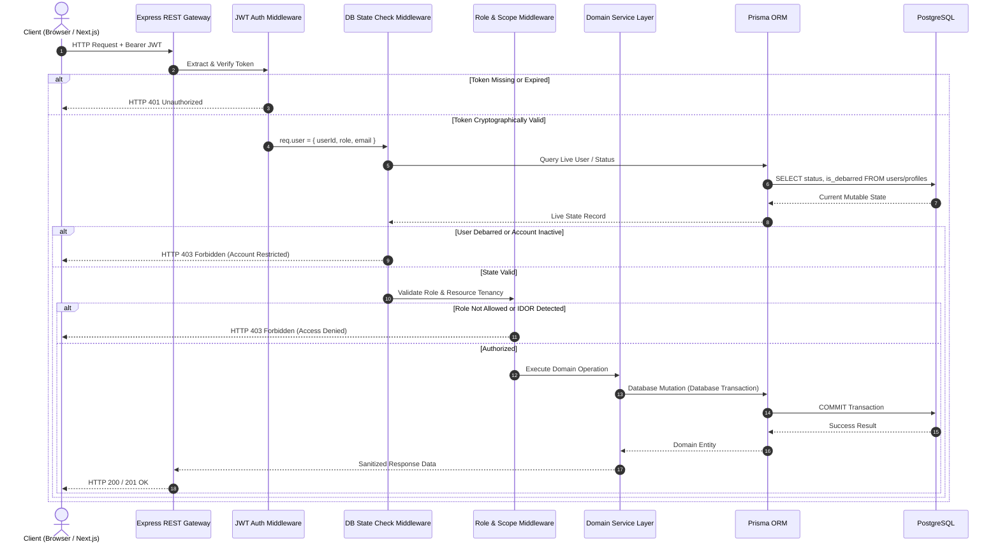

### 7.11 Non-Negotiable Authorization Business Rules
1. **JWT is Not Authoritative for Mutable State:** Debarment, verification, placement, and job status must be checked live against PostgreSQL.
2. **Eligibility is a Pre-Application Gate:** `ELIGIBLE` and `INELIGIBLE` are evaluation outcomes, never application statuses.
3. **`PLACED` is an Institutional Student Status:** It lives on `student_profiles`, never on `job_applications`.
4. **`ACCEPTED` is an Application Lifecycle State:** It lives on `job_applications`, never on `student_profiles`.
5. **Atomic Placement Cascade:** Acceptance of an extended offer engages the institutional placement lock (`placement_status = 'PLACED'`) and cascades other active applications to `AUTO_WITHDRAWN`.
6. **Recruiter Jobs Require TPC Approval:** Recruiter postings must follow `DRAFT` $\rightarrow$ `PENDING_APPROVAL` $\rightarrow$ TPC review $\rightarrow$ `ACTIVE`. If edited in `PENDING_APPROVAL`, they remain `PENDING_APPROVAL` and alert TPC. No additional job status exists.
7. **Strict Student Visibility:** Students can only view and apply to `ACTIVE` job postings whose application deadline has not passed.
8. **Server-Side Enforcement:** Every permission, ownership boundary, and eligibility criterion is enforced server-side.

### 7.12 MVP vs. Future Authentication Scope

| Feature | Phase 1 (MVP) | Phase 2 (V2) | Phase 3 (Future) |
|---|---|---|---|
| **Authentication Standard** | Stateless JWT (HS256) | JWT + Refresh Token Rotation | SAML 2.0 / Campus SSO / OAuth2 |
| **Session Tracking** | Stateless Bearer Tokens | Redis-backed Token Blacklist | Centralized Device & Session Manager |
| **Role Model** | Fixed 3 Roles (`STUDENT`, `RECRUITER`, `TPC_ADMIN`)| Configurable Role Permissions | Multi-tenant Fine-grained RBAC/ABAC |
| **Multi-Factor Auth (MFA)**| Single Factor (Password) | Time-based OTP (TOTP / Authenticator) | Hardware FIDO2 / WebAuthn Keys |
| **Audit Infrastructure** | Relational `audit_logs` table | Partitioned PostgreSQL Audit Tables | Append-Only WORM / Event Ledger |

---

## 8. Data Ownership Boundaries

Institutional security requires that every data entity has an unambiguous owner and strict server-side boundary enforcement:

```
┌─────────────────────────────────────────────────────────────────────────────┐
│                            DATA OWNERSHIP MAP                               │
├──────────────────────┬──────────────────────────────────────────────────────┤
│ Boundary Owner       │ Authoritative Entities Owned                         │
├──────────────────────┼──────────────────────────────────────────────────────┤
│ STUDENT              │ • Student Profile & Academic Details (Editable pre-v)│
│                      │ • Uploaded Resume Files & Extracted Parsed Text      │
│                      │ • Applications submitted by the student              │
│                      │ • Offer Acceptance / Decline decisions               │
├──────────────────────┼──────────────────────────────────────────────────────┤
│ RECRUITER            │ • Recruiter Profile & Company Information            │
│                      │ • Job Postings authored by the organization          │
│                      │ • Candidate Application reviews for authored jobs    │
│                      │ • Interview Schedules for authored jobs              │
│                      │ • Job Offers extended by the organization            │
├──────────────────────┼──────────────────────────────────────────────────────┤
│ TPC ADMIN            │ • Institutional Placement Drives                     │
│                      │ • Job Approval / Rejection decisions                 │
│                      │ • Recruiter Approval / Rejection decisions           │
│                      │ • Student Verification and Debarment flags           │
│                      │ • Placement Policy locks & Override configurations   │
│                      │ • System-wide Audit Logs & Regulatory Export Reports │
└──────────────────────┴──────────────────────────────────────────────────────┘
```

**Rule:** Authorization logic must reside strictly on the server within domain services, never delegated to client-side flags or routing guards.

---

## 9. State Machines & Lifecycle Rules

This section formalizes the authoritative Finite State Machines (FSMs), evaluation gates, lifecycle transitions, and cross-state integrity constraints governing the platform.

### 9.1 Job Posting State Machine
Recruiter-created job postings undergo mandatory administrative governance before becoming discoverable by students.

#### Authoritative Job Statuses:
- `DRAFT`: Posting being authored by recruiter. Invisible to students and TPC review queue.
- `PENDING_APPROVAL`: Recruiter submitted posting for institutional clearance. Visible in TPC Admin review dashboard; strictly invisible to students.
- `ACTIVE`: Approved by TPC Admin (or created directly by TPC Admin). Published in student search feeds and open for applications.
- `REJECTED_BY_TPC`: TPC Admin denied approval with administrative feedback. Invisible to students.
- `CLOSED`: Application deadline reached or closed by recruiter/TPC. No new applications accepted.
- `ARCHIVED`: Finalized historical drive record retained for regulatory accreditation reporting.

#### Allowed Job Transitions:
- `DRAFT` $\rightarrow$ `PENDING_APPROVAL`: Recruiter submits posting for institutional approval.
- `PENDING_APPROVAL` $\rightarrow$ `ACTIVE`: TPC Admin reviews and approves posting.
- `PENDING_APPROVAL` $\rightarrow$ `REJECTED_BY_TPC`: TPC Admin denies posting with feedback.
- `REJECTED_BY_TPC` $\rightarrow$ `DRAFT`: Recruiter reverts rejected posting to draft to amend details and resubmit.
- `ACTIVE` $\rightarrow$ `CLOSED`: Application deadline reached or recruiter/TPC closes the posting.
- `CLOSED` $\rightarrow$ `ARCHIVED`: Placement season concludes; historical drive archived.

#### Strict Job Lifecycle Rules:
1. **Mandatory TPC Approval:** Recruiter-created jobs **MUST NOT** become `ACTIVE` without explicit TPC Admin approval.
2. **Student Isolation:** `PENDING_APPROVAL`, `DRAFT`, and `REJECTED_BY_TPC` postings are completely invisible to students (API queries return `HTTP 404 Not Found`).
3. **Edits in Review:** If a recruiter edits a posting while `status === 'PENDING_APPROVAL'`, it remains strictly `PENDING_APPROVAL`. The system updates `updated_at` and notifies TPC administrators. **No new or intermediate status is ever created.**
4. **TPC Direct Publishing:** TPC Admin may author and publish institutional drives directly as `ACTIVE`.
5. **Application Window:** Students may only view and apply to `ACTIVE` jobs before the `application_deadline`.
6. **Closed Drive Invariant:** `CLOSED` and `ARCHIVED` jobs reject all new application submissions.

```mermaid
stateDiagram-v2
    [*] --> DRAFT : Recruiter authors posting
    [*] --> ACTIVE : TPC Admin creates institutional drive (Directly ACTIVE)
    
    DRAFT --> PENDING_APPROVAL : Recruiter submits for approval
    PENDING_APPROVAL --> PENDING_APPROVAL : Recruiter edits details;\nstatus remains PENDING_APPROVAL;\nupdated_at changes; TPC notified
    
    PENDING_APPROVAL --> ACTIVE : TPC Admin approves
    PENDING_APPROVAL --> REJECTED_BY_TPC : TPC Admin rejects with feedback
    REJECTED_BY_TPC --> DRAFT : Recruiter amends posting

    ACTIVE --> CLOSED : Deadline expires or Recruiter/TPC closes drive
    CLOSED --> ARCHIVED : Drive cycle complete
```

> **Note on Recruiter Edits in Review & TPC Publishing:** When a recruiter edits a posting while in `PENDING_APPROVAL`, it remains strictly `PENDING_APPROVAL` with `updated_at` refreshed and TPC notified (no intermediate or invented status is ever created). TPC Admins possess institutional authority to create drives directly as `ACTIVE`, while recruiter-created jobs strictly require TPC approval before entering `ACTIVE`.

### 9.2 Eligibility State & Verdict Model
Eligibility is architected as an **independent, pre-application evaluation gate**. It is strictly an in-memory evaluation outcome and **NEVER** an application lifecycle status.

#### Evaluation Outcomes:
- `ELIGIBLE`: Student satisfies all institutional and job-specific criteria. Application submission is permitted.
- `INELIGIBLE`: Student fails one or more criteria. Application creation is blocked at the boundary.

#### Evaluated Live Relational State:
The Eligibility Engine evaluates current authoritative PostgreSQL rows at the instant of evaluation:
1. **Student Verification Status:** `student_profiles.verification_status === 'VERIFIED'`
2. **Debarment Status:** `student_profiles.is_debarred === false`
3. **Placement Policy Lock:** `student_profiles.placement_status === 'UNPLACED'` (unless `placement_policy_exempt === true`)
4. **Academic CGPA:** `student_profiles.cgpa >= job_postings.min_cgpa`
5. **Backlog Ceiling:** `student_profiles.active_backlogs <= job_postings.max_active_backlogs`
6. **Department / Branch:** `student_profiles.department IN job_postings.eligible_departments`
7. **Graduation Year:** `student_profiles.graduation_year === job_postings.target_graduation_year`
8. **10th Percentage:** `student_profiles.tenth_percentage >= job_postings.min_tenth_percentage`
9. **12th Percentage:** `student_profiles.twelfth_percentage >= job_postings.min_twelfth_percentage`
10. **Job-Specific Criteria:** Drive deadline unexpired (`application_deadline > now()`) and job status is `ACTIVE`.

#### Strict Eligibility Rules:
1. **Zero Persistence on Ineligibility:** An ineligible attempt creates **ZERO** database rows in `job_applications`.
2. **Mandatory Server-Side Re-evaluation:** Client-side eligibility indicators are UX conveniences only. The server unconditionally re-evaluates all eligibility rules inside the database transaction before application creation.
3. **JWT Is Not Authoritative:** JWT claims must never be trusted for eligibility decisions.

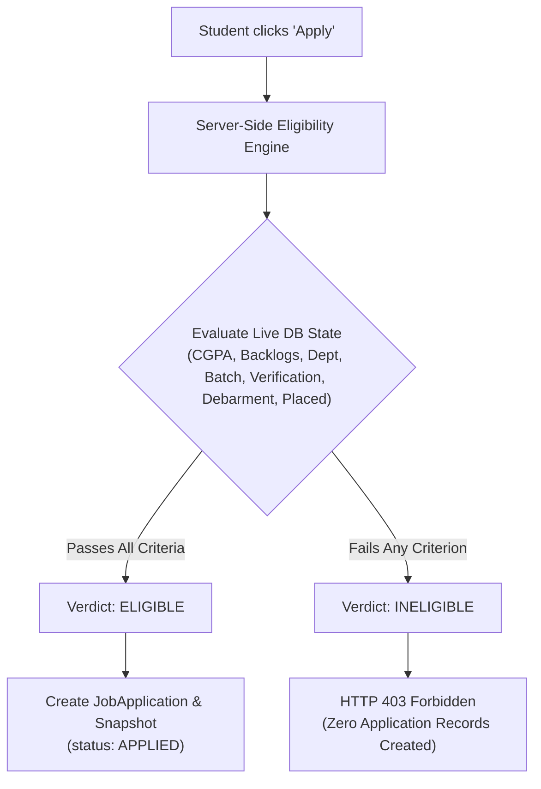

### 9.3 Application State Machine
Every candidate application progresses through a strict, deterministic Finite State Machine (FSM).

#### Authoritative Application Statuses:
- `APPLIED`: Application created and immutable point-in-time snapshot committed.
- `ATS_SHORTLISTED`: Recruiter or system advances applicant based on ATS match score or review.
- `INTERVIEW_SCHEDULED`: Candidate allocated to one or more interview rounds.
- `OFFER_EXTENDED`: Formal corporate job/internship offer extended to candidate.
- `ACCEPTED`: Candidate formally accepted the offer. (**Terminal Success State**).
- `REJECTED`: Candidate screened out or disqualified. (**Terminal State**).
- `WITHDRAWN`: Candidate voluntarily retracted application prior to offer. (**Terminal State**).
- `DECLINED`: Candidate formally declined an extended offer. (**Terminal State**).
- `AUTO_WITHDRAWN`: System cascaded withdrawal due to placement policy lock. (**Terminal State**).

#### Allowed Application Transitions:
- `APPLIED` $\rightarrow$ `ATS_SHORTLISTED`
- `APPLIED` $\rightarrow$ `REJECTED`
- `APPLIED` $\rightarrow$ `WITHDRAWN`
- `APPLIED` $\rightarrow$ `AUTO_WITHDRAWN`
- `ATS_SHORTLISTED` $\rightarrow$ `INTERVIEW_SCHEDULED`
- `ATS_SHORTLISTED` $\rightarrow$ `REJECTED`
- `ATS_SHORTLISTED` $\rightarrow$ `WITHDRAWN`
- `ATS_SHORTLISTED` $\rightarrow$ `AUTO_WITHDRAWN`
- `INTERVIEW_SCHEDULED` $\rightarrow$ `OFFER_EXTENDED`
- `INTERVIEW_SCHEDULED` $\rightarrow$ `REJECTED`
- `INTERVIEW_SCHEDULED` $\rightarrow$ `AUTO_WITHDRAWN`
- `OFFER_EXTENDED` $\rightarrow$ `ACCEPTED`
- `OFFER_EXTENDED` $\rightarrow$ `DECLINED`

#### Application State Machine Rules:
1. **`PLACED` is Never an Application Status:** The terminal success status is strictly `ACCEPTED`.
2. **Transition Validation:** Arbitrary status jumps (e.g., `APPLIED` $\rightarrow$ `ACCEPTED` or `REJECTED` $\rightarrow$ `OFFER_EXTENDED`) are rejected server-side with `HTTP 409 Conflict`.
3. **Stage History Tracking:** Every transition inserts a row into `application_stage_histories`. Initial creation records `from_status: NULL` $\rightarrow$ `to_status: 'APPLIED'`. Subsequent transitions record actual previous and next states.

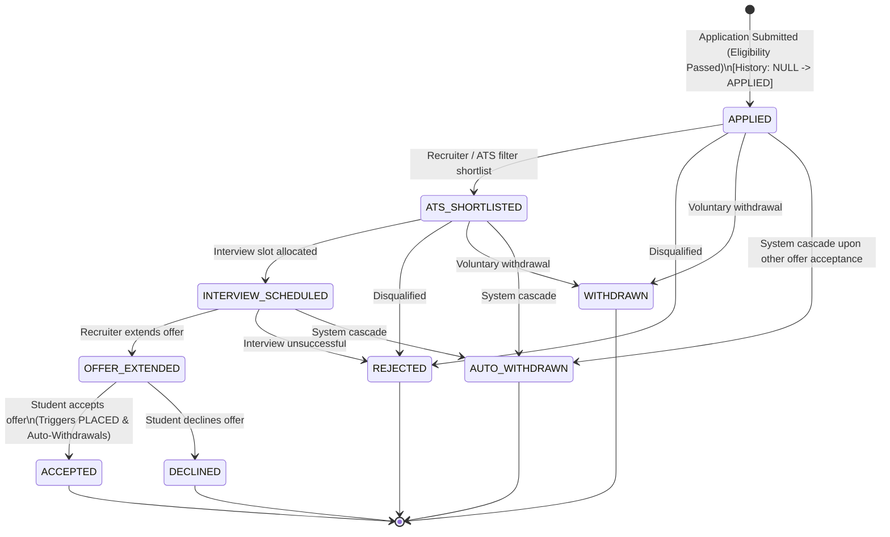

### 9.4 Student Placement Status & Policy Cascade
Student placement status tracks institutional standing across the placement season and is modeled independently from individual application states.

#### Authoritative Placement Statuses:
- `UNPLACED`: Student has not accepted any job offer. Eligible to participate in placement drives.
- `PLACED`: Student has accepted an institutional offer. Placement lock engaged.

#### Transactional Placement Cascade:
When a student accepts an offer, multi-entity operations must execute within a single atomic PostgreSQL transaction through the selected ORM transaction mechanism:
1. Transition target application to `ACCEPTED`.
2. Update `student_profiles.placement_status = 'PLACED'`.
3. Query all other active applications for the student (`APPLIED`, `ATS_SHORTLISTED`, `INTERVIEW_SCHEDULED`) and cascade status to `AUTO_WITHDRAWN`.
4. Cancel all upcoming interview slots associated with auto-withdrawn applications.
5. Create an immutable `placement_records` entry.
6. Emit audit log events and notifications to affected recruiters.

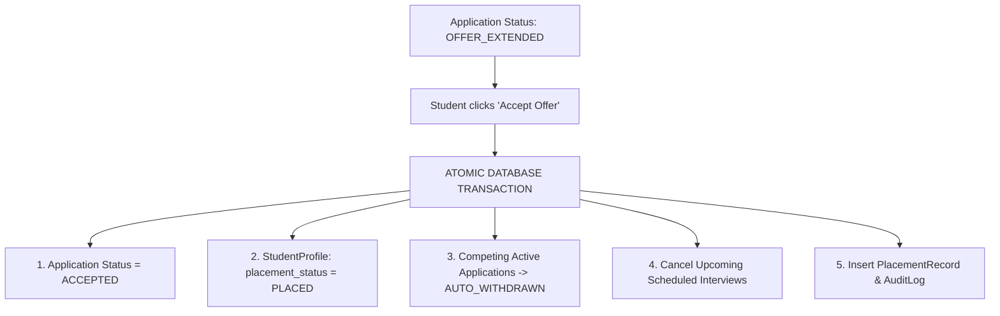

### 9.5 Interview Lifecycle Architecture
Interview management is associated with an active application in `INTERVIEW_SCHEDULED` status.

#### Authoritative Interview Statuses:
- `SCHEDULED`: Interview session confirmed with candidate and panel.
- `COMPLETED`: Interview conducted and interviewer feedback logged.
- `CANCELLED`: Interview cancelled (due to candidate withdrawal, offer acceptance elsewhere, or panel unavailability).
- `RESCHEDULED`: Interview slot modified to a new time window.

#### Interview Lifecycle Rules:
1. **Application Correlation:** An application reaches `INTERVIEW_SCHEDULED` when at least one interview round is in `SCHEDULED` status.
2. **Audit Preservation:** Rescheduling preserves historical interview time windows in `audit_logs`.
3. **Decoupled States:** Cancelling a single interview round does not automatically disqualify or reject the application. Application state transitions and interview state transitions are strictly separate.
4. **No Invented Statuses:** The interview lifecycle is strictly limited to `SCHEDULED`, `COMPLETED`, `CANCELLED`, and `RESCHEDULED`.

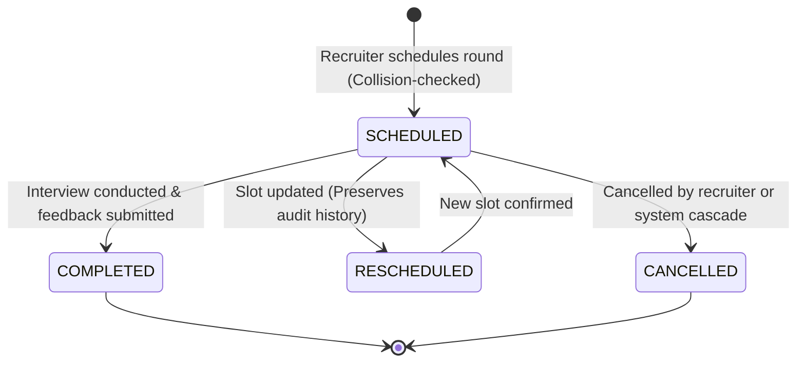

### 9.6 Offer Lifecycle Architecture
Formal employment proposals have their own lifecycle, linked to an application in `OFFER_EXTENDED` status.

#### Authoritative Offer Statuses:
- `EXTENDED`: Offer issued by recruiter with compensation details and deadline.
- `ACCEPTED`: Student accepted offer (triggers application `ACCEPTED` and student `PLACED`).
- `DECLINED`: Student turned down offer (application transitions to `DECLINED`, student remains `UNPLACED`).
- `WITHDRAWN`: Recruiter retracts the offer before the candidate responds.

#### Offer Lifecycle Rules:
1. **State Correlation:** `OFFER_EXTENDED` is the application lifecycle state indicating that an offer in `EXTENDED` status has been issued.
2. **Offer Decisions:** `ACCEPTED` and `DECLINED` are candidate offer decisions and synchronize directly with application state machine transitions (`OFFER_EXTENDED` $\rightarrow$ `ACCEPTED`, `OFFER_EXTENDED` $\rightarrow$ `DECLINED`).
3. **Offer Entity Separation on Recruiter Withdrawal:** `EXTENDED` $\rightarrow$ `WITHDRAWN` indicates that the recruiter retracted the offer before candidate decision. The `JobOffer` entity records status `WITHDRAWN`.
4. **No Undocumented Application FSM Mutations:** The Application FSM must not automatically transition to an undocumented state. The MVP architecture does not define an automatic Application status transition caused by recruiter offer withdrawal (the Application FSM strictly defines transitions only from `OFFER_EXTENDED` to `ACCEPTED` or `DECLINED`). Any future workflow for handling recruiter-withdrawn offers after extension must be explicitly designed as a future state-machine enhancement rather than implied by the MVP.
5. **Placement Trigger:** Offer acceptance triggers the atomic placement policy transaction.
6. **No `PLACED` on Offer:** `PLACED` is never an offer status.

```mermaid
stateDiagram-v2
    [*] --> EXTENDED : Recruiter extends offer to candidate
    EXTENDED --> ACCEPTED : Student accepts offer\n(Triggers atomic placement cascade)
    EXTENDED --> DECLINED : Student declines offer\n(Student remains UNPLACED)
    EXTENDED --> WITHDRAWN : Recruiter retracts offer before candidate decision\n(Recorded on Offer entity; no undocumented Application FSM jump)
    ACCEPTED --> [*]
    DECLINED --> [*]
    WITHDRAWN --> [*]
```

### 9.7 Cross-State Invariants
The system strictly enforces 12 non-negotiable cross-state invariants at the database transaction layer:

1. **Job Approval Invariant:** Recruiter-created jobs cannot enter `ACTIVE` without explicit TPC Admin approval.
2. **Student Visibility Invariant:** Students can strictly only view and query jobs in `ACTIVE` status.
3. **Eligibility Gate Invariant:** Eligibility is an independent pre-application evaluation; `ELIGIBLE` and `INELIGIBLE` are never stored as application statuses.
4. **Initial Application Invariant:** Every application record is created strictly in `APPLIED` status.
5. **Application Transition Invariant:** Only explicitly permitted state transitions in Section 9.3 are valid; arbitrary status jumps are rejected.
6. **Placement State Invariant:** `PLACED` is an institutional state on `student_profiles`, never an application lifecycle state.
7. **Acceptance Invariant:** An application enters `ACCEPTED` if and only if the student accepts an active `EXTENDED` offer.
8. **Snapshot Immutability Invariant:** Once an application is submitted, its `ApplicationSnapshot` is permanently immutable.
9. **Audit Invariant:** All security, governance, and state changes produce append-only audit records (`application_stage_histories`, `audit_logs`).
10. **Authoritative State Invariant:** Authorization and state decisions unconditionally query live PostgreSQL state rather than trusting client payloads or JWT claims.
11. **Transaction Atomicity Invariant:** Multi-entity operations (e.g., offer acceptance, placement locking, and cascading auto-withdrawals) must execute within a single atomic PostgreSQL transaction through the selected ORM transaction mechanism.
12. **Terminal State Invariant:** Terminal application states (`ACCEPTED`, `REJECTED`, `WITHDRAWN`, `DECLINED`, `AUTO_WITHDRAWN`) cannot transition to any other application state.

### 9.8 State Transition Authorization Matrix

| Action / State Transition | Authorized Actor | Server-Side Validation Gates | Authoritative Data Source |
| :--- | :---: | :--- | :--- |
| **`DRAFT` $\rightarrow$ `PENDING_APPROVAL`** | `RECRUITER` | Recruiter owns posting; all mandatory fields populated | PostgreSQL `job_postings`, `recruiter_profiles` |
| **`PENDING_APPROVAL` $\rightarrow$ `ACTIVE`** | `TPC_ADMIN` | Target job is in `PENDING_APPROVAL`; actor has `TPC_ADMIN` role | PostgreSQL `job_postings`, `users` |
| **`PENDING_APPROVAL` $\rightarrow$ `REJECTED_BY_TPC`**| `TPC_ADMIN` | Target job is in `PENDING_APPROVAL`; rejection reason supplied | PostgreSQL `job_postings` |
| **`REJECTED_BY_TPC` $\rightarrow$ `DRAFT`** | `RECRUITER` | Recruiter owns posting; reverts to draft for edits | PostgreSQL `job_postings`, `recruiter_profiles` |
| **`NULL` $\rightarrow$ `APPLIED`** | `STUDENT` | Job is `ACTIVE`; deadline unexpired; student passes eligibility gate | PostgreSQL `student_profiles`, `job_postings` |
| **`APPLIED` $\rightarrow$ `ATS_SHORTLISTED`** | `RECRUITER`, `TPC_ADMIN` | Recruiter owns drive; application is in `APPLIED` | PostgreSQL `job_applications`, `job_postings` |
| **`ATS_SHORTLISTED` $\rightarrow$ `INTERVIEW_SCHEDULED`**| `RECRUITER`, `TPC_ADMIN` | Recruiter owns drive; interview slot collision-free | PostgreSQL `interviews`, `job_applications` |
| **`INTERVIEW_SCHEDULED` $\rightarrow$ `OFFER_EXTENDED`** | `RECRUITER`, `TPC_ADMIN` | Recruiter owns drive; compensation and deadline provided | PostgreSQL `job_offers`, `job_applications` |
| **`OFFER_EXTENDED` $\rightarrow$ `ACCEPTED`** | `STUDENT` | Student owns application; offer validity unexpired | PostgreSQL `job_offers`, `student_profiles` |
| **`OFFER_EXTENDED` $\rightarrow$ `DECLINED`** | `STUDENT` | Student owns application; offer validity unexpired | PostgreSQL `job_offers`, `job_applications` |
| **`APPLIED` / `ATS_SHORTLISTED` $\rightarrow$ `WITHDRAWN`**| `STUDENT` | Student owns application; application not yet in interview/offer | PostgreSQL `job_applications` |
| **Active Applications $\rightarrow$ `AUTO_WITHDRAWN`** | `SYSTEM` | Triggered atomically upon student accepting another offer | PostgreSQL `student_profiles`, `job_applications` |

### 9.9 Invalid State Transitions & Rejection Model
The API rejects invalid state transitions deterministically:

| Attempted Transition | Rejection Reason | HTTP Status Code |
| :--- | :--- | :---: |
| `DRAFT` $\rightarrow$ `ACTIVE` | Recruiter attempting to bypass TPC approval | `403 Forbidden` |
| `APPLIED` $\rightarrow$ `ACCEPTED` | Skipping shortlisting, interview, and offer stages | `409 Conflict` |
| `APPLIED` $\rightarrow$ `OFFER_EXTENDED` | Extending offer without interview scheduling | `409 Conflict` |
| `REJECTED` $\rightarrow$ `OFFER_EXTENDED` | Attempting to extend offer to disqualified candidate | `409 Conflict` |
| `ACCEPTED` $\rightarrow$ `APPLIED` | Attempting to reverse terminal success state | `409 Conflict` |
| `PLACED` $\rightarrow$ Application Status | `PLACED` is a student institutional state, not application status | `422 Unprocessable Entity` |
| `ELIGIBLE` $\rightarrow$ Application Status | `ELIGIBLE` is an evaluation verdict, not application status | `422 Unprocessable Entity` |
| `INELIGIBLE` $\rightarrow$ Application Status | Ineligible attempts are blocked; zero applications created | `422 Unprocessable Entity` |

### 9.10 State Machine Horizons: MVP vs. Future Scope

| Capability | Phase 1 (MVP) | Phase 2 (V2) | Phase 3 (Future) |
| :--- | :--- | :--- | :--- |
| **State Machine Execution** | In-process Express Service Logic | Workflow middleware guards | Event-driven State Machine (XState / Temporal) |
| **Transition Persistence** | Relational `application_stage_histories` | BullMQ Event Worker logging | Full Event Sourcing (CQRS Event Store) |
| **Placement Policy Rules** | Strict "One Student, One Job" | Dream Company / Tier Upgrade | Multi-tier Dynamic Institutional Policy Engine |
| **Interview Coordination** | Collision-checked PostgreSQL slots | Google/Outlook Calendar 2-way sync | Distributed Real-time Panel Scheduler |

---

## 10. Eligibility Architecture (Pre-Application Gate)

Eligibility is architected as an **independent, pre-application evaluation gate**. It is never modeled as an application lifecycle stage.

```
Student Clicks "Apply"
         │
         ▼
┌────────────────────────────────────────────────────────┐
│               ELIGIBILITY ENGINE SERVICE               │
│                                                        │
│  Queries Live PostgreSQL Database:                    │
│  1. Academic Verification: is_verified == true         │
│  2. Debarment Check: is_debarred == false              │
│  3. Placement Policy: placement_status != 'PLACED'     │
│  4. Academic CGPA: student.cgpa >= job.min_cgpa        │
│  5. Backlogs: student.active_backlogs <= job.max_backlogs│
│  6. Department Whitelist: student.dept in job.branches │
│  7. Batch Match: student.grad_year == job.grad_year    │
│  8. 10th / 12th Thresholds: min percentages satisfied  │
└────────────────────────────────────────────────────────┘
         │
         ├─── Fails Any Rule ────> Return HTTP 403 Forbidden
         │                         [ INELIGIBLE + Detailed Reasons List ]
         │                         (Zero Application Record Created)
         │
         └─── Passes All Rules ──> Return Verdict: ELIGIBLE
                                   │
                                   ▼
                         Proceed to Application
                          Snapshot & Submission
```

### 10.1 Key Architectural Rules
1. **Zero Persistence for Ineligibility:** Ineligible application attempts are rejected at the boundary; they do not create "Ineligible Application" records in the database.
2. **Current DB State Only:** All checks run against live relational data, never stale cached tokens or client submissions.
3. **Structured Failure Reporting:** When eligibility fails, the API returns a deterministic payload detailing the exact failure criteria (e.g., `{"criteria": "CGPA", "required": 8.0, "actual": 7.4}`) enabling transparent student UI feedback.

---

## 11. Application Lifecycle Architecture

The application domain manages candidate progression through a strict, deterministic Finite State Machine (FSM).

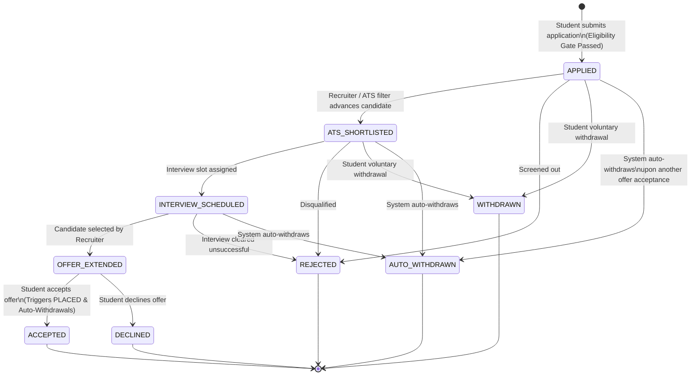

### 11.1 Allowed Application Lifecycle States
- `APPLIED`: Application created and initial snapshot saved.
- `ATS_SHORTLISTED`: Recruiter or system advances applicant based on match score or profile review.
- `INTERVIEW_SCHEDULED`: Candidate allocated to one or more interview rounds.
- `OFFER_EXTENDED`: Formal job/internship offer made to the candidate.
- `ACCEPTED`: Candidate formally accepted the offer. (Terminal Success State).
- `REJECTED`: Candidate screened out or failed interview rounds. (Terminal State).
- `WITHDRAWN`: Candidate voluntarily retracted their application prior to offer. (Terminal State).
- `DECLINED`: Candidate formally turned down an extended offer. (Terminal State).
- `AUTO_WITHDRAWN`: System cascaded withdrawal due to placement policy enforcement. (Terminal State).

### 11.2 Application Status vs. Student Placement Status
- **Application Status (`JobApplication.status`):** Tracks the progress of a specific application for a specific job posting. Valid terminal success state is `ACCEPTED`.
- **Student Placement Status (`StudentProfile.placement_status`):** Tracks the institutional status of the student account across the entire campus placement season (`UNPLACED` or `PLACED`).
- **Rule:** An application status is NEVER `PLACED`. A student profile status is NEVER `ACCEPTED`.

### 11.3 Invalid Transition Guarding
Any API call attempting an invalid transition (such as jumping directly from `APPLIED` to `ACCEPTED`, or transitioning a `REJECTED` application to `OFFER_EXTENDED`) is rejected with `HTTP 409 Conflict` or `HTTP 422 Unprocessable Entity`.

---

## 12. Application Snapshot Architecture

When a student applies for a job, institutional integrity requires an **immutable historical record** of the student's credentials at the exact moment of application.

### 12.1 The Rationale for Snapshots
If a student applies to Company X in September with a CGPA of 8.2 and Resume Version 1, and subsequently in December updates their profile to CGPA 8.5 with Resume Version 2, Company X's compliance audit trail must reflect the exact data that was evaluated when the application was reviewed.

### 12.2 Snapshot Payload Composition
At the instant the application transaction commits, an immutable snapshot is permanently attached to the `JobApplication` record containing:
- **Student Profile Snapshot**: `student_name`, `roll_number`, `institutional_email`, `department`, `graduation_year`.
- **Evaluated Academic Metrics**: `cgpa`, `active_backlogs`, `tenth_percentage`, `twelfth_percentage`.
- **Resume & ATS Snapshot**: Reference to `resume_id`, raw resume text as parsed at submission, deterministic ATS score, matched skills list, and missing skills list.
- **Job-Side Frozen Metadata**: `job_title_snapshot`, `company_name_snapshot`, `job_description_snapshot`, `ctc_snapshot`, and `stipend_snapshot` (ensuring that subsequent post-submission job edits do not alter the contractual terms and job context under which the student applied).

Modifications to the student's active profile or subsequent edits to the job posting never mutate existing historical snapshots.

---

## 13. Resume Architecture

```
Student Uploads File (Multipart/form-data)
                 │
                 ▼
┌────────────────────────────────────────────────────────┐
│            UPLOAD VALIDATION & SECURITY GATE           │
│                                                        │
│  1. Content-Type Check: application/pdf                │
│  2. File Extension Check: .pdf                         │
│  3. File Size Limit: <= 5 MB                           │
│  4. Magic-Byte Header Verification: '%PDF-' (0x25504446)│
└────────────────────────────────────────────────────────┘
                 │
                 ▼
┌────────────────────────────────────────────────────────┐
│          PRIVATE STORAGE ABSTRACTION SUBSYSTEM         │
│                                                        │
│  Generates UUID-based path:                            │
│  uploads/resumes/{student_id}/{uuid}.pdf               │
│  (Stored outside public web root; zero direct URL)     │
└────────────────────────────────────────────────────────┘
                 │
                 ▼
┌────────────────────────────────────────────────────────┐
│               IN-MEMORY PDF TEXT PARSER                │
│                                                        │
│  1. Extracts unicode text streams                      │
│  2. Normalizes whitespace, removes control characters   │
│  3. Caches sanitized raw text in database for ATS       │
└────────────────────────────────────────────────────────┘
```

### 13.1 Validation & Security Controls
1. **File Size Limit:** Strictly capped at 5 MB.
2. **Magic-Byte Header Validation:** The file header is read for the magic byte sequence `%PDF-` (`0x25 0x50 0x44 0x46`). Files claiming to be PDFs with modified extensions are rejected.
3. **Private File Storage:** Resumes are never placed in a publicly accessible web root (e.g., `public/` directory). They are written to a protected volume or private S3 bucket.
4. **Access Control:** Resume downloads are routed through an authenticated Express endpoint that verifies whether the requester is the resume owner, a recruiter reviewing an active applicant, or a TPC Admin.

---

## 14. Deterministic ATS Architecture (Auto-Resume Matcher)

The MVP Auto-Resume Matcher is designed to be **100% deterministic, mathematically verifiable, reproducible, and explainable**. It operates exclusively using set-theoretic **Jaccard Similarity** on normalized lexical token sets, containing zero stochastic algorithms, fuzzy matching, embeddings, or neural network inference.

---

### 14.1 ATS Scope & Conceptual Foundations
The MVP ATS evaluates the degree of lexical alignment between:
- **Set $A$:** Normalized resume skill/token set extracted from the candidate's uploaded resume PDF.
- **Set $B$:** Normalized job requirement skill/token set extracted from the job posting's description and required skills.

$$\text{Jaccard Similarity } J(A, B) = \frac{|A \cap B|}{|A \cup B|}$$

#### Score Range & Scale Semantics:
$$0.0 \le \text{Score} \le 1.0 \quad (0.0\% \le \text{Score} \le 100.0\%)$$
- **Score = 0.0 (0.0%):** Disjoint sets with zero shared normalized tokens ($|A \cap B| = 0$).
- **Score = 1.0 (100.0%):** Identical normalized token sets ($A = B$).
- **Intermediate Values ($0.0 < \text{Score} < 1.0$):** Represent the exact mathematical proportion of shared tokens relative to the total union of unique tokens across both sets.
- **Zero-Union Boundary Condition:** If both normalized sets are completely empty ($|A \cup B| = 0$), the ATS score is defined strictly as **`0.0`** (0.0%). The system does not invent arbitrary fallback values or divide-by-zero exceptions.

---

### 14.2 End-to-End ATS Pipeline & Data Flow

```
Resume PDF
   │
   ▼
Private File Storage Abstraction
   │
   ▼
PDF Parser Engine
   │
   ▼
Extracted Resume Text
   │
   ▼
Text Normalization (Lowercase, clean punctuation, whitespace)
   │
   ▼
Canonical Alias Preprocessing (Deterministic vocabulary mapping)
   │
   ▼
Resume Token/Skill Set (A)
   │
   ├───────────────────────────────┐
   │                               │
   ▼                               ▼
Job Description & Required Skills  Jaccard Similarity Calculation
   │                               J(A, B) = |A ∩ B| / |A ∪ B|
   ▼                               │
Text Normalization                 ▼
   │                               ATS Score (0.0 .. 1.0)
   ▼                               │
Canonical Alias Preprocessing      ▼
   │                               Persist ATS Result & Point-in-Time Snapshot
   ▼                               │
Job Token/Skill Set (B)            ▼
   │                               Explainable Match Details
   └───────────────────────────────┘ (Matched Skills, Missing Skills)
```

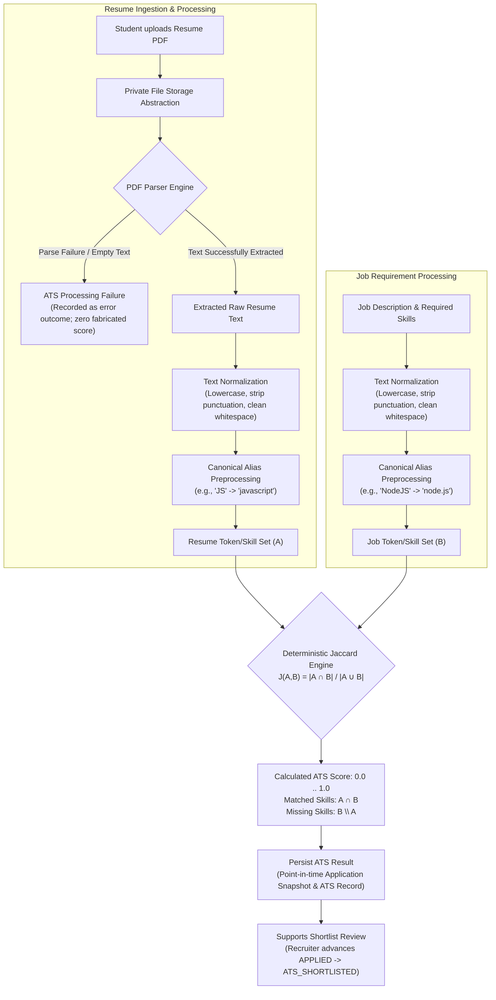

---

### 14.3 Resume PDF Ingestion & Text Processing
The conceptual responsibilities of the resume ingestion pipeline are strictly sequential:
1. **Candidate Upload:** The student uploads a resume in PDF format (`<= 5 MB`, magic-byte verified).
2. **Private Storage Isolation:** The raw file is securely persisted via the private file-storage abstraction at an isolated UUID-named storage path. Resume files are private and must **never** become publicly accessible on the web.
3. **Stream Parsing:** The PDF parser extracts raw Unicode textual streams from the document.
4. **Deterministic Normalization:** The extracted textual stream is passed through deterministic normalization routines.
5. **Canonical Alias Mapping:** Synonymous expressions are translated into uniform canonical tokens during preprocessing.
6. **Token Set Construction:** Normalized tokens are converted into a unique mathematical set $A$.
7. **Jaccard Evaluation:** The ATS engine evaluates set $A$ against the target job's normalized requirement set $B$.

---

### 14.4 PDF Parsing Failure & Anomaly Handling
In real-world deployment, PDF files may be malformed, corrupted, password-protected, non-textual (e.g., scanned bitmap images without OCR), or empty.

#### Strict Architectural Rules for Parsing Anomalies:
1. **Zero Fabricated Scores:** The ATS engine **MUST NOT** silently generate a default, arbitrary, or misleading score when text extraction fails. Fabricating a match score undermines institutional trust and auditability.
2. **Explicit Processing Failure State:** When a parser exception occurs or extracted text is empty/unusable, the system records an explicit **ATS processing failure outcome** on the evaluation record.
3. **Decoupling from Application FSM:** Parsing failure is an **ATS processing outcome**, NOT an Application lifecycle status. It does **not** mutate the application to an invented state (e.g., `ATS_FAILED`, `PARSING_ERROR` do not exist).
4. **Application FSM Integrity:** The candidate's `JobApplication.status` remains strictly in its authoritative lifecycle state (`APPLIED`). Recruiters and administrators can view the processing failure note in the review dashboard and inspect the original PDF directly.

---

### 14.5 Deterministic Text Normalization
Text normalization converts unformatted textual streams into uniform, comparable tokens through deterministic string manipulations:
- **Case Normalization:** Conversion of all characters to lowercase (e.g., `"Python"` $\rightarrow$ `"python"`).
- **Punctuation Normalization & Stripping:** Stripping extraneous delimiters, brackets, and typographic marks while preserving domain-critical dots/symbols defined in technical aliases (e.g., `"node.js"`, `"c++"`).
- **Whitespace Normalization:** Collapsing contiguous spaces, tabs, and newline control sequences into single space separators.
- **Token Normalization:** Splitting sanitized text into discrete lexical tokens.

**Excluded from MVP Normalization:** Zero fuzzy matching, zero phonetic matching (Soundex/Metaphone), zero semantic embeddings, zero LLM-based rephrasing, and zero frequency weighting.

---

### 14.6 Canonical Alias Preprocessing
Technical skills and tools frequently appear in varied orthographic forms across candidate resumes and job postings. Canonical alias mapping resolves these variations deterministically during preprocessing:

| Raw Input Variant | Canonical Normalized Token |
| :--- | :--- |
| `"JS"`, `"JavaScript"`, `"Javascript"` | `"javascript"` |
| `"NodeJS"`, `"Node.JS"`, `"node"` | `"node.js"` |
| `"ReactJS"`, `"React.js"`, `"React"` | `"react"` |
| `"Postgres"`, `"PostgreSQL"`, `"pgsql"` | `"postgresql"` |
| `"AWS"`, `"Amazon Web Services"` | `"amazon web services"` |
| `"Mongo"`, `"MongoDB"` | `"mongodb"` |
| `"K8s"`, `"Kubernetes"` | `"kubernetes"` |
| `"TS"`, `"TypeScript"` | `"typescript"` |

#### Critical Rules on Aliases:
- **Preprocessing Only:** Alias mapping occurs strictly before mathematical set construction.
- **Zero Weighting:** Canonical aliases do **not** assign differential weights or importance scores. Every recognized alias maps to a single canonical token with identical set membership value.
- **No Fuzzy Matching:** An input token must match an exact dictionary entry; approximate or edit-distance matches are prohibited.

---

### 14.7 Job-Side ATS Input Specification
The comparison target is derived strictly from the job posting's authoritative textual requirements:
- `job_postings.job_description`: Primary textual overview of the role and responsibilities.
- `job_postings.required_skills`: Explicit array of required technical skills and competencies.

#### Non-Negotiable Scoping Rules:
1. **No Extraneous Scoring Inputs:** The ATS matcher must **never** ingest non-textual candidate or company attributes, including company reputation, CTC/salary, candidate CGPA, college/branch name, years of experience weighting, or priority flags.
2. **Absolute Separation from Eligibility:** Eligibility is a **separate architectural engine** evaluated prior to application creation. ATS similarity is an informative matching score and **must not** become an eligibility rule.

---

### 14.8 Jaccard Similarity Mathematical Calculation

#### Set-Theoretic Formulation:
$$J(A, B) = \frac{|A \cap B|}{|A \cup B|}$$
Where:
- $A$ is the normalized unique token set of the candidate resume.
- $B$ is the normalized unique token set of the job posting requirements.
- **Intersection ($A \cap B$):** The set of unique canonical tokens present in **both** the resume and the job requirement.
- **Union ($A \cup B$):** The set of all unique canonical tokens present in **either** the resume, the job requirement, or both.

#### Set Deduplication Invariant:
Because Jaccard operates on mathematical **sets**, duplicate token occurrences do not alter set cardinality ($|A|$). Mentioning `"react"` ten times in a resume produces the exact same set element as mentioning it once. Word frequency, term density, and TF-IDF weighting are **strictly excluded** from the MVP.

#### Deterministic Worked Example:
- **Normalized Candidate Resume Set ($A$):**
  $$A = \{\text{javascript, react, node.js, mongodb}\}$$
- **Normalized Job Requirement Set ($B$):**
  $$B = \{\text{javascript, react, node.js, express}\}$$
- **Intersection ($A \cap B$):**
  $$A \cap B = \{\text{javascript, react, node.js}\} \implies |A \cap B| = 3$$
- **Union ($A \cup B$):**
  $$A \cup B = \{\text{javascript, react, node.js, mongodb, express}\} \implies |A \cup B| = 5$$
- **Deterministic ATS Score:**
  $$J(A, B) = \frac{3}{5} = 0.60 \quad (60.00\%)$$
- **Explainable Breakdown:**
  - **Matched Skills:** `["javascript", "react", "node.js"]`
  - **Missing Skills ($B \setminus A$):** `["express"]`

---

### 14.9 Score Semantics & Interpretability
The ATS score is strictly a **lexical overlap metric** between two document representations.

#### Architectural Bounds on Interpretation:
- **What the Score Is:** A deterministic, explainable measurement of the proportion of required job skills present in the applicant's resume.
- **What the Score Is NOT:** The score does **not** evaluate candidate quality, seniority, intellectual capacity, cultural fit, career trajectory, soft skills, or interview competence.
- **Zero AI / LLM Judgment:** The ATS engine makes no qualitative judgments and uses zero black-box neural models.

---

### 14.10 ATS Shortlisting Threshold Policy
To maintain architectural discipline without pre-empting institutional recruitment policies:

> **"The MVP architecture does not hard-code an ATS threshold at this stage. Any threshold used for ATS shortlist decisions will be defined explicitly during implementation and documented before being treated as an authoritative business rule."**

No arbitrary thresholds (such as 0.5, 0.6, 70%) are hardcoded into the architecture or database schema. Recruiters view the ranked scores and matched/missing skill breakdowns to inform their administrative shortlisting decisions.

---

### 14.11 ATS Result Persistence & Historical Auditability
ATS evaluation outputs are permanently persisted in relational storage (`ats_scores` table and `ApplicationSnapshot`) to fulfill five critical institutional requirements:
1. **Score Visibility:** Displaying match percentage and matched/missing skill chips on recruiter and student dashboards.
2. **Shortlist Decisions:** Providing verifiable data for recruiters advancing candidates to interview rounds.
3. **Auditability & Explainability:** Providing complete audit trails for placement accreditation reviews.
4. **Institutional Analytics:** Generating aggregate recruitment drive reports.
5. **Reproducibility:** Ensuring that any historical evaluation can be mathematically re-verified.

**Immutability Rule:** Persisting ATS outputs must never overwrite or mutate the point-in-time `ApplicationSnapshot` created during application submission.

---

### 14.12 ATS Interaction with Application Lifecycle
The ATS engine integrates with the authoritative Application Finite State Machine (FSM) strictly as an **informational decision-support subsystem**:

1. **Initial Creation:** The student submits an application; the application transitions `NULL` $\rightarrow$ `APPLIED`.
2. **ATS Evaluation:** The ATS engine evaluates the application and persists the score and breakdown.
3. **Shortlist Advancement:** The recruiter (or automated drive policy) reviews the ATS score and explicitly transitions the application:
   $$\text{APPLIED} \longrightarrow \text{ATS\_SHORTLISTED}$$
4. **Zero Invented Application States:** The system **MUST NOT** invent intermediate Application statuses (e.g., `ATS_PROCESSING`, `ATS_FAILED`, `MATCHED`, `SHORTLIST_PENDING` do not exist). Parsing or processing issues remain internal ATS result states, leaving `JobApplication.status` cleanly in `APPLIED`.

---

### 14.13 Decoupling: ATS Matching vs. Eligibility Evaluation
The platform maintains an absolute separation of concerns between Eligibility and ATS Matching:

| Dimension | Eligibility Engine (Section 10) | ATS Matcher Engine (Section 14) |
| :--- | :--- | :--- |
| **Fundamental Question** | *"Is this student legally and academically permitted to apply?"* | *"How much normalized textual overlap exists between this resume and the job requirements?"* |
| **Execution Timing** | Pre-application gate (evaluated **before** application record creation) | Post-submission processing (evaluated upon or immediately following submission) |
| **Authoritative Data Sources** | Live PostgreSQL profile: CGPA, backlogs, department, batch, debarment, placement status | Document text: Extracted resume text vs. job description & required skills |
| **Evaluation Verdict** | Binary gate: `ELIGIBLE` vs. `INELIGIBLE` | Continuous metric: `0.00%` to `100.00%` ($0.0 \le J \le 1.0$) |
| **Failure Impact** | Blocks application creation entirely (**zero** database records created) | Persists processing error note; application remains in `APPLIED` |
| **Formula Coupling** | Zero coupling (academic metrics never enter Jaccard) | Zero coupling (eligibility gates never enter Jaccard) |

---

### 14.14 ATS vs. Application Snapshot Architecture
At the instant an application is committed, the platform creates an immutable `ApplicationSnapshot`.
- The snapshot permanently captures the candidate's academic metrics, submitted resume reference, parsed resume text snapshot, evaluated ATS score, matched skills array, and missing skills array, along with job-side frozen metadata (`job_title_snapshot`, `company_name_snapshot`, `job_description_snapshot`, `ctc_snapshot`, `stipend_snapshot`).
- Subsequent updates to the student's profile, uploads of new resume versions, or post-submission edits to the job posting **never** mutate historical application snapshots.

---

### 14.15 ATS Security & Access Control Boundaries
1. **Private Resume Storage:** Uploaded resume PDFs are stored outside the web server's public document root.
2. **Access Authorization:** Direct access to resume files requires authenticated requests validated via backend Express middleware.
3. **Insecure Direct Object Reference (IDOR) Defense:** A student is strictly forbidden from downloading or viewing another student's resume.
4. **Recruiter Drive Scoping:** Recruiters may only access resumes and ATS breakdowns for job postings authored by their approved organization.
5. **TPC Administrative Governance:** TPC Admins have institutional audit access across all applications.
6. **Server-Side Enforcement:** Authorization is verified server-side using live PostgreSQL state; client-side parameters and unverified JWT claims are never trusted.

---

### 14.16 ATS Auditability & Event Logging
All significant ATS operations are permanently recorded in the **append-only audit log** (`audit_logs` table), preserving:
- Evaluated `application_id`.
- Submitted `resume_id` and storage reference.
- Job posting requirement snapshot evaluated.
- Resulting Jaccard score ($0.0 .. 1.0$) and matched/missing skill arrays.
- Processing outcome (`SUCCESS` or specific failure code).
- Actor and evaluation timestamp (`TIMESTAMPTZ`).

---

### 14.17 Determinism, Explainability & Reproducibility Guarantee
The MVP ATS provides a mathematical guarantee of **total determinism**:
$$\forall \, (R, J), \quad \text{ATS}(R, J)_{t_1} \equiv \text{ATS}(R, J)_{t_2}$$
Given the same normalized resume text, identical canonical alias mappings, and the same job requirement input, the calculated score is mathematically identical across all executions. The scoring process is 100% transparent and can be computed manually by students, recruiters, or auditors.

---

### 14.18 Implementation Horizons: MVP vs. Future Scope

| Capability | Phase 1 (MVP) | Phase 2 (V2) | Phase 3 (Future) |
| :--- | :--- | :--- | :--- |
| **Matching Algorithm** | Pure Jaccard Similarity on Canonical Sets | Weighted Jaccard (Must-have vs Nice-to-have) | Semantic Vector Embeddings (Cosine Similarity) |
| **Text Ingestion** | PDF text stream extraction | OCR for scanned image-only PDFs (Tesseract) | Multi-format parsing (DOCX, RTF, LinkedIn PDF) |
| **Alias Preprocessing**| Static deterministic dictionary | Dynamic alias management via TPC Admin UI | Machine-learned technical taxonomy & ontology |
| **Section Extraction** | Full-document tokenization | Sectional parsing (Education, Experience, Projects) | Structured JSON resume entity extraction |
| **Scoring Explainability**| Exact matched and missing skill lists | Skill category gap analysis | Natural Language fit summaries & interview probes |
| **Model Nature** | Pure Discrete Mathematics (Set Theory) | Parametric Heuristic Scoring | Deep NLP / Transformer Models (BERT / LLM) |

> [!IMPORTANT]
> All Phase 2 and Phase 3 capabilities are **strictly prohibited** from the MVP implementation boundary.

---

### 14.19 Architectural Invariants of the ATS Engine

The ATS engine strictly enforces 17 non-negotiable architectural invariants:

1. **Deterministic Jaccard Only:** The MVP ATS must use pure mathematical Jaccard similarity; no other scoring algorithm is permitted.
2. **Mathematical Formula Invariant:** The score is calculated strictly as $J(A, B) = \frac{|A \cap B|}{|A \cup B|}$.
3. **Frequency Invariant:** Duplicate token occurrences do not affect the score; set semantics strictly apply.
4. **Canonical Alias Invariant:** Canonical aliases are strictly preprocessing tools for vocabulary normalization and do not assign differential weights.
5. **No Fuzzy Matching Invariant:** Approximate string distance matching (Levenshtein, trigram) is strictly excluded in MVP.
6. **No Embeddings Invariant:** Vector embeddings and dense semantic vector spaces are strictly excluded in MVP.
7. **No LLM Scoring Invariant:** Large Language Models and prompt-based evaluations are strictly excluded in MVP.
8. **No Weighted Skill Scoring Invariant:** All recognized skills possess identical mathematical weight in MVP.
9. **Eligibility Separation Invariant:** Eligibility evaluation is completely separate from ATS matching; academic criteria never enter the Jaccard formula.
10. **Application FSM Invariant:** ATS matching does not introduce any new Application statuses; parsing failures remain internal ATS outcomes.
11. **Placement Status Invariant:** `PLACED` is an institutional `StudentProfile` state and is never an Application status.
12. **Eligibility Verdict Invariant:** `ELIGIBLE` and `INELIGIBLE` are pre-application evaluation outcomes and are never Application statuses.
13. **Private Storage Invariant:** Uploaded resume files remain strictly private and protected behind authenticated Express endpoints.
14. **Authoritative State Invariant:** Authorization and state checks unconditionally query live PostgreSQL state rather than trusting client payloads or JWT claims.
15. **Append-Only Audit Invariant:** ATS operations and stage transitions are logged in an append-only audit trail.
16. **Reproducibility Invariant:** Identical normalized inputs must unconditionally produce identical Jaccard scores.
17. **Zero Fabricated Scores Invariant:** PDF parsing failure or empty extracted text must result in an explicit processing failure state and must never produce a fabricated match score.

---

## 15. Interview Architecture

The interview management domain coordinates the assessment rounds between shortlisted candidates and corporate evaluation panels.

### 15.1 Architectural Components
- **Rounds Specification:** Supports sequential or independent rounds (e.g., Round 1: Online Technical Test, Round 2: System Design, Round 3: HR).
- **Collision Detection Engine:** Prior to committing an interview slot, the domain service queries for temporal overlap:
  $$\text{Slot } A \text{ overlaps Slot } B \iff (A_{\text{start}} < B_{\text{end}}) \land (A_{\text{end}} > B_{\text{start}})$$
  Checks collisions across:
  1. Candidate's concurrent interview schedules across all drives.
  2. Interview panel / Recruiter schedule.
- **Timezone Normalization:** All interview timestamps are stored in UTC (`TIMESTAMPTZ` in PostgreSQL). Conversion to institutional local time (e.g., IST `Asia/Kolkata`) is performed at the client/presentation boundary.
- **Status Lifecycle:** `SCHEDULED` $\rightarrow$ `COMPLETED` | `CANCELLED` | `RESCHEDULED`.

---

## 16. Offer & Placement Policy Architecture

```
Recruiter Extends Offer
         │
         ▼
Application Status: OFFER_EXTENDED
         │
         ├─── Student Declines ──────> Application Status: DECLINED
         │                             (Student remains UNPLACED)
         │
         └─── Student Accepts Offer ──> [ ATOMIC RELATIONAL TRANSACTION ]
                                       │
                                       ├─ 1. Application Status = ACCEPTED
                                       ├─ 2. StudentProfile: placement_status = PLACED
                                       ├─ 3. Query all other active applications for student:
                                       │     (APPLIED, ATS_SHORTLISTED, INTERVIEW_SCHEDULED)
                                       ├─ 4. Cascade Status to: AUTO_WITHDRAWN
                                       ├─ 5. Cancel future scheduled interview slots
                                       ├─ 6. Record Audit Log entry
                                       └─ 7. Notify affected recruiters & TPC
```

### 16.1 Institutional Placement Policy Enforcement ("One Student, One Job")
To ensure fair placement distribution, institutional guidelines mandate that once a student formally accepts a job offer:
1. Their institutional profile status is updated immediately to `PLACED`.
2. All pending applications for other organizations are automatically transitioned to `AUTO_WITHDRAWN`.
3. The student is locked from applying to any future recruitment drives unless a TPC Administrator grants a formal policy exception (e.g., Dream Company / Tier Upgrade policy).

---

## 17. Notification Architecture

The notification engine provides operational updates across stakeholder portals.

### 17.1 Dual Notification Channels
1. **In-App Notifications:** Persisted in PostgreSQL. Displayed in real-time navigation badges and portal notification centers.
2. **Transactional Email:** Outbound SMTP notifications for high-priority lifecycle events.

### 17.2 Trigger Events
- **Student Events:** Application stage advanced, interview scheduled, offer extended, eligibility status change.
- **Recruiter Events:** New applicant submitted, job approved/rejected by TPC, offer accepted/declined by candidate.
- **TPC Admin Events:** New recruiter registered, job submitted for approval, policy violation alert.

---

## 18. Analytics Architecture

The analytics domain aggregates operational and regulatory metrics for institutional accreditation (e.g., NAAC, NIRF).

### 18.1 Key Institutional Metrics
- **Placement Percentage:** $\frac{\text{Total Placed Students}}{\text{Total Registered Eligible Students}} \times 100$
- **Compensation Metrics:** Highest CTC, Median CTC, Average CTC by department and gender.
- **Recruiter Participation:** Total active employers, offers per company, offer acceptance ratio.
- **ATS Analytics:** Distribution of ATS match scores across shortlisted vs rejected candidates.

### 18.2 Performance Design
Analytics queries utilize optimized PostgreSQL aggregation queries and indexed foreign keys. Raw analytical computations are restricted to read-only query transactions to prevent locking active transactional tables.

---

## 19. Export Architecture

Export capabilities enable TPC Administrators to extract placement records for compliance reporting.

### 19.1 Supported Formats
- **CSV:** Lightweight, universal tabular interchange.
- **XLSX:** Formatted institutional spreadsheets with column auto-widths.

### 19.2 Formula Injection Defense (CSV / Spreadsheet Security)
A critical security risk in spreadsheet exports is **Formula Injection (CSV Injection)**. If a malicious student or recruiter enters a name or company starting with `=`, `+`, `-`, or `@`, spreadsheet applications (Excel, LibreOffice) may execute arbitrary formulas or system commands upon opening.

All exported string cells must be sanitized against spreadsheet formula-injection prefixes before CSV/XLSX generation.

---

## 20. Audit Architecture

The platform implements an immutable, append-only audit trail for all governance and security-sensitive mutations.

### 20.1 Audited Actions
- `AUTH_LOGIN_SUCCESS`, `AUTH_LOGIN_FAILURE`, `AUTH_PASSWORD_RESET`
- `STUDENT_VERIFIED`, `STUDENT_DEBARRED`, `STUDENT_REINSTATED`
- `RECRUITER_APPROVED`, `RECRUITER_REJECTED`
- `JOB_APPROVED`, `JOB_REJECTED`, `JOB_CLOSED`
- `APPLICATION_STAGE_CHANGED`
- `OFFER_EXTENDED`, `OFFER_ACCEPTED`, `OFFER_DECLINED`
- `PLACEMENT_STATUS_LOCKED`, `POLICY_OVERRIDE_GRANTED`

### 20.2 Audit Record Structure
Each audit entry captures:
- `actor_id` (User ID performing action)
- `actor_role` (`STUDENT`, `RECRUITER`, `TPC_ADMIN`, or `SYSTEM`)
- `action` (Standardized action enum)
- `resource_type` (e.g., `JobApplication`, `JobPosting`, `StudentProfile`)
- `resource_id` (Target entity UUID)
- `ip_address` & `user_agent`
- `payload_delta` (JSON capturing previous state vs new state)
- `created_at` (Immutable UTC timestamp)

---

## 21. Error Handling Architecture

The API implements a consistent, predictable HTTP error structure.

### 21.1 Standardized Error Contract
Every non-2xx HTTP response returns a standardized JSON payload:
```json
{
  "statusCode": 403,
  "error": "Forbidden",
  "message": "Student is currently debarred from participating in placement drives.",
  "timestamp": "2026-09-24T16:55:00.000Z",
  "path": "/api/applications"
}
```

### 21.2 HTTP Status Code Matrix

| Status Code | Meaning | Usage Scenario in Portal |
| :--- | :--- | :--- |
| **400 Bad Request** | Malformed Syntax | Invalid JSON payload, malformed query params. |
| **401 Unauthorized** | Missing or Invalid Auth | Missing Bearer token, expired JWT, invalid signature. |
| **403 Forbidden** | Authorized but Disallowed | Debarred student applying, Recruiter accessing other's job. |
| **404 Not Found** | Resource Missing | Job ID does not exist, or unapproved job requested by student. |
| **409 Conflict** | State Machine Conflict | Transitioning an already `REJECTED` app; Interview collision. |
| **422 Unprocessable**| Validation Failed | Zod schema failure (e.g., negative CGPA, invalid email). |
| **429 Too Many Req** | Rate Limit Exceeded | Login brute-force threshold hit; rapid file upload spam. |
| **500 Server Error** | Internal Failure | Unhandled exceptions (generic message returned; details logged). |

---

## 22. Deployment & Security Architecture

This section formalizes the authoritative deployment topology, environment boundaries, secret management protocols, network defenses, threat models, and architectural security invariants governing the platform.

---

### 22.1 MVP Deployment Architecture & Component Topology
The platform operates as a cohesive, modular full-stack web application designed for high relational integrity, low operational friction, and strict data boundaries.

#### Approved Production Stack:
- **Frontend Layer:** Next.js (React) providing server-side rendered public portals and client-side interactive dashboards.
- **Backend API Gateway:** Node.js + Express.js structured as a modular monolith REST API (`/api/v1`).
- **Data Access & Relational Persistence:** PostgreSQL managed via Prisma ORM for typed transactions and ACID compliance.
- **Authentication & Authorization:** Stateless JSON Web Tokens (JWT) for cryptographic identity proof paired with live PostgreSQL queries for authoritative mutable state.
- **Input Validation:** Typed Zod schemas enforced at the API controller boundary.
- **Document Processing Subsystem:** Server-side PDF parser stream extractor.
- **File Storage Abstraction:** Decoupled storage adapter utilizing local filesystem volumes for development and secure Cloudinary or S3-compatible private object storage for production.
- **ATS Matcher Engine:** Deterministic Jaccard Similarity Engine executed entirely server-side.

#### Logical Component Flows:

1. **User Request & Transaction Flow:**
   $$\text{User Browser} \longrightarrow \text{Next.js Frontend} \stackrel{\text{HTTPS}}{\longrightarrow} \text{Express API Gateway} \longrightarrow \text{Prisma ORM} \longrightarrow \text{PostgreSQL}$$

2. **Resume Ingestion & ATS Matching Flow:**
   $$\text{Express API} \longrightarrow \text{Private Storage} \longrightarrow \text{PDF Parser} \longrightarrow \text{Text Normalization} \longrightarrow \text{Deterministic Jaccard ATS} \longrightarrow \text{PostgreSQL ATS Record}$$

*(Note: Advanced distributed caching layers such as Redis or message queues such as Kafka/BullMQ are strictly classified as Future / Phase 2 scope and are excluded from the MVP mandatory deployment).*

---

### 22.2 Environment Separation & Data Isolation
The architecture mandates three strictly isolated operational tiers to protect institutional recruitment integrity:

1. **Development Environment (`development`):**
   - **Purpose:** Local engineer workstation development, unit testing, and component prototyping.
   - **Infrastructure:** Local Node.js runtime, local or containerized PostgreSQL development instance, and local private disk storage (`uploads/resumes/`).
   - **Data Isolation:** Uses synthetic mock profiles and seed scripts. Strictly isolated from production databases and production networks.

2. **Staging Environment (`staging`):**
   - **Purpose:** Pre-release verification, compliance audit dry-runs, and user acceptance testing (UAT).
   - **Infrastructure:** Production-mirrored configuration running on isolated staging hosts with an independent staging database and dedicated staging storage bucket.
   - **Data Isolation:** Uses sanitized synthetic datasets. Production credentials, secret keys, and student resume files must **never** be used in staging.

3. **Production Environment (`production`):**
   - **Purpose:** Live institutional placement operations, real candidate applications, and regulatory records.
   - **Infrastructure:** High-availability managed PostgreSQL, production private object storage (Cloudinary or S3-compatible), strict HTTPS/TLS 1.3 encryption, and restricted administrative network access.
   - **Data Isolation:** Authoritative student academic records and live corporate offers. Production secrets and data are strictly firewalled from lower environments.

> [!IMPORTANT]
> **Data Isolation Rule:** Production databases, encryption keys, institutional credentials, and candidate resume PDFs must never be copied, restored, or casually reused in development or staging environments.

---

### 22.3 Environment Variables & Secret Management
All sensitive credentials, signing keys, and environment-dependent configurations are injected at runtime via system environment variables.

#### Core Secret Categories:
- **Database Connection Information:** Host, port, database name, and authenticated connection strings.
- **JWT Cryptographic Keys:** High-entropy HMAC signing secrets (`JWT_SECRET`).
- **Private Storage Credentials:** Cloudinary API keys/secrets or S3 access keys, secret keys, bucket names, and regions.
- **Application Environment Context:** Runtime environment identifier (`NODE_ENV`), server port, and institutional configuration parameters.
- **CORS Allowed Origins:** Explicit frontend origin URLs permitted to communicate with the API.

#### Architectural Secret Rules:
1. **Zero Hardcoded Secrets:** No secrets, connection strings, or cryptographic keys may ever be hardcoded into application source files.
2. **Zero Secrets in Version Control:** Secrets must never be committed to Git. `.env` files are restricted strictly to local developer workstations and must be permanently excluded via `.gitignore`.
3. **Zero Browser Exposure:** Backend secrets must never be prefixed with public frontend exposure variables (e.g., `NEXT_PUBLIC_`) and must never be transmitted in API responses.
4. **Platform Secret Injection:** Production secrets must be injected through the hosting platform's secure secret manager.
5. **Zero Secret Logging:** Application loggers must redact sensitive keys and must never output database connection strings, JWT secrets, or storage credentials.

---

### 22.4 HTTPS & Network Security Architecture
The platform enforces transport encryption and network zoning across all communication boundaries:

- **Mandatory HTTPS:** All production browser-to-frontend and frontend-to-backend communication requires HTTPS over TLS 1.3 (with fallback to TLS 1.2). Plaintext HTTP requests are automatically redirected to HTTPS with `301 Moved Permanently`.
- **Credential Protection in Transit:** JWT bearer tokens, login passwords, and candidate profile data must never traverse unencrypted networks.
- **Secure File Streaming:** Resume uploads and downloads are executed exclusively over encrypted HTTPS streams.
- **Database Network Isolation:** The PostgreSQL instance must never be publicly exposed to the internet. The database resides within a private network subnet accepting connections exclusively from authorized application backend servers.
- **Surface Segregation:**
  - **Public Surface:** Next.js frontend pages and authenticated Express REST endpoints (`/api/v1/*`).
  - **Private Surface:** PostgreSQL database ports and private resume storage buckets.

---

### 22.5 Authentication Security & Credential Protection
The authentication subsystem establishes verifiable cryptographic proof of identity while safeguarding user credentials:

- **Password Hashing:** User passwords are never stored in plaintext. Passwords are hashed using a memory-hard password hashing algorithm such as Argon2id, or bcrypt with an appropriately configured work factor (production parameters finalized during implementation).
- **Stateless JWT Claims:** Access tokens are minted with minimal claims strictly required for identity context:
  $$\text{JWT Payload} = \{ \text{sub}, \text{role}, \text{iat}, \text{exp} \}$$
  Optional non-sensitive identity attributes (such as email) are included only when genuinely required.
- **Zero Mutable State in Tokens:** Dynamic business state (`is_debarred`, `verification_status`, `placement_status`, `approval_status`, eligibility verdicts) is **strictly excluded** from JWT claims.
- **Token Verification Sequence:** The backend validates the presence and validity of the required JWT claims:
  - `sub`
  - `role`
  - `iat`
  - `exp`

  Optional non-sensitive identity claims may be included only when actually required.
  Malformed or expired tokens are deterministically rejected with `HTTP 401 Unauthorized`.
- **Live Database State Verification:** PostgreSQL is authoritative for mutable state. Sensitive operations re-query PostgreSQL to verify that the requesting user's account is not debarred, locked, or unapproved. JWT is identity/role context only.
- **Scope Horizon:** Refresh-token rotation remains Future / Phase 2; MVP relies on short-lived stateless access tokens with client re-authentication.

---

### 22.6 Server-Side Authorization & RBAC Enforcement
Authorization is enforced strictly on the server by the Express backend. Client-side routing guards and UI disables are user-experience conveniences only.

#### The Three MVP Institutional Roles:
1. **`STUDENT`:** Enrolled students participating in campus placement drives.
   - Authorized strictly to read and manage their own academic profile, upload their own resumes, inspect active jobs, evaluate their own eligibility, submit applications, manage their own interview slots, and accept/decline extended offers.
   - Prohibited from viewing draft/unapproved jobs, accessing other students' records, approving jobs, or accessing administrative portals.
2. **`RECRUITER`:** Verified corporate hiring representatives.
   - Authorized to manage job postings authored by their approved organization, inspect applicants for their drives, review ATS scores, schedule interview slots, and extend offers.
   - Prohibited from approving their own jobs, activating draft drives without TPC clearance, or accessing drives/applicants belonging to other companies.
3. **`TPC_ADMIN`:** Institutional Training & Placement Cell administrators.
   - Authorized to review and approve/reject recruiter accounts, approve/reject job postings, publish institutional drives directly to `ACTIVE`, verify or debar student profiles, manage placement policy overrides, inspect institutional analytics, and access append-only audit logs.

#### Comprehensive Authorization Formula:
$$\text{Access Granted} \iff \text{Valid Token} \land \text{Authorized Role} \land \text{Resource Ownership Verified} \land \text{Authoritative DB State Valid}$$

---

### 22.7 Insecure Direct Object Reference (IDOR) Protection
To prevent horizontal and vertical privilege escalation, the platform rejects reliance on unguessable UUIDs as a security mechanism.

#### Server-Side Ownership Verification Protocol:
For every state-changing or sensitive read endpoint, the server executes a mandatory 6-step protocol:
1. **Authenticate Caller:** Extract and verify `sub` (User ID) and `role` from the validated JWT.
2. **Determine Role Context:** Confirm caller's assigned institutional role.
3. **Enforce Tenant Ownership / Scope:**
   - **Student Requests:** The domain service verifies that the target resource (profile, resume, application) contains `student_id === authenticatedStudentId`.
   - **Recruiter Requests:** The domain service verifies that the target resource (job, applicant pipeline, interview) is bound to `company_id === authenticatedCompanyId`.
   - **TPC Admin Requests:** Access is granted strictly within documented institutional administration domains.
4. **Check Authoritative Live State:** Verify against PostgreSQL that the student is not debarred and the recruiter is approved.
5. **Apply Domain Rules:** Validate that target status matches state machine requirements.
6. **Safe Information Disclosure:** If ownership verification fails, the endpoint returns `HTTP 403 Forbidden` or `HTTP 404 Not Found` (to prevent attackers from confirming the existence of unauthorized UUIDs).

---

### 22.8 Input Validation & Data Boundary Security
Every incoming request is treated as untrusted input and must pass through validation gates before reaching domain services:

- **Zod Schema Validation:** All request payloads (`req.body`, `req.query`, `req.params`) are validated against strict Zod schemas at the Express route boundary. Unrecognized attributes are stripped automatically to prevent parameter pollution.
- **Domain Attribute Protection:**
  - Password complexity, email formats, and string lengths are strictly enforced.
  - Academic scores (`cgpa`, `tenth_percentage`, `twelfth_percentage`, `active_backlogs`) are validated within numeric range boundaries.
  - State fields (`status`, `placement_status`, `verification_status`) cannot be set arbitrarily; they are governed by state machine validators.
- **Zero Client Trust:** The server never trusts client-supplied eligibility claims, application statuses, placement states, or ATS match percentages. All authoritative values are computed server-side.

---

### 22.9 File Upload Security & Storage Protection
Uploaded resume files represent external binary data and must be isolated and sanitized:

1. **PDF Format Only:** The MVP accepts strictly document files in PDF format (`application/pdf`). All other file formats (`.docx`, `.exe`, `.zip`, `.html`, `.png`) are rejected.
2. **File Size Enforcement:** Document payloads are strictly capped at **5 MB**. Requests exceeding this threshold are rejected with `HTTP 422 Unprocessable Entity` (`FILE_TOO_LARGE`).
3. **Magic-Byte Header Inspection:** File type validation does not trust the client-supplied `Content-Type` header or file extension. The server inspects the initial file bytes to verify the canonical PDF magic sequence `%PDF-` (`0x25 0x50 0x44 0x46`).
4. **Server-Generated Storage Identifiers:** Files are saved using server-generated UUIDv4 storage keys (`uploads/resumes/{student_id}/{uuid}.pdf`). Original client filenames are sanitized and never used as direct filesystem paths, preventing path-traversal attacks (`../`).
5. **Private Storage Isolation:** Resume files are stored outside the public HTTP web root. Direct access to storage buckets is blocked.
6. **Authenticated Streaming:** Resumes are retrieved exclusively through authenticated Express stream endpoints that verify user ownership or authorized recruiter/admin scope.
7. **Execution Prevention:** Upload directories are configured with execute permissions disabled, ensuring uploaded files can never be executed as server-side scripts.

---

### 22.10 PDF Parsing & Content Extraction Security
The text parsing subsystem processes untrusted candidate documents and must be protected against parser exploitation:

- **Safe Exception Handling:** Malformed, corrupted, or password-protected PDFs are caught gracefully by parser wrappers. Parser exceptions are handled cleanly without crashing the Express process.
- **Bounded Resource Consumption:** PDF parsing operations are executed with memory ceilings and execution timeouts to prevent resource-exhaustion Denial of Service (ReDoS / memory bombs).
- **Server-Side Isolation:** Parsing occurs entirely on backend infrastructure; raw binary streams are never evaluated in client browsers.
- **Untrusted Text Sanitization:** Extracted Unicode text is sanitized against control characters and null bytes before normalization. Parsed text is never rendered as raw HTML to prevent Cross-Site Scripting (XSS).
- **Deterministic Token Processing:** The ATS engine receives normalized lexical token sets only.
- **Failure Transparency:** Inability to parse text results in an explicit ATS processing error state. The system **never** fabricates a match score upon parsing failure.

---

### 22.11 Database Security & Persistence Protection
PostgreSQL is the single authoritative source of truth for the portal and is fortified against unauthorized access and data corruption:

- **Private Subnet Placement:** PostgreSQL accepts incoming connections exclusively from the backend application instances over secure private networking paths.
- **Access Boundary:** Browsers and frontend clients have **zero direct access** to PostgreSQL; all queries traverse the Express API and Prisma ORM.
- **Parameterized Queries:** Prisma ORM executes strictly parameterized SQL queries, inherently preventing SQL injection vulnerabilities.
- **Credential Protection:** Database connection credentials (`DATABASE_URL`) are injected via environment variables and are excluded from version control and application logs.
- **Encryption at Rest & in Transit:** Database connections mandate SSL/TLS encryption (`sslmode=require`). Storage volume encryption is enabled on managed database disks.
- **Least Privilege Access:** Database user accounts utilized by the application operate with the minimal database permissions required for CRUD operations.

---

### 22.12 Logging & Append-Only Audit Security
The platform maintains an immutable audit trail for institutional governance and compliance reporting:

- **Append-Only Architecture:** Audit records are written to the `audit_logs` table via append-only insertions. No update (`UPDATE`) or deletion (`DELETE`) endpoints exist.
- **Audited Events:** Security-critical actions are permanently logged:
  - User authentication successes and failures.
  - Recruiter account approvals and rejections.
  - Job posting approval, rejection, and closing events.
  - Application state machine transitions (`application_stage_histories`).
  - Student debarment and academic verification updates.
  - Offer extensions, acceptances, declinations, and retractions.
  - Institutional placement policy overrides.
  - Bulk administrative data exports.
- **Audit Record Schema:** Captures `id` (UUID), `actor_id`, `action`, `entity_type`, `entity_id`, `old_value`, `new_value`, `ip_address`, `user_agent`, and `created_at` (`TIMESTAMPTZ`).
- **Secret Redaction:** Passwords, JWT secrets, database connection strings, and private storage credentials are permanently filtered and **never** written to audit logs or console streams.

---

### 22.13 Secure Error Handling & Information Leakage Prevention
Error responses are designed to inform clients of failure causes without leaking underlying infrastructure topology:

- **Sanitized Client Envelopes:** In production (`NODE_ENV === 'production'`), error responses return standardized, machine-readable envelopes:
  ```json
  {
    "success": false,
    "error": {
      "code": "RESOURCE_NOT_FOUND",
      "message": "The requested resource was not found.",
      "details": {}
    }
  }
  ```
- **Zero Stack Trace Leakage:** Internal execution stack traces, database schema details, SQL error strings, and filesystem paths are suppressed from API responses and logged internally to administrative monitoring streams.
- **Deterministic HTTP Error Semantics:**
  - `401 Unauthorized`: Authentication missing, expired, or invalid.
  - `403 Forbidden`: Authenticated actor lacks role permission, failed IDOR check, or account is debarred.
  - `404 Not Found`: Target resource does not exist or is intentionally hidden to prevent resource enumeration.
  - `409 Conflict`: Valid request conflicts with current business or state machine state (e.g., duplicate application, invalid lifecycle jump).
  - `422 Unprocessable Entity`: Syntactically valid request violates domain constraints or Zod validation schemas.
  - `500 Internal Server Error`: Unhandled internal server exception.

---

### 22.14 Rate Limiting & Abuse Prevention Strategy
Sensitive authentication, resume-upload, ATS-processing, state-transition, and bulk-export endpoints must be rate-limited.

Exact production rate limits will be finalized during implementation/deployment based on workload, infrastructure capacity, endpoint cost, and observed abuse patterns.

No fixed numeric rate limit is authoritative during Day 2.

A reverse-proxy or managed edge service such as Nginx, Cloudflare, or a cloud load balancer may provide additional deployment-level rate limiting and traffic protection.

The specific provider is deployment-dependent and is not an MVP architectural dependency.

---

### 22.15 CORS & Browser Security Controls
Browser-based security controls prevent cross-origin data theft, clickjacking, and content injection:

- **Strict CORS Policy:** The Express backend restricts Cross-Origin Resource Sharing (CORS) to the explicit domain of the Next.js frontend application. Wildcard origins (`*`) are strictly prohibited in production.
- **Security HTTP Headers (Helmet):**
  - `Strict-Transport-Security` (HSTS): Enforces browser HTTPS communication for a minimum of one year (`max-age=31536000; includeSubDomains`).
  - `X-Frame-Options: DENY`: Prevents UI redressing and clickjacking attacks.
  - `X-Content-Type-Options: nosniff`: Prevents MIME-type sniffing.
  - `Content-Security-Policy` (CSP): Restricts script execution sources and disallows unsafe inline scripts.
  - `Referrer-Policy: strict-origin-when-cross-origin`: Restricts referrer information leakage.

---

### 22.16 Data Privacy & PII Protection Principles
The platform manages sensitive candidate academic credentials, corporate recruitment pipelines, and compensation figures:

- **Data Minimization:** The system collects strictly the academic metrics, resumes, and contact fields necessary for campus recruitment drives.
- **Role-Gated Access:** Candidate contact details and academic records are visible strictly to verified TPC Admins and recruiters reviewing active applications for their drives.
- **Private Document Lifecycle:** Resume PDFs are accessible only by the student owner, authorized drive recruiters, and TPC Admins.
- **Log Sanitation:** Student personal identifiable information (PII) is excluded from standard application log outputs.

---

### 22.17 Administrative Export Security
Institutional CSV and XLSX exports contain aggregate candidate and placement data and require specialized export defenses:

- **Server-Side Authorization:** Exports are restricted strictly to authorized `TPC_ADMIN` sessions (and recruiter-scoped candidate CSVs for authorized drives).
- **Filter Validation:** Export filters (drive ID, department, year) are validated against database boundaries before generating export streams.
- **Spreadsheet Formula Injection Defense:** When generating CSV or spreadsheet exports, all text fields are sanitized against formula injection attacks. Any cell starting with formula command triggers (`=`, `+`, `-`, `@`, `\t`, `\r`) is safely prepended with an apostrophe (`'`) to neutralize remote code execution in spreadsheet applications.
- **Streaming Generation:** Exports are streamed to clients to prevent unbounded memory allocation on large datasets.

---

### 22.18 Deployment Security Boundaries

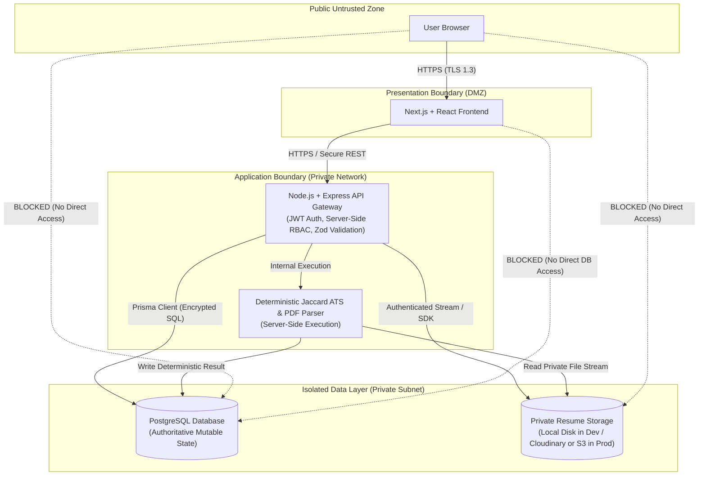

---

### 22.19 System Failure & Safe Degradation Architecture
The architecture defines deterministic failure behaviors to prevent data corruption or state fabrications during infrastructure disruptions:

- **Frontend Unavailable:** Backend API remains isolated and secure; queued transactions and background evaluations remain unaffected.
- **API Gateway Unavailable:** Clients receive standard gateway timeout errors (`502 Bad Gateway` / `503 Service Unavailable`); client-side operations fail safely without data loss.
- **Database Unavailable:** State-changing requests fail deterministically (`500 Internal Server Error`). The platform **never fabricates state** or serves stale cached authorization decisions when the database is unreachable.
- **Private Storage Unavailable:** Resume uploads and PDF viewing operations return graceful error messages. Existing application records and historical snapshots remain intact.
- **PDF Parser Failure:** Results in an explicit internal ATS processing failure outcome. The system **never fabricates a match score** when document parsing fails.

---

### 22.20 Backup, Retention & Recovery Principles
To guarantee institutional business continuity and data longevity:

Production PostgreSQL backups should be enabled according to the selected deployment provider's capabilities.

Backup frequency, retention, and point-in-time recovery configuration will be finalized during deployment.

Backup access must be restricted and restoration procedures should be tested before production use.

- **Object Storage Retention:** Candidate resume documents are retained in private storage for the duration of the institutional placement cycle and archived according to university compliance policies.

---

### 22.21 Observability & Monitoring Architecture
Production environments require comprehensive operational telemetry to detect anomalies and security incidents:

- **Monitored Telemetry:**
  - API endpoint availability and response latency.
  - HTTP error rates categorized by status code (`4xx` vs `5xx`).
  - Rate-limit threshold triggers and brute-force authentication spikes.
  - PostgreSQL connection pool utilization and query latency.
  - Resume upload failure rates and PDF parser crash counts.
  - ATS similarity evaluation throughput.
- **Privacy-Preserving Logs:** Observability logs capture structured contextual metadata (`timestamp`, `traceId`, `method`, `path`, `statusCode`, `durationMs`) while permanently redacting credentials, authorization tokens, passwords, and private resume contents.

---

### 22.22 CI/CD Security Principles
Deployment pipelines enforce automated quality gates prior to production release:

1. **Automated Validation:** Every pull request triggers automated linting, type-checking (`tsc --noEmit`), and test execution.
2. **Build Verification:** Production bundles for Next.js and Express are validated in clean environments.
3. **Secret Protection in CI:** Deployment pipeline secrets are managed via encrypted repository secret vaults. Build scripts must never echo or print secret variables to console logs.
4. **Environment Promotion:** Code changes promote sequentially through Development $\rightarrow$ Staging $\rightarrow$ Production. Direct, unreviewed commits to production branches are strictly blocked.

---

### 22.23 Deployment Topology Diagram

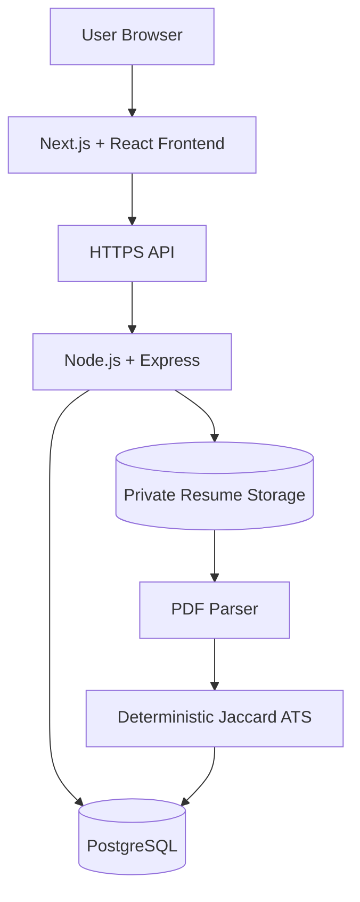

---

### 22.24 Comprehensive Security Threat Model

| Threat Scenario | Potential Impact | Architectural Mitigation & Defense-in-Depth |
| :--- | :--- | :--- |
| **Stolen / Forged JWT** | Unauthorized user impersonation | Cryptographic HMAC-SHA256 signature verification; short token expiration; sensitive operations re-query PostgreSQL for live debarment and approval status. |
| **Insecure Direct Object Reference (IDOR)** | Candidate data leakage or drive tampering | Domain services enforce tenant ownership checks (`student_id` or `company_id`) against authoritative PostgreSQL state; UUIDs never grant access. |
| **Malicious PDF Upload** | Remote code execution, buffer overflow, or XSS | Strict 5 MB size ceiling; magic-byte `%PDF-` validation; isolated private storage; non-executable storage volumes; sanitized text extraction. |
| **Unauthorized Job Approval** | Unverified jobs published to campus | Strict server-side RBAC: only `TPC_ADMIN` can trigger job approval; recruiter jobs cannot enter `ACTIVE` without administrative clearance. |
| **Recruiter Approving Own Job** | Bypass of institutional salary/quality standards | Recruiter role is hard-blocked from job approval routes; attempts return `HTTP 403 Forbidden`; edits in review remain `PENDING_APPROVAL`. |
| **Forged Eligibility / Application State** | Ineligible candidate placed fraudulently | Server-side eligibility engine evaluates live academic metrics inside an atomic transaction immediately before application creation; client claims ignored. |
| **ATS Score Manipulation** | Artificial inflation of candidate ranking | Jaccard scoring executes strictly server-side on normalized canonical tokens; point-in-time score persisted in database and immutable snapshot. |
| **Spreadsheet Formula Injection** | Remote code execution on administrative workstations | Text cells in CSV and XLSX exports beginning with formula triggers (`=`, `+`, `-`, `@`) are prepended with an apostrophe (`'`) to neutralize execution. |
| **Secret Key Leakage** | Database compromise or token forgery | Zero secrets in source control or Git; runtime injection via system environment variables; secrets excluded from API responses and log streams. |
| **Direct Database Exposure** | Unauthorized external database queries | PostgreSQL is housed in a private subnet with no public IP; access restricted strictly to backend application instances over encrypted SSL. |

---

### 22.25 Security Scope Horizons: MVP vs. Future

| Security Capability | Phase 1 (MVP) | Phase 2 (V2) | Phase 3 (Future) |
| :--- | :--- | :--- | :--- |
| **Transport Security** | Mandatory HTTPS / TLS 1.3 | Strict HSTS Preloading | Mutual TLS (mTLS) between services |
| **Token Lifecycle** | Stateless JWT (HS256) | JWT + Refresh Token Rotation | Token revocation lists via Redis |
| **Malware Defense** | Size, extension & magic-byte check | Asynchronous ClamAV malware scan | Multi-engine sandbox inspection |
| **Network Perimeter** | Express rate limiting & Helmet | Cloudflare / AWS WAF integration | Distributed DDoS Shield & Geo-blocking |
| **Audit Architecture** | Relational `audit_logs` table | Partitioned PostgreSQL audit logs | Cryptographic append-only event ledger |
| **Secret Management** | Platform environment variables | Vault / AWS Secrets Manager | Automated secret rotation workflows |
| **Observability** | Structured console logging & metrics | Centralized APM (Datadog/NewRelic) | SIEM integration & automated SOC alerts |

> [!NOTE]
> All Phase 2 and Phase 3 capabilities are classified as future enhancements and are strictly excluded from the MVP implementation boundary.

---

### 22.26 Non-Negotiable Security Architectural Invariants

The platform strictly enforces 20 non-negotiable security invariants across all operational domains:

1. **Untrusted Browser Input:** All incoming browser and client inputs are inherently untrusted and must pass server-side Zod validation.
2. **JWT Identity Context Only:** JWT tokens provide cryptographic identity proof (`sub`, `role`) and must **never** be treated as authoritative for mutable business state.
3. **PostgreSQL Is Authoritative:** PostgreSQL is the sole authoritative source of truth for mutable security, verification, and placement states.
4. **Mandatory Server-Side Authorization:** Every permission, ownership boundary, and eligibility criterion is enforced server-side.
5. **UUIDs Never Grant Authorization:** The unguessability of UUIDv4 does not substitute for ownership checks; knowledge of a UUID never grants access.
6. **Mandatory Job Approval:** Recruiter-created jobs **MUST NOT** enter `ACTIVE` without explicit TPC Admin approval.
7. **Pending Edits Invariant:** Editing a job while `status === 'PENDING_APPROVAL'` leaves the status strictly as `PENDING_APPROVAL`. No additional Job status is created.
8. **Pre-Application Eligibility Gate:** Academic eligibility is evaluated before application creation.
9. **Zero Persistence on Ineligibility:** Ineligible application attempts create **ZERO** database records in `job_applications`.
10. **State Machine Invariant:** Application status transitions must pass server-side FSM validation; arbitrary status jumps are rejected.
11. **Placement State Invariant:** `PLACED` is an institutional `StudentProfile` state and is **never** an Application status.
12. **Deterministic MVP ATS:** The MVP ATS engine must use pure mathematical Jaccard similarity; no other scoring algorithm is permitted.
13. **Zero Fabricated ATS Scores:** Parsing failure or empty extracted text must result in an explicit processing failure state and must never produce a fabricated match score.
14. **Private Resume Storage:** Uploaded resume files remain strictly private and protected behind authenticated Express streaming endpoints.
15. **Append-Only Audit Logs:** System audit logs are append-only; update and delete operations are strictly prohibited.
16. **Zero Secrets in Git:** Cryptographic keys, database URLs, and storage credentials must never be committed to version control.
17. **Zero Secrets in Output:** Secrets and password hashes must never appear in application logs or API response payloads.
18. **Isolated Database Surface:** The production PostgreSQL database is never exposed directly to client browsers or public networks.
19. **Zero Client Status Authority:** Client-supplied application, job, or placement statuses are never authoritative.
20. **Zero Client ATS Authority:** Client-supplied ATS scores or match results are never authoritative; the server calculates and persists all scores.

---

## 23. End-to-End Data Flow Diagrams

### Flow A: Authentication Flow
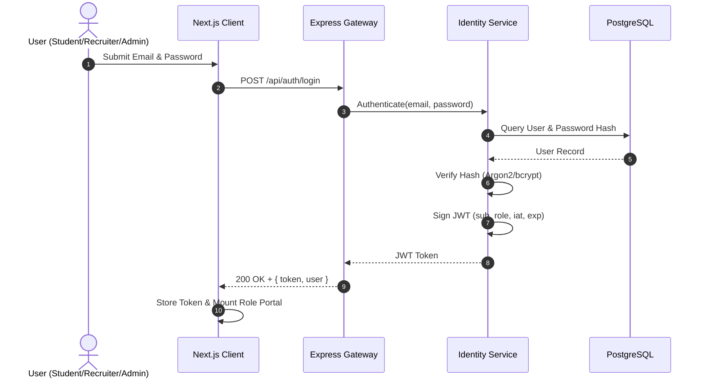

### Flow B: Recruiter Job Posting & TPC Approval Flow
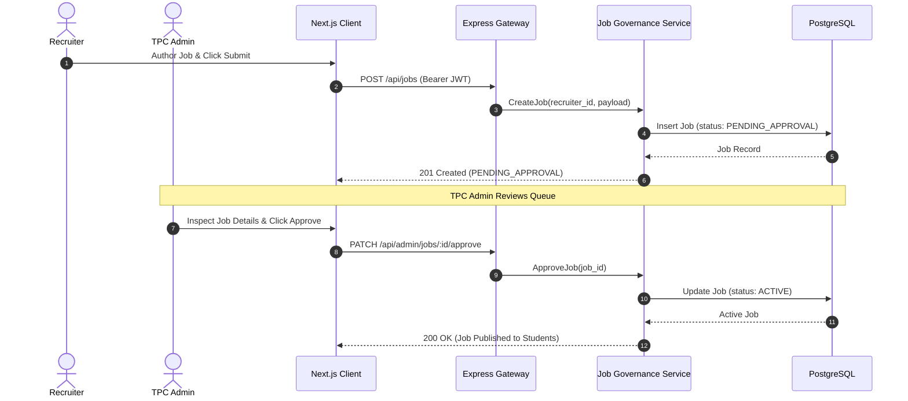

### Flow C: Pre-Application Eligibility Verification Flow
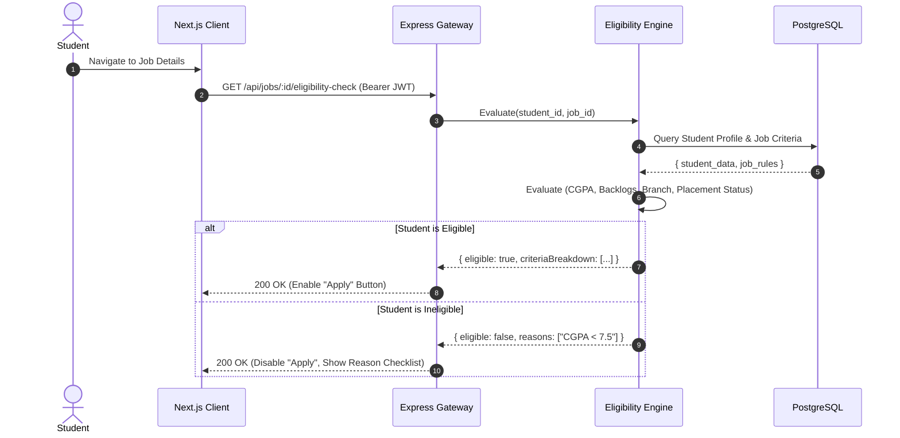

### Flow D: Application Submission Flow
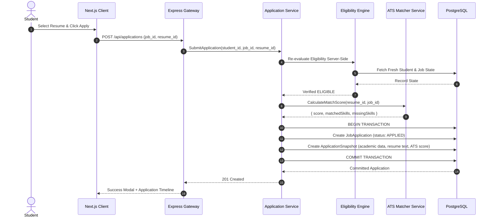

### Flow E: Resume Upload & ATS Parsing Flow
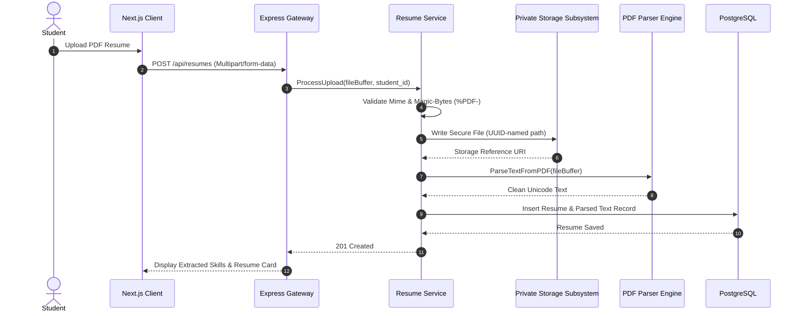

### Flow F: Offer Acceptance & Cascading Placement Flow
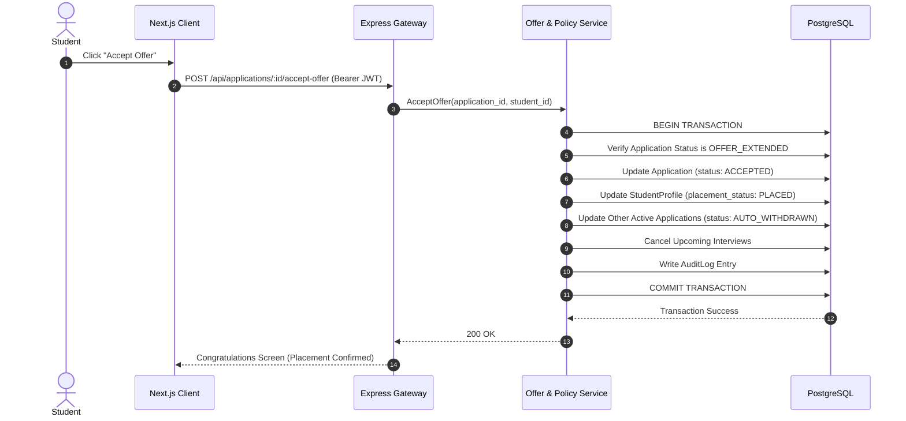

---

## 24. MVP vs. V2 vs. Future Architectural Matrix

| Architectural Feature | Phase 1: MVP | Phase 2: V2 | Phase 3: Future |
| :--- | :--- | :--- | :--- |
| **System Model** | Modular Monolith | Modular Monolith | Event-Driven Monolith / Services |
| **Job Lifecycle** | Recruiter: DRAFT $\rightarrow$ PENDING_APPROVAL $\rightarrow$ TPC $\rightarrow$ ACTIVE | Bulk Approval / Schedule Publish | External Multi-board Job Sync |
| **ATS Matcher** | Deterministic Jaccard Similarity on Canonical Skill Sets | Weighted Must-have vs Good-to-have Skills | Semantic Vectors (BERT) / LLM Screening |
| **File Storage** | Private Disk (Dev) / Cloudinary/S3 Abstraction (Prod) | Direct S3 Upload via Pre-signed URLs | Virus Scanning / Anti-Malware ClamAV |
| **Async Tasks** | Synchronous Node.js Event Loop Execution | Redis + BullMQ Background Job Workers | Kafka / Dedicated Queue Microservice |
| **Real-time Comms** | Polling & In-App Relational Table Updates | Server-Sent Events (SSE) / WebSockets | WebSockets with Redis Pub/Sub |
| **Authentication** | Stateless JWT (HS256) + Real-time DB Queries | JWT + Refresh Token Rotation | SAML 2.0 / Campus SSO / Active Directory |
| **Interviews** | Collision-checked Scheduling + Link Management | Google Calendar / Outlook Calendar Sync | Built-in WebRTC Audio/Video Interviewing |
| **Exports** | In-request CSV & XLSX with Formula Defense | Asynchronous Background Export Downloads | Drag-and-Drop Regulatory Report Builder |

---

## 25. Architecture Decision Records (ADRs)

### ADR-001: Modular Monolith Architecture
- **Decision:** Implement the backend as a single Express.js application organized into strict domain modules.
- **Reason:** Campus recruitment involves high transactional interdependencies (e.g., offer acceptance requiring atomic updates across student placement status, multiple applications, and interview slots). A modular monolith provides ACID transactions via PostgreSQL without distributed transaction managers.
- **Alternatives Considered:** Microservices (rejected due to network latency, distributed data consistency issues, and operational overhead).
- **Consequences:** Domain services must not directly invoke other domain repositories; they must interact via public domain service interfaces to prevent tight coupling.

### ADR-002: Next.js + React for Client Architecture
- **Decision:** Utilize Next.js with React for the frontend layer.
- **Reason:** Combines React component reusability, strict TypeScript safety, route-level layout encapsulation, and hybrid rendering. Server components optimize public pages, while client components handle dynamic state-driven portals.
- **Alternatives Considered:** Client-rendered React SPA (rejected due to lack of built-in routing boundaries and server rendering capabilities).
- **Consequences:** Client and server component boundaries must be clearly managed to avoid hydration errors and unwanted bundle size increases.

### ADR-003: Node.js + Express.js for Backend Architecture
- **Decision:** Build the REST API using Node.js and Express.js.
- **Reason:** Robust middleware ecosystem, rapid REST development, non-blocking I/O ideal for file handling and database transactions, and unified TypeScript language across frontend and backend.
- **Alternatives Considered:** NestJS (rejected as overly complex for the team's timeline), Django/FastAPI (rejected to preserve full-stack TypeScript consistency).
- **Consequences:** The development team must enforce strict architectural discipline since Express is unopinionated.

### ADR-004: PostgreSQL with Prisma ORM
- **Decision:** Use PostgreSQL as the relational database engine and Prisma as the typed ORM.
- **Reason:** PostgreSQL provides industry-standard relational integrity, ACID compliance, `TIMESTAMPTZ` support, and rich indexing. Prisma provides compile-time type safety, automated migrations, and intuitive transactional primitives.
- **Alternatives Considered:** MongoDB (rejected due to lack of relational integrity for complex academic/placement policies), TypeORM (rejected due to error-prone decorator patterns and migration bugs).
- **Consequences:** Multi-entity operations must execute within a single atomic PostgreSQL transaction through the selected ORM transaction mechanism.

### ADR-005: JWT Identity with DB Authoritative Mutable State
- **Decision:** JWTs contain the minimum identity/role context required by the architecture: `sub`, `role`, `iat`, and `exp`. Optional non-sensitive identity claims such as `email` may be included only when actually required. Require real-time database queries for authoritative mutable business state (`is_debarred`, `verification_status`, `placement_status`, eligibility verdict, application status, job status, recruiter approval status).
- **Reason:** Prevents stale-token exploits where a debarred or placed student continues to access restricted placement actions using a token minted prior to the status change. Mutable business and security state must never be trusted from JWT claims.
- **Alternatives Considered:** Fully stateful server sessions (rejected due to server memory overhead and horizontal scaling friction); Embedding status flags in JWT (rejected due to inability to immediately revoke permissions upon administrative action).
- **Consequences:** Every protected state mutation requires a lightweight query to PostgreSQL to check live student/recruiter flags. The following attributes strictly remain outside JWT authority: `is_debarred`, `verification_status`, `placement_status`, eligibility verdict, application status, job status, and recruiter approval status.

### ADR-006: Deterministic Jaccard Similarity for MVP ATS
- **Decision:** Implement the MVP ATS using pure mathematical Jaccard similarity on canonicalized skill sets.
- **Reason:** Institutional placement requires 100% transparent, auditable, and explainable scoring. Pure Jaccard similarity is deterministic, contains zero bias, requires no GPU/AI infrastructure, and can be verified by students and TPC administrators.
- **Alternatives Considered:** LLM scoring via OpenAI/Anthropic (rejected due to non-deterministic outputs, API latency, cost, and hallucination risks); Vector embeddings (rejected for MVP complexity).
- **Consequences:** Advanced semantic nuances are not captured in MVP; canonical alias dictionaries must be maintained for common skill variations.

### ADR-007: Private File Storage Abstraction
- **Decision:** Implement a file storage abstraction interface with support for local disk storage during development and S3-compatible/Cloudinary storage for production.
- **Reason:** Allows development without cloud credentials while ensuring zero code changes when deploying to production environments. Resumes are kept strictly out of the public web root.
- **Alternatives Considered:** Storing PDF files directly as BLOBs in PostgreSQL (rejected due to database bloat and performance degradation).
- **Consequences:** Resume downloads must be proxied through an authenticated Express endpoint with proper streaming and authorization checks.

---

## 26. Architecture Constraints

The following non-negotiable architectural rules must be strictly respected across all future implementation phases:

1. **Eligibility is a Pre-Application Gate:** Eligibility verification must always occur before an application record is created. `ELIGIBLE` and `INELIGIBLE` are evaluation verdicts, NEVER application lifecycle states.
2. **Strict Status Separation:** `ACCEPTED` is an application lifecycle state (`JobApplication.status`). `PLACED` is a student institutional state (`StudentProfile.placement_status`). They must never be conflated.
3. **JWT Is Not Authoritative for Mutable State:** JWTs must never be trusted for debarment, profile verification, placement status, or job approval. Sensitive operations must verify live database state.
4. **Recruiter Jobs Require TPC Approval:** Recruiter-created job postings must follow `DRAFT` $\rightarrow$ `PENDING_APPROVAL` $\rightarrow$ TPC review $\rightarrow$ `ACTIVE`. If edited while in `PENDING_APPROVAL`, they remain `PENDING_APPROVAL`. Students must never see unapproved jobs.
5. **Deterministic MVP ATS:** The MVP ATS matcher must use exact Jaccard similarity on canonicalized skill sets. No AI, LLMs, embeddings, or heuristic weights in MVP.
6. **Immutable Application Snapshots:** Every application submission must store an immutable snapshot of student academic details and resume text at the moment of submission.
7. **Server-Side Authorization is Mandatory:** Client-side guards and UI disables are UX conveniences only; every authorization and eligibility rule must be re-evaluated server-side.
8. **Formula Injection Sanitization:** All spreadsheet and CSV exports must sanitize text fields against formula injection prefixes (`=`, `+`, `-`, `@`).

---

## 27. Final Security & Documentation Consistency Audit

### 27.1 State Machine & Enum Consistency Matrix
- **Job Status Integrity:** No unapproved intermediate job-review status is defined.
- **No additional Job status exists.**
- **Exactly 3 Roles:**
  - `STUDENT`
  - `RECRUITER`
  - `TPC_ADMIN`
- **Exactly 6 Job Statuses:**
  - `DRAFT`
  - `PENDING_APPROVAL`
  - `ACTIVE`
  - `REJECTED_BY_TPC`
  - `CLOSED`
  - `ARCHIVED`
- **Exactly 9 Application Statuses:**
  - `APPLIED`
  - `ATS_SHORTLISTED`
  - `INTERVIEW_SCHEDULED`
  - `OFFER_EXTENDED`
  - `ACCEPTED`
  - `REJECTED`
  - `WITHDRAWN`
  - `DECLINED`
  - `AUTO_WITHDRAWN`
- **Placement Statuses:**
  - `UNPLACED`
  - `PLACED`
- **Eligibility Verdicts:**
  - `ELIGIBLE`
  - `INELIGIBLE`
- **Interview Statuses:**
  - `SCHEDULED`
  - `COMPLETED`
  - `CANCELLED`
  - `RESCHEDULED`
- **Offer Statuses:**
  - `EXTENDED`
  - `ACCEPTED`
  - `DECLINED`
  - `WITHDRAWN`

### 27.2 Core Architectural Invariants Verification
- **Placement vs. Application Separation:** `PLACED` is an institutional student state on `student_profiles`, never an application lifecycle state. `ACCEPTED` is the successful terminal application state.
- **Eligibility Separation:** `ELIGIBLE` and `INELIGIBLE` are pre-application gate evaluation outcomes, never application statuses. Eligibility is verified before application creation; ineligible attempts create zero application records.
- **Job Approval Workflow:** Recruiter-created jobs require explicit TPC approval to reach `ACTIVE`. Edits to `PENDING_APPROVAL` jobs remain in `PENDING_APPROVAL`. TPC administrators may directly create institutional jobs as `ACTIVE`.
- **JWT Identity & Security Context:** JWT contains minimal identity/role context only. Minimum required JWT claims are `sub`, `role`, `iat`, and `exp`. Optional non-sensitive claims may be included only when actually required. PostgreSQL is the authoritative source for all mutable business state (`is_debarred`, `verification_status`, `placement_status`, etc.).
- **Server-Side Authorization & Anti-IDOR:** Server-side RBAC and tenant ownership verification are mandatory on every protected endpoint. Unguessable UUIDs never grant authorization.
- **Data Integrity & Immutability:** Application snapshots remain immutable upon submission. Audit logs remain append-only. Application history tracking begins `NULL -> APPLIED`.
- **Atomic Placement Cascade:** Offer acceptance executes within a single atomic PostgreSQL transaction through the selected ORM transaction mechanism, updating the student to `PLACED` and cascading competing applications to `AUTO_WITHDRAWN`.
- **Offer Withdrawal:** Recruiter or administrative offer withdrawal transitions the offer entity without inventing an artificial application status transition.
- **Deterministic ATS:** ATS similarity scoring is strictly deterministic mathematical Jaccard similarity on canonical token sets. No AI, LLMs, embeddings, or heuristic weights are used, and no artificial scoring threshold is invented. Resume PDF files remain strictly private. Document parsing failures never fabricate an ATS score.
- **Rate Limiting & Infrastructure:** No fixed numeric rate limit is authoritative during Day 2; exact limits are finalized during implementation/deployment based on infrastructure and observed abuse patterns. Edge/reverse-proxy services (such as Nginx, Cloudflare, or cloud load balancers) are optional, deployment-dependent infrastructure and not MVP dependencies.
- **Database Backups:** No invented daily backup frequency, RPO, or RTO is authoritative; backup frequency, retention, and point-in-time recovery are configured based on provider capabilities during deployment with restricted access and pre-tested restoration procedures.
- **Zero Implementation Code:** No executable TypeScript/JavaScript/Prisma code remains. No Express routes, controllers, services, middleware, Prisma schemas, migrations, frontend components, or Docker/deployment configuration files were created.

---

## 28. Documentation-Only Boundary

Day 2 remains documentation-only.

No source-code implementation has been created.
No Express routes have been implemented.
No controllers or services have been implemented.
No Prisma schema or migrations have been created.
No frontend implementation has been created.
No deployment configuration has been created.

Implementation begins on Day 3.
