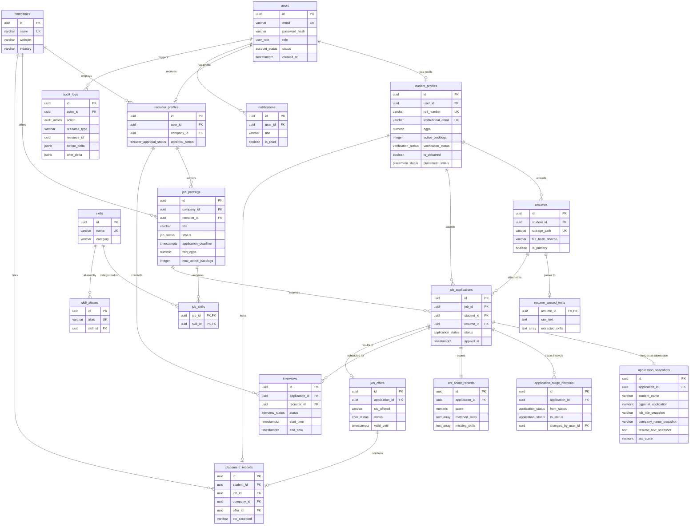

# Database Architecture & Relational Schema Design
## Campus Placement & Referral Portal with Auto-Resume Matcher

---

## 1. Database Design Principles

### 1.1 Core Relational Engine & Tooling
- **Primary Database Engine:** PostgreSQL 16+
- **Data Access & Object-Relational Mapping (ORM):** Prisma ORM
- **Primary Key Standard:** UUIDv4 (`UUID` type in PostgreSQL, generated via `gen_random_uuid()` or client-side crypto) across all primary entities to avoid sequential enumeration attacks and ease data migration.
- **Timestamp Standard:** All temporal fields use `TIMESTAMPTZ` (UTC with timezone offset stored). System times are recorded strictly in UTC (`now()`). Presentation-layer conversions to Indian Standard Time (IST / `Asia/Kolkata`) happen at the client edge.
- **Relational Integrity:** Foreign keys are explicitly defined with strict referential constraints (`RESTRICT`, `CASCADE`, `SET NULL`) enforced at the database engine level.
- **Normalization Level:** Third Normal Form (3NF) for transactional operational entities. Controlled, deliberate snapshot denormalization is utilized strictly for historical compliance records (`ApplicationSnapshot`).

### 1.2 The Authoritative State Rule
> **JWT is NOT the database.**
> **PostgreSQL is the single authoritative source of truth for all mutable business state.**

State variables including `is_debarred`, `verification_status`, `placement_status`, `job_posting.status`, and `recruiter.approval_status` are never permanently embedded in authentication tokens. Every sensitive state mutation and authorization gate must inspect live PostgreSQL rows within active database transactions.

### 1.3 Immutable Historical Integrity
Placement portals handle sensitive accreditation records (NIRF/NAAC compliance). Once an application is submitted, the candidate's academic metrics and resume text at that exact point in time must be permanently preserved. Future student profile edits (e.g., subsequent semester CGPA updates or updated resume uploads) must never overwrite historical application data.

---

## 2. Entity Inventory & Domain Justification

### 2.1 Explicit Entity Inventory Table

| # | Entity Name | Purpose & Justification | Scope | Key Relationships |
|---|---|---|:---:|---|
| 1 | **User** | Core authentication and identity record. Houses credentials, global role, and login audit timestamps. | **MVP** | 1:1 `StudentProfile`, 1:1 `RecruiterProfile`, 1:N `Notification`, 1:N `AuditLog` |
| 2 | **StudentProfile** | Institutional academic record, verified metrics, placement status, and debarment flags. | **MVP** | 1:1 `User`, 1:N `Resume`, 1:N `JobApplication`, 1:N `PlacementRecord` |
| 3 | **Company** | Corporate entity directory holding corporate brand details, website, and industry classification. | **MVP** | 1:N `RecruiterProfile`, 1:N `JobPosting` |
| 4 | **RecruiterProfile** | Organizational point-of-contact, TPC verification status, and corporate job author. | **MVP** | 1:1 `User`, N:1 `Company`, 1:N `JobPosting` |
| 5 | **JobPosting** | Campus drive / recruitment posting containing criteria, deadlines, status, and TPC approval. | **MVP** | N:1 `Company`, N:1 `RecruiterProfile`, 1:N `JobSkill`, 1:N `JobApplication` |
| 6 | **Skill** | Master dictionary of standardized technical skills and keywords. | **MVP** | 1:N `JobSkill`, 1:N `SkillAlias` |
| 7 | **JobSkill** | Relational join table mapping required skills to job postings. | **MVP** | N:1 `JobPosting`, N:1 `Skill` |
| 8 | **SkillAlias** | Deterministic canonical alias dictionary for skill preprocessing (e.g., `postgres` $\rightarrow$ `postgresql`). | **MVP** | N:1 `Skill` |
| 9 | **Resume** | Metadata for student-uploaded PDF resume files, private storage keys, and active resume flags. | **MVP** | N:1 `StudentProfile`, 1:1 `ResumeParsedText`, 1:N `JobApplication` |
| 10 | **ResumeParsedText** | Sanitized, normalized plain-text stream extracted from the resume PDF for ATS ingestion. | **MVP** | 1:1 `Resume` |
| 11 | **JobApplication** | Student application to a specific job posting, governing current application lifecycle state. | **MVP** | N:1 `StudentProfile`, N:1 `JobPosting`, N:1 `Resume`, 1:1 `ApplicationSnapshot`, 1:N `ApplicationStageHistory`, 1:1 `AtsScoreRecord`, 1:N `Interview`, 1:1 `JobOffer` |
| 12 | **ApplicationSnapshot** | Immutable point-in-time snapshot preserving evaluated student academic metrics, resume asset/text, ATS score, and job criteria at submission. | **MVP** | 1:1 `JobApplication` |
| 13 | **ApplicationStageHistory** | Append-only audit timeline tracking every application state transition, actor, and timestamp. | **MVP** | N:1 `JobApplication`, N:1 `User` (actor) |
| 14 | **AtsScoreRecord** | Deterministic Jaccard similarity score, matched skills array, and missing skills array. | **MVP** | 1:1 `JobApplication`, N:1 `Resume`, N:1 `JobPosting` |
| 15 | **Interview** | Scheduled interview assessment session between candidate and recruiters. | **MVP** | N:1 `JobApplication`, N:1 `RecruiterProfile` |
| 16 | **JobOffer** | Formal placement offer extended to a student candidate with compensation details. | **MVP** | 1:1 `JobApplication` |
| 17 | **PlacementRecord** | Institutional placement registry marking final hiring confirmation and policy lock. | **MVP** | N:1 `StudentProfile`, N:1 `JobPosting`, 1:1 `JobOffer` |
| 18 | **Notification** | User-facing notification records for in-app alert center and delivery state tracking. | **MVP** | N:1 `User` |
| 19 | **AuditLog** | Append-only institutional security and compliance audit log capturing state deltas and actor IPs. | **MVP** | N:1 `User` (actor) |

### 2.2 Analysis of Excluded / Deferred Entities

- **`Role` (Relational Table) $\rightarrow$ EXCLUDED for MVP:** Native PostgreSQL enum `UserRole` (`STUDENT`, `RECRUITER`, `TPC_ADMIN`) is utilized instead. The permissions are strictly fixed by institutional policy and do not require runtime dynamic role creation. Eliminates an unnecessary table join on every authentication query.
- **`SessionLog` $\rightarrow$ EXCLUDED for MVP:** User authentication events are captured in `AuditLog` (`AUTH_LOGIN_SUCCESS`, `AUTH_LOGIN_FAILURE`), and tokens are stateless JWTs.
- **`AcademicHistory` $\rightarrow$ CONSOLIDATED into `StudentProfile` for MVP:** Historical semester-by-semester grade cards are not required for MVP eligibility gating. Flattening 10th%, 12th%, CGPA, backlogs, branch, and graduation batch into `StudentProfile` ensures zero-overhead atomic eligibility checks.
- **`EligibilityEvaluation` (Persistent Table) $\rightarrow$ EXCLUDED:** Eligibility is a transient pre-application gate evaluated in real time. Persisting evaluation queries creates massive database churn. The final evaluated eligibility verdict is permanently preserved in `ApplicationSnapshot` upon successful submission.
- **`InterviewRound` $\rightarrow$ CONSOLIDATED into `Interview` for MVP:** MVP drives typically have 1–3 rounds per candidate. Adding a round descriptor (`round_number`, `round_type`) directly onto `Interview` handles scheduling without redundant table hierarchy.
- **`PlacementPolicy` / `PlacementPolicyOverride` $\rightarrow$ CONSOLIDATED for MVP:** The core policy ("One Student, One Job") is codified in the domain service with an override flag on `StudentProfile` (`placement_policy_exempt: BOOLEAN`), eliminating an unused configuration table.
- **`NotificationTemplate` $\rightarrow$ EXCLUDED for MVP:** Notification messages are generated using typed server-side template functions in code rather than dynamic database template rendering.

---

## 3. User & Identity Model

### 3.1 Table Definition: `users`
The `users` table is the authentication root for all system stakeholders.

```sql
CREATE TYPE user_role AS ENUM ('STUDENT', 'RECRUITER', 'TPC_ADMIN');
CREATE TYPE account_status AS ENUM ('ACTIVE', 'SUSPENDED', 'DEACTIVATED');

CREATE TABLE users (
    id UUID PRIMARY KEY DEFAULT gen_random_uuid(),
    email VARCHAR(255) NOT NULL UNIQUE,
    password_hash VARCHAR(255) NOT NULL,
    role user_role NOT NULL,
    status account_status NOT NULL DEFAULT 'ACTIVE',
    last_login_at TIMESTAMPTZ,
    created_at TIMESTAMPTZ NOT NULL DEFAULT now(),
    updated_at TIMESTAMPTZ NOT NULL DEFAULT now()
);

CREATE INDEX idx_users_email ON users(email);
CREATE INDEX idx_users_role ON users(role);
```

### 3.2 Design Decision: Native Enum vs. Dynamic Table
The system selects a native PostgreSQL `user_role` enum over a dynamic relational table. Campus placement permissions are structurally defined (`STUDENT` can only apply and manage profile; `RECRUITER` can only post jobs and review applicants; `TPC_ADMIN` governs all institutional operations). Dynamic runtime role creation is out of scope for institutional workflows and would add unnecessary latency to token verification.

---

## 4. Student Database Design

### 4.1 Table Definition: `student_profiles`
Stores the authoritative academic metrics, verified credentials, and institutional placement state of enrolled students.

```sql
CREATE TYPE verification_status AS ENUM ('PENDING', 'VERIFIED', 'REJECTED');
CREATE TYPE placement_status AS ENUM ('UNPLACED', 'PLACED');

CREATE TABLE student_profiles (
    id UUID PRIMARY KEY DEFAULT gen_random_uuid(),
    user_id UUID NOT NULL UNIQUE REFERENCES users(id) ON DELETE CASCADE,
    roll_number VARCHAR(50) NOT NULL UNIQUE,
    first_name VARCHAR(100) NOT NULL,
    last_name VARCHAR(100) NOT NULL,
    institutional_email VARCHAR(255) NOT NULL UNIQUE,
    personal_email VARCHAR(255),
    phone VARCHAR(20),
    department VARCHAR(100) NOT NULL,
    degree VARCHAR(50) NOT NULL,
    graduation_year INTEGER NOT NULL,
    cgpa NUMERIC(4, 2) NOT NULL,
    tenth_percentage NUMERIC(5, 2) NOT NULL,
    twelfth_percentage NUMERIC(5, 2) NOT NULL,
    active_backlogs INTEGER NOT NULL DEFAULT 0,
    history_of_backlogs INTEGER NOT NULL DEFAULT 0,
    verification_status verification_status NOT NULL DEFAULT 'PENDING',
    verified_by UUID REFERENCES users(id) ON DELETE SET NULL,
    verified_at TIMESTAMPTZ,
    is_debarred BOOLEAN NOT NULL DEFAULT FALSE,
    debarment_reason TEXT,
    placement_status placement_status NOT NULL DEFAULT 'UNPLACED',
    placement_policy_exempt BOOLEAN NOT NULL DEFAULT FALSE,
    created_at TIMESTAMPTZ NOT NULL DEFAULT now(),
    updated_at TIMESTAMPTZ NOT NULL DEFAULT now()
);

CREATE INDEX idx_student_profiles_roll ON student_profiles(roll_number);
CREATE INDEX idx_student_profiles_dept_grad ON student_profiles(department, graduation_year);
CREATE INDEX idx_student_profiles_placement_status ON student_profiles(placement_status);
CREATE INDEX idx_student_profiles_debarred ON student_profiles(is_debarred);
```

### 4.2 Critical Constraints & Business Rules
1. **`placement_status` Scope:** Strictly typed as `UNPLACED` or `PLACED`. This attribute lives exclusively on `student_profiles` and reflects institutional status. It is NEVER an application state.
2. **Authoritative Checks:** When a student attempts to apply for a drive, the application service directly checks `student_profiles.is_debarred === false`, `student_profiles.verification_status === 'VERIFIED'`, and `student_profiles.placement_status === 'UNPLACED'` (unless `placement_policy_exempt === true`).
3. **Unique Keys:** `user_id`, `roll_number`, and `institutional_email` are strictly unique.

---

## 5. Recruiter & Company Design

### 5.1 Multi-Recruiter Institutional Model
Corporate hiring often involves multiple recruiters, alumni, or HR panels from the same company. Thus, `companies` is designed as a standalone entity with a 1-to-Many relationship to `recruiter_profiles`.

```sql
CREATE TYPE recruiter_approval_status AS ENUM ('PENDING_APPROVAL', 'APPROVED', 'REJECTED');

CREATE TABLE companies (
    id UUID PRIMARY KEY DEFAULT gen_random_uuid(),
    name VARCHAR(255) NOT NULL UNIQUE,
    website VARCHAR(255),
    industry VARCHAR(100),
    description TEXT,
    logo_storage_path VARCHAR(500),
    created_at TIMESTAMPTZ NOT NULL DEFAULT now(),
    updated_at TIMESTAMPTZ NOT NULL DEFAULT now()
);

CREATE TABLE recruiter_profiles (
    id UUID PRIMARY KEY DEFAULT gen_random_uuid(),
    user_id UUID NOT NULL UNIQUE REFERENCES users(id) ON DELETE CASCADE,
    company_id UUID NOT NULL REFERENCES companies(id) ON DELETE RESTRICT,
    designation VARCHAR(100) NOT NULL,
    corporate_email VARCHAR(255) NOT NULL,
    phone VARCHAR(20),
    is_alumni BOOLEAN NOT NULL DEFAULT FALSE,
    graduation_batch INTEGER,
    approval_status recruiter_approval_status NOT NULL DEFAULT 'PENDING_APPROVAL',
    approved_by UUID REFERENCES users(id) ON DELETE SET NULL,
    approval_notes TEXT,
    created_at TIMESTAMPTZ NOT NULL DEFAULT now(),
    updated_at TIMESTAMPTZ NOT NULL DEFAULT now()
);

CREATE INDEX idx_recruiter_profiles_company ON recruiter_profiles(company_id);
CREATE INDEX idx_recruiter_profiles_approval ON recruiter_profiles(approval_status);
```

### 5.2 Server-Side Ownership Enforcement
- Every job posting records `company_id` and `recruiter_id`.
- Express authorization middleware ensures that `recruiter_profiles.approval_status === 'APPROVED'` before permitting any job posting submission.
- When querying applicants, interviews, or candidates, the API strictly restricts recruiters to jobs authored by their company or assigned recruiter profile.

---

## 6. Job Posting Database Design

### 6.1 Table Definition: `job_postings`
Captures corporate hiring requirements, compensation details, application deadlines, eligibility criteria, and institutional governance approval.

```sql
CREATE TYPE job_status AS ENUM (
    'DRAFT',
    'PENDING_APPROVAL',
    'ACTIVE',
    'REJECTED_BY_TPC',
    'CLOSED',
    'ARCHIVED'
);

CREATE TYPE employment_type AS ENUM (
    'FULL_TIME',
    'INTERNSHIP',
    'INTERN_PPO'
);

CREATE TABLE job_postings (
    id UUID PRIMARY KEY DEFAULT gen_random_uuid(),
    company_id UUID NOT NULL REFERENCES companies(id) ON DELETE RESTRICT,
    recruiter_id UUID NOT NULL REFERENCES recruiter_profiles(id) ON DELETE RESTRICT,
    title VARCHAR(255) NOT NULL,
    description TEXT NOT NULL,
    employment_type employment_type NOT NULL DEFAULT 'FULL_TIME',
    location VARCHAR(255) NOT NULL,
    ctc_or_stipend VARCHAR(100) NOT NULL,
    base_salary NUMERIC(12, 2),
    application_deadline TIMESTAMPTZ NOT NULL,
    
    -- Embedded Standard Eligibility Criteria
    eligible_departments TEXT[] NOT NULL, -- e.g. ARRAY['CSE', 'IT', 'ECE']
    target_graduation_year INTEGER NOT NULL,
    min_cgpa NUMERIC(4, 2) NOT NULL DEFAULT 0.0,
    max_active_backlogs INTEGER NOT NULL DEFAULT 0,
    min_tenth_percentage NUMERIC(5, 2) NOT NULL DEFAULT 0.0,
    min_twelfth_percentage NUMERIC(5, 2) NOT NULL DEFAULT 0.0,
    
    -- Governance & TPC Workflow Fields
    status job_status NOT NULL DEFAULT 'DRAFT',
    submitted_at TIMESTAMPTZ,
    tpc_reviewed_by UUID REFERENCES users(id) ON DELETE SET NULL,
    tpc_reviewed_at TIMESTAMPTZ,
    tpc_rejection_reason TEXT,
    
    created_at TIMESTAMPTZ NOT NULL DEFAULT now(),
    updated_at TIMESTAMPTZ NOT NULL DEFAULT now()
);

CREATE INDEX idx_job_postings_status ON job_postings(status);
CREATE INDEX idx_job_postings_deadline ON job_postings(application_deadline);
CREATE INDEX idx_job_postings_company ON job_postings(company_id);
CREATE INDEX idx_job_postings_recruiter ON job_postings(recruiter_id);
```

### 6.2 Strict Job Lifecycle Governance
- **Authoritative Lifecycle:** The job lifecycle strictly follows: `DRAFT` $\rightarrow$ `PENDING_APPROVAL` $\rightarrow$ `ACTIVE`, with terminal/review branches `PENDING_APPROVAL` $\rightarrow$ `REJECTED_BY_TPC`, `ACTIVE` $\rightarrow$ `CLOSED`, and `CLOSED` $\rightarrow$ `ARCHIVED`. No additional job status exists.
- **Edits during Review:** When a recruiter updates a posting while `status === 'PENDING_APPROVAL'`, the record executes an `UPDATE` that mutates fields and updates `updated_at`. The status remains strictly `PENDING_APPROVAL`, and TPC administrators are notified.
- **Institutional Visibility:** Students can strictly only query jobs where `status === 'ACTIVE' AND application_deadline > now()`.

---

## 7. Skill & Canonical Alias Model

### 7.1 Relational Normalization Strategy
To facilitate exact set-based Jaccard similarity without string-parsing race conditions, skills are stored in a normalized `skills` catalog. The canonical alias mapping table (`skill_aliases`) preprocesses synonymous variations into a single canonical skill ID before matching.

```sql
CREATE TABLE skills (
    id UUID PRIMARY KEY DEFAULT gen_random_uuid(),
    name VARCHAR(100) NOT NULL UNIQUE, -- Normalized lowercase (e.g. 'postgresql')
    category VARCHAR(50),              -- e.g. 'Database', 'Language', 'Framework'
    created_at TIMESTAMPTZ NOT NULL DEFAULT now()
);

CREATE TABLE skill_aliases (
    id UUID PRIMARY KEY DEFAULT gen_random_uuid(),
    alias VARCHAR(100) NOT NULL UNIQUE, -- Normalized lowercase (e.g. 'postgres')
    skill_id UUID NOT NULL REFERENCES skills(id) ON DELETE CASCADE,
    created_at TIMESTAMPTZ NOT NULL DEFAULT now()
);

CREATE TABLE job_skills (
    job_id UUID NOT NULL REFERENCES job_postings(id) ON DELETE CASCADE,
    skill_id UUID NOT NULL REFERENCES skills(id) ON DELETE RESTRICT,
    created_at TIMESTAMPTZ NOT NULL DEFAULT now(),
    PRIMARY KEY (job_id, skill_id)
);

CREATE INDEX idx_skills_name ON skills(name);
CREATE INDEX idx_skill_aliases_alias ON skill_aliases(alias);
```

---

## 8. Eligibility Engine Design

### 8.1 Transient Evaluation vs. Persistent Storage
Eligibility is an **evaluation gate**, not an application entity or lifecycle state:
1. **Rule Persistence:** Standard criteria (CGPA, backlogs, department array, graduation year, 10th/12th thresholds) are stored directly as columns on `job_postings`. This avoids multi-table join overhead during high-volume drive browsing.
2. **Live Evaluation:** The Eligibility Engine executes an in-memory comparison between live `student_profiles` columns and `job_postings` columns.
3. **No Persistent `EligibilityEvaluation` Records:** Rejected eligibility checks create zero database records. Accepted eligibility checks culminate in application submission, where the evaluated criteria are permanently preserved in `ApplicationSnapshot`.

---

## 9. Resume Database Design

### 9.2 Tables: `resumes` and `resume_parsed_texts`
Resume binaries are stored strictly in private, unguessable storage paths outside the web root.

```sql
CREATE TABLE resumes (
    id UUID PRIMARY KEY DEFAULT gen_random_uuid(),
    student_id UUID NOT NULL REFERENCES student_profiles(id) ON DELETE CASCADE,
    original_filename VARCHAR(255) NOT NULL,
    storage_path VARCHAR(500) NOT NULL UNIQUE, -- Private storage URI or path
    mime_type VARCHAR(100) NOT NULL DEFAULT 'application/pdf',
    file_size_bytes INTEGER NOT NULL,
    file_hash_sha256 VARCHAR(64) NOT NULL,    -- SHA-256 for integrity & deduplication
    is_primary BOOLEAN NOT NULL DEFAULT TRUE,
    created_at TIMESTAMPTZ NOT NULL DEFAULT now(),
    updated_at TIMESTAMPTZ NOT NULL DEFAULT now()
);

CREATE TABLE resume_parsed_texts (
    resume_id UUID PRIMARY KEY REFERENCES resumes(id) ON DELETE CASCADE,
    raw_text TEXT NOT NULL,
    extracted_skills TEXT[] NOT NULL DEFAULT ARRAY[]::TEXT[],
    parsed_at TIMESTAMPTZ NOT NULL DEFAULT now()
);

CREATE INDEX idx_resumes_student ON resumes(student_id);
```

---

## 10. Application Database Design

### 10.1 Table Definition: `job_applications`
Houses the active lifecycle state of a candidate's submission.

```sql
CREATE TYPE application_status AS ENUM (
    'APPLIED',
    'ATS_SHORTLISTED',
    'INTERVIEW_SCHEDULED',
    'OFFER_EXTENDED',
    'ACCEPTED',
    'REJECTED',
    'WITHDRAWN',
    'DECLINED',
    'AUTO_WITHDRAWN'
);

CREATE TABLE job_applications (
    id UUID PRIMARY KEY DEFAULT gen_random_uuid(),
    job_id UUID NOT NULL REFERENCES job_postings(id) ON DELETE RESTRICT,
    student_id UUID NOT NULL REFERENCES student_profiles(id) ON DELETE RESTRICT,
    resume_id UUID NOT NULL REFERENCES resumes(id) ON DELETE RESTRICT,
    status application_status NOT NULL DEFAULT 'APPLIED',
    applied_at TIMESTAMPTZ NOT NULL DEFAULT now(),
    updated_at TIMESTAMPTZ NOT NULL DEFAULT now(),
    
    -- Composite Unique Constraint: Exactly one application per student per job posting
    CONSTRAINT uq_student_job_application UNIQUE (student_id, job_id)
);

CREATE INDEX idx_job_applications_job ON job_applications(job_id);
CREATE INDEX idx_job_applications_student ON job_applications(student_id);
CREATE INDEX idx_job_applications_status ON job_applications(status);
```

### 10.2 Disallowed States
- `PLACED` is an institutional state on `student_profiles`, NEVER on `job_applications`.
- `ELIGIBLE` and `INELIGIBLE` are pre-application evaluation outcomes, NEVER application statuses.

---

## 11. Application Snapshot Design

### 11.1 Table Definition: `application_snapshots`
Guarantees point-in-time non-repudiation for institutional audit, dispute resolution, and NIRF/accreditation compliance.

```sql
CREATE TABLE application_snapshots (
    id UUID PRIMARY KEY DEFAULT gen_random_uuid(),
    application_id UUID NOT NULL UNIQUE REFERENCES job_applications(id) ON DELETE RESTRICT,
    
    -- Immutable Candidate Academic Record at Submission
    student_name VARCHAR(200) NOT NULL,
    roll_number VARCHAR(50) NOT NULL,
    institutional_email VARCHAR(255) NOT NULL,
    department VARCHAR(100) NOT NULL,
    graduation_year INTEGER NOT NULL,
    cgpa_at_application NUMERIC(4, 2) NOT NULL,
    active_backlogs_at_application INTEGER NOT NULL,
    tenth_percentage NUMERIC(5, 2) NOT NULL,
    twelfth_percentage NUMERIC(5, 2) NOT NULL,
    
    -- Immutable Job Posting Details & Criteria at Submission
    job_title_snapshot VARCHAR(255) NOT NULL,
    company_name_snapshot VARCHAR(255) NOT NULL,
    job_description_snapshot TEXT NOT NULL,
    eligible_departments_snapshot TEXT[] NOT NULL,
    target_graduation_year_snapshot INTEGER NOT NULL,
    min_cgpa_snapshot NUMERIC(4, 2) NOT NULL,
    max_active_backlogs_snapshot INTEGER NOT NULL,
    min_tenth_percentage_snapshot NUMERIC(5, 2) NOT NULL,
    min_twelfth_percentage_snapshot NUMERIC(5, 2) NOT NULL,
    required_skills_snapshot TEXT[] NOT NULL,
    
    -- Immutable Resume Asset & Text Snapshot
    submitted_resume_id UUID NOT NULL,
    submitted_resume_filename VARCHAR(255) NOT NULL,
    resume_text_snapshot TEXT NOT NULL,
    
    -- Evaluated ATS Result at Submission
    ats_score NUMERIC(5, 2) NOT NULL,
    matched_skills TEXT[] NOT NULL,
    missing_skills TEXT[] NOT NULL,
    
    created_at TIMESTAMPTZ NOT NULL DEFAULT now()
);

CREATE INDEX idx_app_snapshots_application ON application_snapshots(application_id);
```

**Rule:** `application_snapshots` is write-once and permanently immutable. All values—both student-side credentials and job-side criteria—are deep-copied at the exact moment of application submission. If the original `JobPosting` or `StudentProfile` is edited or modified later, this snapshot remains completely untouched. No `UPDATE` endpoint or service method shall ever exist for this entity.

---

## 12. Application Stage History Design

### 12.1 Table Definition: `application_stage_histories`
Stores the complete state machine audit log and timeline for candidate progression.

```sql
CREATE TABLE application_stage_histories (
    id UUID PRIMARY KEY DEFAULT gen_random_uuid(),
    application_id UUID NOT NULL REFERENCES job_applications(id) ON DELETE CASCADE,
    from_status application_status, -- NULL for initial application creation
    to_status application_status NOT NULL,
    changed_by_user_id UUID NOT NULL REFERENCES users(id) ON DELETE RESTRICT,
    actor_role user_role NOT NULL,
    transition_reason TEXT,
    created_at TIMESTAMPTZ NOT NULL DEFAULT now()
);

CREATE INDEX idx_app_stage_histories_app ON application_stage_histories(application_id);
CREATE INDEX idx_app_stage_histories_created_at ON application_stage_histories(created_at);
```

**Lifecycle Event Semantics:**
- **Initial Application Creation:** Recorded with `from_status: NULL` and `to_status: 'APPLIED'`. This captures the creation event accurately without inventing a fake state transition (such as `APPLIED` $\rightarrow$ `APPLIED`).
- **Subsequent Stage Progressions:** Recorded with both `from_status` and `to_status` populated (e.g., `APPLIED` $\rightarrow$ `ATS_SHORTLISTED`, `ATS_SHORTLISTED` $\rightarrow$ `INTERVIEW_SCHEDULED`, `INTERVIEW_SCHEDULED` $\rightarrow$ `OFFER_EXTENDED`, `OFFER_EXTENDED` $\rightarrow$ `ACCEPTED`).

---

## 13. Deterministic ATS Matcher Database Design

### 13.1 Table Definition: `ats_score_records`
Stores the mathematical Jaccard similarity output calculated during application submission or recruiter screening.

```sql
CREATE TABLE ats_score_records (
    id UUID PRIMARY KEY DEFAULT gen_random_uuid(),
    application_id UUID NOT NULL UNIQUE REFERENCES job_applications(id) ON DELETE CASCADE,
    job_id UUID NOT NULL REFERENCES job_postings(id) ON DELETE RESTRICT,
    resume_id UUID NOT NULL REFERENCES resumes(id) ON DELETE RESTRICT,
    
    -- Deterministic Mathematical Jaccard Metrics
    score NUMERIC(5, 2) NOT NULL, -- Value between 0.00 and 100.00
    matched_skills TEXT[] NOT NULL,
    missing_skills TEXT[] NOT NULL,
    job_skill_count INTEGER NOT NULL,
    resume_skill_count INTEGER NOT NULL,
    intersection_count INTEGER NOT NULL,
    union_count INTEGER NOT NULL,
    
    algorithm_version VARCHAR(20) NOT NULL DEFAULT 'JACCARD_MVP_V1',
    calculated_at TIMESTAMPTZ NOT NULL DEFAULT now()
);

CREATE INDEX idx_ats_scores_job_score ON ats_score_records(job_id, score DESC);
```

### 13.2 Mathematical Formula Codified
$$\text{score} = \frac{\text{intersection\_count}}{\text{union\_count}} \times 100$$
No vectors, embeddings, or neural inference weights are persisted.

---

## 14. Interview Database Design

### 14.1 Table Definition: `interviews`
Manages interview rounds and temporal scheduling between candidates and recruitment panels.

```sql
CREATE TYPE interview_status AS ENUM (
    'SCHEDULED',
    'COMPLETED',
    'CANCELLED',
    'RESCHEDULED'
);

CREATE TYPE interview_round_type AS ENUM (
    'TECHNICAL',
    'HR',
    'MANAGERIAL',
    'ONLINE_TEST'
);

CREATE TABLE interviews (
    id UUID PRIMARY KEY DEFAULT gen_random_uuid(),
    application_id UUID NOT NULL REFERENCES job_applications(id) ON DELETE RESTRICT,
    recruiter_id UUID NOT NULL REFERENCES recruiter_profiles(id) ON DELETE RESTRICT,
    round_number INTEGER NOT NULL DEFAULT 1,
    round_type interview_round_type NOT NULL DEFAULT 'TECHNICAL',
    start_time TIMESTAMPTZ NOT NULL,
    end_time TIMESTAMPTZ NOT NULL,
    meeting_link VARCHAR(500),
    venue VARCHAR(255),
    interviewer_notes TEXT,
    status interview_status NOT NULL DEFAULT 'SCHEDULED',
    created_at TIMESTAMPTZ NOT NULL DEFAULT now(),
    updated_at TIMESTAMPTZ NOT NULL DEFAULT now()
);

CREATE INDEX idx_interviews_application ON interviews(application_id);
CREATE INDEX idx_interviews_recruiter_time ON interviews(recruiter_id, start_time, end_time);
CREATE INDEX idx_interviews_time_window ON interviews(start_time, end_time);
```

### 14.2 Collision Detection Query Indexing
The index `(recruiter_id, start_time, end_time)` and a query across candidate active interviews support rapid interval overlap detection:
$$\text{Overlap} \iff (A.\text{start\_time} < B.\text{end\_time}) \land (A.\text{end\_time} > B.\text{start\_time})$$

---

## 15. Offer & Placement Database Design

### 15.1 Tables: `job_offers` and `placement_records`
Manages formal hiring proposals and final institutional placement compliance locks.

```sql
CREATE TYPE offer_status AS ENUM (
    'EXTENDED',
    'ACCEPTED',
    'DECLINED',
    'EXPIRED'
);

CREATE TABLE job_offers (
    id UUID PRIMARY KEY DEFAULT gen_random_uuid(),
    application_id UUID NOT NULL UNIQUE REFERENCES job_applications(id) ON DELETE RESTRICT,
    ctc_offered VARCHAR(100) NOT NULL,
    base_salary_offered NUMERIC(12, 2),
    offer_letter_storage_path VARCHAR(500),
    valid_until TIMESTAMPTZ NOT NULL,
    status offer_status NOT NULL DEFAULT 'EXTENDED',
    extended_at TIMESTAMPTZ NOT NULL DEFAULT now(),
    responded_at TIMESTAMPTZ,
    student_remarks TEXT,
    created_at TIMESTAMPTZ NOT NULL DEFAULT now(),
    updated_at TIMESTAMPTZ NOT NULL DEFAULT now()
);

CREATE TABLE placement_records (
    id UUID PRIMARY KEY DEFAULT gen_random_uuid(),
    student_id UUID NOT NULL REFERENCES student_profiles(id) ON DELETE RESTRICT,
    job_id UUID NOT NULL REFERENCES job_postings(id) ON DELETE RESTRICT,
    company_id UUID NOT NULL REFERENCES companies(id) ON DELETE RESTRICT,
    offer_id UUID NOT NULL UNIQUE REFERENCES job_offers(id) ON DELETE RESTRICT,
    ctc_accepted VARCHAR(100) NOT NULL,
    accepted_date TIMESTAMPTZ NOT NULL DEFAULT now(),
    academic_year VARCHAR(20) NOT NULL,
    tpc_officer_id UUID REFERENCES users(id) ON DELETE SET NULL,
    created_at TIMESTAMPTZ NOT NULL DEFAULT now(),
    
    CONSTRAINT uq_student_placement UNIQUE (student_id) -- One institutional placement lock
);

CREATE INDEX idx_placement_records_student ON placement_records(student_id);
CREATE INDEX idx_placement_records_company ON placement_records(company_id);
CREATE INDEX idx_placement_records_academic_year ON placement_records(academic_year);
```

---

## 16. Notification Database Design

### 16.1 Table Definition: `notifications`
Supports student, recruiter, and administrator in-app alert centers.

```sql
CREATE TABLE notifications (
    id UUID PRIMARY KEY DEFAULT gen_random_uuid(),
    user_id UUID NOT NULL REFERENCES users(id) ON DELETE CASCADE,
    title VARCHAR(200) NOT NULL,
    message TEXT NOT NULL,
    event_type VARCHAR(100) NOT NULL,
    related_resource_type VARCHAR(50), -- e.g. 'JobApplication', 'JobPosting'
    related_resource_id UUID,
    is_read BOOLEAN NOT NULL DEFAULT FALSE,
    read_at TIMESTAMPTZ,
    created_at TIMESTAMPTZ NOT NULL DEFAULT now()
);

CREATE INDEX idx_notifications_user_read ON notifications(user_id, is_read);
CREATE INDEX idx_notifications_created_at ON notifications(created_at);
```

---

## 17. Audit Log Database Design

### 17.1 Table Definition: `audit_logs`
Provides an append-only audit log for security, administrative actions, and regulatory compliance.

```sql
CREATE TYPE audit_action AS ENUM (
    'AUTH_LOGIN_SUCCESS',
    'AUTH_LOGIN_FAILURE',
    'AUTH_PASSWORD_RESET',
    'STUDENT_VERIFIED',
    'STUDENT_DEBARRED',
    'STUDENT_REINSTATED',
    'RECRUITER_APPROVED',
    'RECRUITER_REJECTED',
    'JOB_POSTING_SUBMITTED',
    'JOB_POSTING_APPROVED',
    'JOB_POSTING_REJECTED',
    'JOB_POSTING_CLOSED',
    'APPLICATION_SUBMITTED',
    'APPLICATION_STAGE_CHANGED',
    'OFFER_EXTENDED',
    'OFFER_ACCEPTED',
    'OFFER_DECLINED',
    'PLACEMENT_POLICY_LOCK_ENGAGED',
    'PLACEMENT_POLICY_OVERRIDE_GRANTED'
);

CREATE TABLE audit_logs (
    id UUID PRIMARY KEY DEFAULT gen_random_uuid(),
    actor_id UUID REFERENCES users(id) ON DELETE SET NULL,
    actor_role user_role,
    action audit_action NOT NULL,
    resource_type VARCHAR(100) NOT NULL,
    resource_id UUID,
    before_delta JSONB,
    after_delta JSONB,
    ip_address VARCHAR(45) NOT NULL,
    user_agent TEXT,
    created_at TIMESTAMPTZ NOT NULL DEFAULT now()
);

CREATE INDEX idx_audit_logs_actor ON audit_logs(actor_id);
CREATE INDEX idx_audit_logs_resource ON audit_logs(resource_type, resource_id);
CREATE INDEX idx_audit_logs_action ON audit_logs(action);
CREATE INDEX idx_audit_logs_created_at ON audit_logs(created_at);
```

---

## 18. Comprehensive Entity Relationships

```
User (1) ────────── (1) StudentProfile
User (1) ────────── (1) RecruiterProfile
User (1) ────────── (N) Notification
User (1) ────────── (N) AuditLog

Company (1) ─────── (N) RecruiterProfile
Company (1) ─────── (N) JobPosting
Company (1) ─────── (N) PlacementRecord

RecruiterProfile (1) ─ (N) JobPosting
RecruiterProfile (1) ─ (N) Interview

JobPosting (1) ──── (N) JobSkill ───── (N) Skill
Skill (1) ───────── (N) SkillAlias
JobPosting (1) ──── (N) JobApplication

StudentProfile (1) ─ (N) Resume ─────── (1) ResumeParsedText
StudentProfile (1) ─ (N) JobApplication
StudentProfile (1) ─ (1) PlacementRecord

JobApplication (1) ─ (1) ApplicationSnapshot
JobApplication (1) ─ (N) ApplicationStageHistory
JobApplication (1) ─ (1) AtsScoreRecord
JobApplication (1) ─ (N) Interview
JobApplication (1) ─ (1) JobOffer ───── (1) PlacementRecord
```

---

## 19. Delete and Update Referential Actions

Institutional placement data requires strict referential safeguards against accidental cascading deletion.

| Foreign Key Relationship | Delete Action | Update Action | Rationale |
|---|:---:|:---:|---|
| `student_profiles.user_id` $\rightarrow$ `users.id` | **CASCADE** | CASCADE | Student profile is co-dependent on identity. |
| `recruiter_profiles.user_id` $\rightarrow$ `users.id` | **CASCADE** | CASCADE | Recruiter profile is co-dependent on identity. |
| `recruiter_profiles.company_id` $\rightarrow$ `companies.id` | **RESTRICT** | CASCADE | Cannot delete company while recruiter profiles exist. |
| `job_postings.company_id` $\rightarrow$ `companies.id` | **RESTRICT** | CASCADE | Historical jobs must not be deleted if company is removed. |
| `job_postings.recruiter_id` $\rightarrow$ `recruiter_profiles.id` | **RESTRICT** | CASCADE | Drive record must remain intact even if recruiter leaves. |
| `job_applications.student_id` $\rightarrow$ `student_profiles.id` | **RESTRICT** | CASCADE | Cannot delete student who has submitted active applications. |
| `job_applications.job_id` $\rightarrow$ `job_postings.id` | **RESTRICT** | CASCADE | Job cannot be deleted once students have applied. |
| `job_applications.resume_id` $\rightarrow$ `resumes.id` | **RESTRICT** | CASCADE | Submitted resume record cannot be deleted while linked to apps. |
| `application_snapshots.application_id` $\rightarrow$ `job_applications.id` | **RESTRICT** | CASCADE | Historical snapshot must never be severed. |
| `application_stage_histories.application_id` $\rightarrow$ `job_applications.id` | **CASCADE** | CASCADE | Histories cleanly track application root. |
| `ats_score_records.application_id` $\rightarrow$ `job_applications.id` | **CASCADE** | CASCADE | Score record tied to application entity. |
| `interviews.application_id` $\rightarrow$ `job_applications.id` | **RESTRICT** | CASCADE | Cannot delete application with interview history. |
| `job_offers.application_id` $\rightarrow$ `job_applications.id` | **RESTRICT** | CASCADE | Offer audit records must remain permanent. |
| `placement_records.student_id` $\rightarrow$ `student_profiles.id` | **RESTRICT** | CASCADE | Institutional placement record is legally permanent. |
| `notifications.user_id` $\rightarrow$ `users.id` | **CASCADE** | CASCADE | User notifications are deleted on account purging. |
| `audit_logs.actor_id` $\rightarrow$ `users.id` | **SET NULL** | CASCADE | Retain audit trail even if actor account is purged. |

---

## 20. Database Constraints & Indexing Strategy

### 20.1 Primary Keys, Unique Constraints & Composite Indexes

| Table | Constraint Type | Column(s) | Business / Performance Rationale |
|---|:---:|---|---|
| `users` | PK | `id` | Standard UUID primary key. |
| `users` | UNIQUE | `email` | Unique login handle. Indexed for credential lookup. |
| `student_profiles` | UNIQUE | `user_id` | Enforces exact 1:1 relationship with user. |
| `student_profiles` | UNIQUE | `roll_number` | Institutional student identifier uniqueness. |
| `student_profiles` | UNIQUE | `institutional_email`| Institutional student mailbox. |
| `student_profiles` | INDEX | `(department, graduation_year)` | Accelerates drive eligibility batch filtering. |
| `student_profiles` | INDEX | `placement_status` | Filter for placed vs unplaced cohorts. |
| `companies` | UNIQUE | `name` | Prevents duplicate company profiles. |
| `recruiter_profiles`| UNIQUE | `user_id` | Enforces exact 1:1 relationship with user. |
| `job_postings` | INDEX | `status` | High-frequency student queries filter by `ACTIVE`. |
| `job_postings` | INDEX | `application_deadline` | Drive expiration evaluation and sorting. |
| `skills` | UNIQUE | `name` | Standardized canonical skill dictionary handle. |
| `skill_aliases` | UNIQUE | `alias` | Fast canonical resolution for ATS tokenizer. |
| `job_skills` | PK (Composite) | `(job_id, skill_id)` | Prevents duplicate skill attachment on postings. |
| `resumes` | UNIQUE | `storage_path` | Prevents disk path collisions. |
| **`job_applications`** | **UNIQUE (Composite)** | **`(student_id, job_id)`** | **Prevents duplicate applications by same student.** |
| `job_applications` | INDEX | `status` | Applicant pipeline stage filtering. |
| `application_snapshots` | UNIQUE | `application_id` | Exactly one immutable snapshot per application. |
| `ats_score_records` | UNIQUE | `application_id` | Exactly one ATS record per application. |
| `ats_score_records` | INDEX | `(job_id, score DESC)` | Fast ranking of applicants by ATS score for recruiters. |
| `interviews` | INDEX | `(recruiter_id, start_time, end_time)` | Rapid interview collision detection. |
| `job_offers` | UNIQUE | `application_id` | Exactly one offer per application. |
| `placement_records`| UNIQUE | `student_id` | Enforces single institutional placement lock. |
| `notifications` | INDEX | `(user_id, is_read)` | Efficient unread alert counter queries. |
| `audit_logs` | INDEX | `(resource_type, resource_id)` | Audit trail inspection for specific resources. |

---

## 21. Definitive Enum Inventory

| Enum Name | Allowed Values | Semantic Domain |
|---|---|---|
| `user_role` | `STUDENT`, `RECRUITER`, `TPC_ADMIN` | Global authorization role. |
| `account_status` | `ACTIVE`, `SUSPENDED`, `DEACTIVATED` | User account login accessibility. |
| `verification_status` | `PENDING`, `VERIFIED`, `REJECTED` | Student profile institutional verification. |
| `placement_status` | `UNPLACED`, `PLACED` | Student institutional placement status. |
| `recruiter_approval_status` | `PENDING_APPROVAL`, `APPROVED`, `REJECTED` | Recruiter organizational clearance. |
| `job_status` | `DRAFT`, `PENDING_APPROVAL`, `ACTIVE`, `REJECTED_BY_TPC`, `CLOSED`, `ARCHIVED` | Job posting lifecycle governance. |
| `employment_type` | `FULL_TIME`, `INTERNSHIP`, `INTERN_PPO` | Employment category. |
| `application_status` | `APPLIED`, `ATS_SHORTLISTED`, `INTERVIEW_SCHEDULED`, `OFFER_EXTENDED`, `ACCEPTED`, `REJECTED`, `WITHDRAWN`, `DECLINED`, `AUTO_WITHDRAWN` | Candidate job application state machine. |
| `interview_status` | `SCHEDULED`, `COMPLETED`, `CANCELLED`, `RESCHEDULED` | Interview session status. |
| `interview_round_type` | `TECHNICAL`, `HR`, `MANAGERIAL`, `ONLINE_TEST` | Interview round classification. |
| `offer_status` | `EXTENDED`, `ACCEPTED`, `DECLINED`, `EXPIRED` | Corporate job offer state. |
| `audit_action` | *19 distinct actions defined in Section 17* | Immutable audit action classification. |

---

## 22. Entity-Relationship (ER) Diagram



---

## 23. Transaction Boundaries & Critical Atomic Operations

All complex business workflows are executed within PostgreSQL atomic transactions (`prisma.$transaction`) to preserve referential consistency:

### 23.1 Transaction A: Application Submission
```
BEGIN TRANSACTION;
  1. Re-query live student_profiles (FOR UPDATE) to confirm:
     - is_debarred == false
     - verification_status == 'VERIFIED'
     - placement_status == 'UNPLACED'
  2. Verify student matches job_postings academic criteria (CGPA, backlogs, branch, graduation year)
  3. Verify job_postings.status == 'ACTIVE' AND application_deadline > now()
  4. INSERT INTO job_applications (status: 'APPLIED')
  5. Compute deterministic Jaccard ATS score against job_skills
  6. INSERT INTO ats_score_records (score, matched_skills, missing_skills)
  7. INSERT INTO application_snapshots (immutable student academic metrics, job-side criteria/title/skills, resume text, ATS score)
  8. INSERT INTO application_stage_histories (from_status: NULL, to_status: 'APPLIED', actor: student_id)
COMMIT;
```

### 23.2 Transaction B: Offer Acceptance & Cascading Policy Lock
```
BEGIN TRANSACTION;
  1. Lock target job_offers and job_applications (FOR UPDATE)
  2. Verify offer.status == 'EXTENDED' AND offer.valid_until > now()
  3. UPDATE job_offers SET status = 'ACCEPTED', responded_at = now()
  4. UPDATE job_applications SET status = 'ACCEPTED' WHERE id = offer.application_id
  5. UPDATE student_profiles SET placement_status = 'PLACED' WHERE id = application.student_id
  6. INSERT INTO placement_records (student_id, job_id, company_id, offer_id, ctc_accepted)
  7. UPDATE job_applications 
     SET status = 'AUTO_WITHDRAWN'
     WHERE student_id = application.student_id 
       AND id != application.id
       AND status IN ('APPLIED', 'ATS_SHORTLISTED', 'INTERVIEW_SCHEDULED')
  8. UPDATE interviews 
     SET status = 'CANCELLED'
     WHERE application_id IN (
       SELECT id FROM job_applications 
       WHERE student_id = application.student_id AND status = 'AUTO_WITHDRAWN'
     ) AND status = 'SCHEDULED'
  9. INSERT INTO audit_logs (action: 'OFFER_ACCEPTED', payload: {...})
  10. INSERT INTO audit_logs (action: 'PLACEMENT_POLICY_LOCK_ENGAGED', payload: {...})
COMMIT;
```

### 23.3 Transaction C: TPC Job Approval
```
BEGIN TRANSACTION;
  1. Verify job_postings.status == 'PENDING_APPROVAL'
  2. UPDATE job_postings 
     SET status = 'ACTIVE', tpc_reviewed_by = admin_id, tpc_reviewed_at = now()
     WHERE id = job_id
  3. INSERT INTO audit_logs (action: 'JOB_POSTING_APPROVED', payload: {...})
  4. INSERT INTO notifications (user_id: recruiter.user_id, title: 'Job Approved', ...)
COMMIT;
```

---

## 24. Historical Data Retention Rules

1. **`application_snapshots` Immutability:** Historical snapshots are permanently write-once. Profile revisions by students after graduation or subsequent semesters do not mutate historical snapshots.
2. **`application_stage_histories` Append-Only:** Rows are inserted on status transitions and are never edited or deleted.
3. **`audit_logs` Append-Only:** Logs are immutable. `actor_id` references use `ON DELETE SET NULL` so that even if a user account is deleted, the historical action log remains fully queryable.
4. **Placement Records Permanence:** `placement_records` cannot be deleted through standard operational endpoints. They serve as institutional legal evidence for regulatory bodies (NIRF, NAAC, AICTE).

---

## 25. MVP vs. V2 vs. Future Database Scope

| Component | MVP Database Scope | Phase 2 (V2) Scope | Future Scope |
|---|---|---|---|
| **Database Engine** | PostgreSQL Relational | PostgreSQL + Redis (Session/Cache) | Sharded PostgreSQL / Read Replicas |
| **User & Role** | Native Postgres Enum (`user_role`) | Dynamic Permission Roles | Federated Identity / SAML Directory |
| **Eligibility** | Direct Column Criteria on Job | Complex Custom JSON Logic Rules | Multi-tier Dynamic Institutional Rules |
| **ATS Scoring** | Relational Jaccard Scoring Table | Weighted Keyword Metrics | Vector Embeddings (`pgvector`) / LLM |
| **File Records** | Private storage URI in `resumes` | Cloud Pre-signed Upload Tokens | Distributed Multi-cloud Object Store |
| **Audit Records** | Relational `audit_logs` table | Partitioned PostgreSQL Audit Table | WORM (Write Once Read Many) Ledger |

---

## 26. Database Design Validation Checklist

- [x] **Authoritative Job Statuses Only:** Job lifecycle strictly uses `DRAFT`, `PENDING_APPROVAL`, `ACTIVE`, `REJECTED_BY_TPC`, `CLOSED`, `ARCHIVED`. Edits in review remain `PENDING_APPROVAL`.
- [x] **No `PLACED` Application Status:** Application statuses strictly stop at `ACCEPTED`. `PLACED` is an institutional state on `student_profiles`.
- [x] **No `ELIGIBLE` / `INELIGIBLE` Application Status:** Eligibility is an independent pre-application evaluation gate.
- [x] **`ApplicationStatus` and `PlacementStatus` are Separate:** Enforced through two distinct enums and tables.
- [x] **Student + Job Duplicate Application Prevented:** Enforced via `UNIQUE(student_id, job_id)` constraint on `job_applications`.
- [x] **Recruiter Jobs Require TPC Approval:** Recruiter postings initialize to `DRAFT` or `PENDING_APPROVAL`. Students can only query `ACTIVE`.
- [x] **Historical Snapshots are Immutable:** `application_snapshots` table permanently preserves data evaluated at submission.
- [x] **Audit History is Preserved:** `application_stage_histories` and `audit_logs` are strictly append-only.
- [x] **Resume Ownership is Enforced:** `resumes.student_id` enforces student tenancy.
- [x] **Private Resume Storage is Represented:** Resumes store unguessable private storage paths; no public URLs.
- [x] **JWT is Not Treated as Database State:** Real-time PostgreSQL queries check `is_debarred`, `verification_status`, and `placement_status`.
- [x] **MVP ATS is Deterministic Jaccard:** Pure set intersection over set union: $J(R, J) = \frac{|R \cap J|}{|R \cup J|} \times 100$.
- [x] **No Embeddings / LLM / Fuzzy Scoring in MVP:** Completely excluded from database tables.
- [x] **ER Diagram Matches Entity Definitions:** Mermaid ER diagram reflects all 19 entities and foreign keys.
- [x] **Foreign Keys are Defined:** All relational keys explicitly documented.
- [x] **Delete Behavior is Defined:** Every foreign key defines `RESTRICT`, `CASCADE`, or `SET NULL`.
- [x] **Important Indexes are Defined:** High-frequency query indexes documented with performance rationale.
- [x] **Transaction Boundaries are Documented:** Application submission, offer acceptance, and job approval transaction boundaries detailed.
- [x] **No `schema.prisma` Created:** Pure design documentation; zero schema or migration files created.
- [x] **No Application Code Created:** No backend/frontend code or dependencies installed.

---

*Designed on Day 2, implemented from Day 3 onward.*
